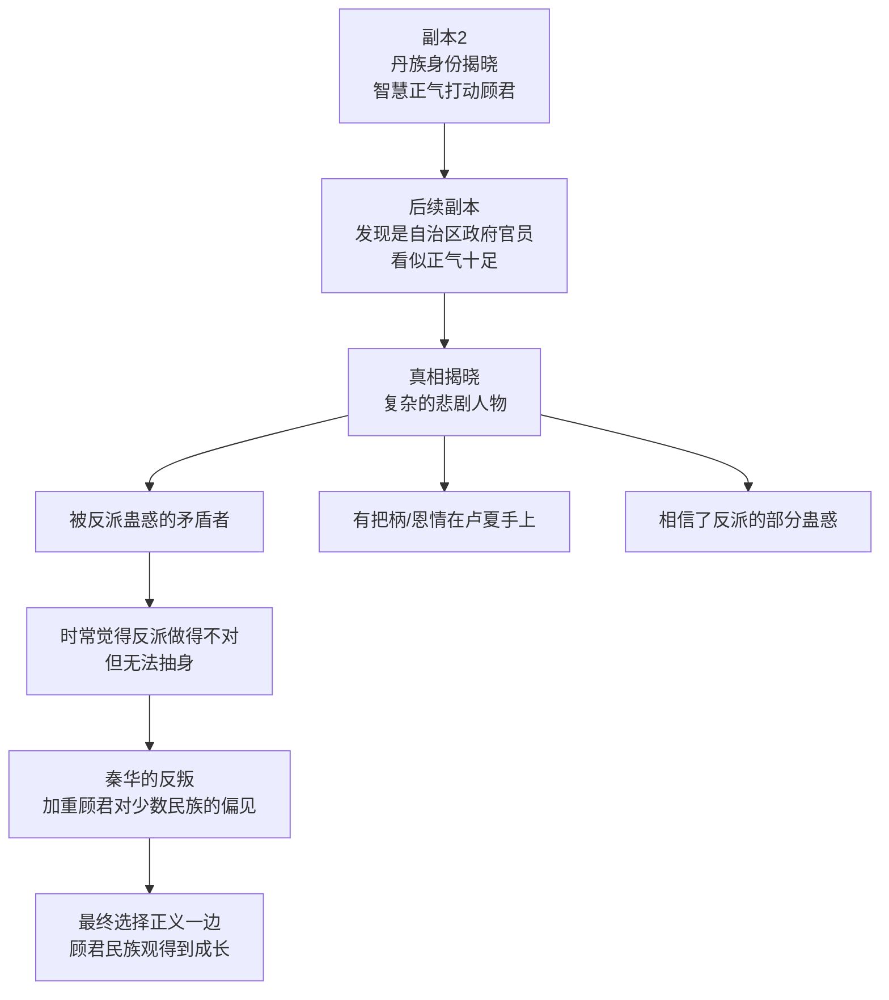
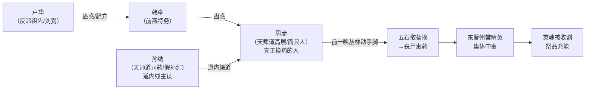

# 副本2：兰亭集会——兰亭集序

## 一、基础信息

| 项目 | 内容 |
|---|---|
| **副本编号** | 2/14 |
| **章节跨度** | 第17章 ~ 第52章（共36章） |
| **时代** | 东晋永和九年（353年），三月初三（单日，从凌晨至清晨约12个时辰） |
| **地点** | 会稽山阴·兰亭、曲水溪畔及周边山林亭舍 |
| **核心事件** | 兰亭集会——东晋雅集风俗：服石行散+修禊祓禊+流觞曲水+赋诗属文。主角团需要自己在集会中发现这场聚会的真正目的：王羲之试图调和桓温与殷浩两派矛盾（表面北伐之争，暗为传国玉玺归属）。此事震动南北——北方慕容鲜卑和关中苻氏虎视眈眈。卢华（桓温幕僚，化名刘弼，桓家管家）得知后谋划一切：通过"韩卓（前燕线，蛊惑天师道高层周彦在前一晚换药）+孙绣（天师道司药/假孙绰，道内线主谋）"双主谋结构将五石散替换为丧尸毒药，妄图对南方精英一网打尽+收割祭品。太原王氏（王绥之）早发现图谋，将计就计调包解药待价而沽；桓温早察觉勾结，预制切割证据两头下注 |
| **鬼怪类型** | 丧尸——五石散被替换为丧尸毒药，**服药+沾水触发变异**（修禊/流觞=两次大规模触发点），中毒者依次经历：欣快期→癫狂期→异变期→丧尸化（共四阶）。行散习俗是天然掩护——早期变异被名士当作"行散得好""合乎道法"。解药对①②③期可逆转，④期不可挽回只能武力清除 |
| **原著引子** | 王羲之《兰亭集序》（全篇是召唤后世之人的仪式文本，写作过程=仪式倒计时） |
| **国宝获取** | 兰亭集序真迹（王羲之所赠） |
| **门票** | 墨迹残片（兰亭集序一角碎片，背面有“会于会稽山阴”字样）→ 副本3入场凭证 |
| **核心机制** | 主角团以隐形状态进入（仪式未完成，不属于这个时代，与这个世界无因果纠缠）。**唯一死因=规则杀：改变物理世界+被观测→抹杀**。赵衡（空中漂浮的火把）、纪明（逃亡留痕）、卫泽（冲撞名士）、方远（诗稿没放好）、马川（阻塞逃命名士）皆死于此。丧尸只杀"存在之人"（NPC祭品），看不见隐形人——但丧尸杀也是规则的一部分。兰亭集序完成后集体显形为"后世之人"，脱离规则杀风险 |
| **暗线** | 桓温、殷浩乔装易容秘密到场；谢安表面是谢家名士，实受褚太后委托搅局——避免桓温、殷浩任何一方独大威胁朝廷。丧尸爆发只是表象——死去的路人+丧尸化名士，灵魂被反派批量收割为祭品。卢华做的手脚让玉玺仪式召唤提前——主角团被提前拉入。**面具人（孙绣等）从未杀人——他们只是密会投毒的阴谋者，第一幕的"追杀"是误读，揭晓时反转为"真正杀死同伴的是这个世界本身"** |
| **“王栀之”** | 双主谋：韩卓（前燕特务）+孙绣（天师道司药，易容冒充孙绰，孙恩先祖）——皆被卢华蛊惑/利用，以为各为其主（前燕霸业/天师道掌权），实际在帮反派收割祭品。二人在副本中被处决；卢华也被判处死刑，但临刑前以易容术偷天换日假死逃脱——主角团以为他只是桓温幕府中一个不起眼的已死内奸 |

---

## 二、十一人队伍

| # | 角色 | 定位 | 结局 |
|---|---|---|---|
| 1 | **顾君** | 主角，历史考据型 | 存活 |
| 2 | **白艺** | 首次参团，物理学博士 | 存活 |
| 3 | **老莫** | 历史教授，魏晋史专家 | 存活 |
| 4 | **张洋** | 贫嘴发小，野史爱好者 | 存活 |
| 5 | **苏晚晴** | 考古所研究员，老莫大师姐。高挑冷面，理性冷静。张洋未来对象（仅伏笔） | 存活 |
| 6 | **秦华** | 反派阵营大将。古道热肠/精明能干 | 存活（反派需要他） |
| 7 | **赵衡** | 路人A，历史嘉豪型（浅尝辄止、人云亦云） | **死**（规则杀：拿起火把→"空中漂浮的火把"异象被面具人观测→人头落地，Ch18秦华口述并误判为面具人所杀） |
| 8 | **方远** | 路人B，纯阴谋论者（万事皆阴谋） | **死**（规则杀：拿起名士诗稿找"伪造证据"，放回时没放好→仆从发现→抹杀，Ch33） |
| 9 | **卫泽** | 路人C，历史发明家（编造历史、拼接野史） | **死**（规则杀：下水修禊冲撞名士→被感知→整个人消失，Ch26失踪式） |
| 10 | **纪明** | 路人D，引经据典型+极度怕事（从小书呆子，遇意外就慌） | **死**（规则杀：逃亡留痕被观测→当众被规则撕碎，Ch20。众人误判为面具人碎尸） |
| 11 | **马川** | 路人E，反驳型人格（极度自负，任何人提出观点必用武断的浅显历史印象反驳） | **死**（丧尸杀=规则的一部分：呆立阻塞逃命名士→造成物理改变→被丧尸一并抹除，Ch35） |

**主角团无伪装身份**——他们以隐形状态进入副本，NPC看不见他们。隐形源于“仪式未完成，不属于这个时代”的时空规则。兰亭集序完成后集体显形，成为“后世之人”。

**五个路人外貌识别锚点：**
- 赵衡：三十多岁，圆脸，微胖，运动外套，眼神容易兴奋。
- 方远：瘦长脸，黑框眼镜，常抱着鼓鼓囊囊的背包。
- 卫泽：高瘦，肩窄，下巴尖，头发往后梳得用力。
- 纪明：二十七八岁，脸白，厚镜片，紧张时捏衣角。
- 马川：寸头，方脸，粗脖子，常抱臂，身体姿态带压迫感。

**入梦次数与认知差异：**
- 顾君、张洋、老莫经历过桃花源，是二次入梦。进入副本2时会默认“这不是普通梦”，但仍只掌握桃花源那次的生存经验，不知道兰亭完整规则。
- 秦华、赵衡、方远、卫泽、纪明、马川也是二次入梦者。因为有过第一次经历，他们出场时不会完全茫然，会下意识点人数、检查随身物、压低声音讨论真实性，并对“这到底是不是梦”已经有怀疑。
- 白艺、苏晚晴首次入梦。白艺不知道顾君等人的桃花源经历，必须在副本2中与顾君沟通后才知道；苏晚晴只基于眼前环境和老莫反应做判断。
- 所有人只能基于自己当前经历发言。作者设定中的“兰亭集会”“永和九年”“隐形规则”等答案，不能在角色没有获得线索前由台词直接说出。

**苏晚晴补充设定：**
- 身高175cm，马尾辫，不苟言笑，说话极少但句句切中要害
- 与老莫的关系：师生关系，但更像同僚——老莫尊重她的判断
- 性格核心：极度严谨，做事讲究证据和逻辑链，不容忍“想当然”和“差不多”
- 与张洋的反差与互补：
  - 张洋天马行空、嘴贫话多、逻辑跳跃，苏晚晴严谨克制、一字一句、讲究证据
  - 张洋的行为言语经常让她无语甚至气到——但他偶尔的“胡说八道”里会突然冒出一个她没想到的角度，帮她打开了思路
  - 她不会承认这一点，但心里记住了
  - 暗互补：她的严谨补他的散漫，他的灵活补她的死板
- 本副本中的感情线处理：**不展开**，只埋种子。具体表现：
  - 某个瞬间张洋的某个举动让她微微愣了一下（不是心动，是“这个人比我以为的靠谱一点”）
  - 后续可歌可泣的感情线在后期副本展开

**老莫补充设定：**
- 表面身份：历史教授，魏晋史专家
- 真实身份：吴越钱家后人，世代守护国宝的暗线家族
- 本副本中的行为模式：装作被动卷入，实际主动入场。利用隐形状态窃听各方情报，但只给主角团抛出一两个关键线索，从不解释来源
- 诡异淡定的原因：他知道很多内情（爷爷、父亲与官方合作，发现历史被动过手脚）
- **兰亭名士名单**：作为魏晋史教授，他对兰亭集会42人的历史名单烂熟于心——进入副本第一天就对在场名士逐一核对。郗超不在42人名单上，但老莫作为历史学者知道他后来将成为桓温第一谋士——这个少年此刻出现在这里，意味着历史正在他眼前分叉。不在名单上的人（卢华、杜子恭、韩卓、裴俭）他一开始就在暗中观察。但和顾君不同——顾君靠行为和现象推理"谁有问题"，老莫靠历史知识提前"圈出嫌疑人"再验证。他从不主动说"某某不在名单上"，只是默默看、默默记、偶尔给顾君扔一个名字
- 本副本中给读者的印象：可疑、像掌控一切、让人摸不透

**秦华补充设定：**
- 40岁出头，中等身材，面相和善，说话条理清晰
- **民族身份**：丹族（虚构少数民族）。本副本中揭晓他的少数民族身份
- **前期表现**：古道热肠，多次在关键时刻帮主角团化解危机（如提供关键信息、分析局势）
- **与顾君的互动**：
  - 顾君对少数民族不感冒——他痛恨女真和蒙古入主中原，对少数民族有偏见
  - 但在与秦华相处中，被秦华的智慧和正气打动
  - 秦华对历史的见解独特而深刻，让顾君不得不重新审视自己的偏见
- **中期暴露**：被苏晚晴无意中发现他携带某种官府信物——他是某自治区政府的班子成员之一
- **真实身份**：反派阵营核心成员，卢夏的直属下属。本副本中他的任务是观察+在关键时刻引导白艺
- **与白艺的互动**：用“理性分析”方式接近——两人讨论问题时逻辑清晰、互相启发
- **祭品伏笔**：某次路人死亡时，秦华有一瞬间的不忍，并下意识地看了一眼某个方向（确认“收割”是否成功）

**秦华跨副本角色弧光：**



| 阶段 | 秦华的状态 | 顾君的认知变化 |
|---|---|---|
| 副本2 | 丹族身份揭晓，智慧正气 | “这个人让我刮目相看” |
| 中期副本 | 自治区政府官员，看似正气 | 信任+依赖 |
| 真相揭晓 | 被反派蛊惑的矛盾者，有把柄在卢夏手上 | 震惊+背叛感 |
| 反叛期 | 秦华的反叛行为 | “我就知道……”偏见加重 |
| 最终 | 秦华选择正义，牺牲/付出代价 | 偏见被打破，民族观成长 |

**赵衡（路人A）补充设定：**
- 35岁，自信满满，历史知识全部来自通俗读物和短视频
- 历史嘉豪型：只说最经典的印象，觉得自己老懂了。典型言论如"秦桧是好人，岳飞情商低""宋朝就是废物窝囊""大明不和亲不割地，硬气""沙陀宋、鲜卑李唐"——基本没有细致研究，全是人云亦云的二手结论
- 标志性行为：喜欢用一句话总结复杂历史事件（"这不就是xxx吗"）
- 死因：入梦后看见远处火把，兴奋地走上去打招呼，**拿起了火把**——"空中漂浮的火把"异象被面具人观测到→规则杀，人头直接落地。面具人一脚碾过头颅（死后行为）。秦华目击全过程，Ch18向顾君口述并误判为面具人所杀。他是本副本第一个死者，死因是"轻敌+鲁莽"——也成了面具人误读型恐怖的起点

**方远（路人B）补充设定：**
- 32岁，纯阴谋论者，看什么都是“背后有人操控”
- 典型言论：“《兰亭集序》根本不是王羲之写的，是李世民伪造的”“传国玉玺早被日本人偷走了，故宫里的那个是假的”“这个副本肯定是政府在拿我们做实验，摄像头在盯着呢”
- 标志性行为：用阴谋论解释一切异常现象——酒杯悬停是“磁场干扰”，丧尸是“全息投影+次声波”，NPC是“政府雇的演员”。因为不相信任何表面规则，反而更容易触碰真正的禁忌
- 死因：坚称《兰亭集序》是李世民伪造的，拿起名士的诗稿要找"证据"——被附近异动惊到，塞回去时**没放好**→仆从拾起发现位置不对（被观测）→规则抹杀（Ch33）。他的死让全队第一次完整理解规则：不是被看见才死，是留下痕迹被察觉才死

---

**卫泽（路人C）补充设定：**
- 38岁，历史发明家，自媒体出身，编造历史换取流量
- 典型言论："桓温其实是女扮男装，史书被改了""谢安是穿越者，他预言了淝水之战""《兰亭集序》暗藏藏宝图，找到就能找到秦始皇陵"——把野史拼接成"独家发现"，深信不疑
- 标志性行为：喜欢"纠正"别人的历史认知，以一个完全不存在的"史料记载"作为证据（"有个野史你没读过，上面写得清清楚楚……"）。对兰亭集会的"独一无二解读"让他成为NPC眼中的异类
- 死因（Ch26）：修禊时不甘当透明人，挤进人堆也下了水——转身时**撞了一个名士的肩膀**，名士感到空无一人处有实体（被感知）→规则抹杀。**整个人消失**——水里没有挣扎，岸上没有人影，就像从来没有这个人。众人起初只当他走散，直到顾君和白艺把"撞了人"和"无影无踪"拼在一起，才推出规则（Ch31闭环）。他是规则杀最恐怖的示范：安静、干净、无迹可寻

---

**纪明（路人D）补充设定：**
- 27岁，历史系研究生，引经据典型。书架上全是原典，生活里全是意外——从小到大最怕的就是"计划外的事"
- 典型言论："《世说新语·雅量》第三十七条谢安闻淮上捷报……""《晋书·桓温传》记载……"——能大段背诵原文，但一到关键时刻声音就发抖
- 标志性行为：遇事先翻书。被追杀时第一反应是翻书找对策→站在原地发抖
- 死因：重伤逃亡中一路留下痕迹（断枝、声响、血迹），被面具人循异象追踪→踉跄逃到主角团脚下抓住顾君裤腿求救——"救救我！哥，救救我！大哥，我不能死！我纪明还不能死！"——**规则当众将其撕碎**（Ch20）。顾君只看见一半，误判为面具人碎尸。他是本副本第二个死者，他的死确立了"这个副本真的会死人"——不是幻觉，不是游戏

**马川（路人E）补充设定：**
- 34岁，餐饮店主，反驳型人格。极度自负，靠着百家号和三分钟科普视频"研究"了二十年历史，任何人的任何观点他都能反驳——用自己那套武断、浅显得可笑的"历史印象"
- 典型言论："你说的不对，我研究过""你这个观点很外行""我在百家号上写过一篇分析……"——不管对方是谁（包括老莫这样的在职教授），开口第一句一定是"你错了"
- 标志性行为：在主角团讨论生存策略时，对每个人的建议都逐一反驳：顾君说"维持隐形不要碰NPC"→"你这太被动了，我们得主动出击"；老莫说"观察王羲之写作进度判断倒计时"→"书法和生存有什么关系，你在装逼吧"。所有人都想让他闭嘴
- 死因（Ch35）：混乱区域中呆立不动（吓僵+赌气），**阻塞了一名逃命名士的去路**——名士被绊，丧尸循动而至，将他与名士一并抹除。丧尸从不知道他的存在，它们清除的只是他造成的物理改变。死前最后一句话还在为自己辩护："你们这个方案本来就有问题……"。他是自负到愚蠢型：死到临头都在嘴硬

---

## 三、六大势力与关键NPC

### 势力一：世家大族（王/谢）

| NPC | 身份 | 副本功能 |
|---|---|---|
| **王羲之** | 右军将军、会稽内史、书法家 | 集会发起人。表面主持雅集，实际主持玉玺归属的最终决断。**政治立场：明面属司马昱一方（会稽内史=司马昱封国最高行政长官），但识时务、主调和——他深知桓温与殷浩都是朝廷支柱，任何一边倒下都会危及国家安全；与殷浩有政见冲突（曾致书力谏北伐必败），与桓温有书信往来（不附和不死磕）；与太原王氏王述水火不容（素轻王述，因其升迁愤而誓墓）。知道玉玺的力量，态度是"不能落入任何一方手中"** |
| **谢安** | 隐居会稽东山、尚未出山的政治家 | 表面是谢家名士参与雅集，实受褚太后秘密委托——**但他真正的效忠对象不是司马昱，而是褚蒜子本人**（褚太后之母谢真石是谢安堂姐）：只有褚蒜子掌权，谢家才能长保荣华。殷浩在他眼里是可弃的棋子。最冷静的棋手。提议"召后世之人"来决断玉玺归属 |
| **谢万** | 谢安之弟 | 谢家的武力代表，明面上早已站队司马昱，暗中监视桓温阵营动向 |
| **王献之** | 王羲之幼子，10岁 | 少年天才，在集会中写诗。顾君从他身上看到王栀之的影子（副本1回响） |
| **王绥之**（原创） | 太原王氏子弟，**伪装成琅琊王氏远房子弟**混入场中 | 太原王氏的暗探（家主王述与王羲之历来不和）。家族早已察觉前燕特务+天师道叛徒的换药图谋，**将计就计——只暗中调包了韩卓的解药**（真解药捏在手里，待事态发酵让琅琊王氏被踢出权力中心，自己以"救世主"收割政治资本）。**暗通谢安**——以为谢安站司马昱一方，邀谢家终结琅琊后共辅司马昱登基执政。暴露后被王羲之以家主身份施压，咬死不认；趁调兵搜查的半个时辰空档，秘密把真解药塞给谢安——谢安收下，转身当众拿出使用。**他递过去的不是解药，是绞索**。暴露后与王羲之两轮互咬：咬琅琊"王衍清谈误国""王敦两度叛乱"，被王羲之以"太原王浚引鲜卑入塞""王浑王济屡荐刘渊养虎为患"双倍奉还——两房内斗，门户之见压过外患 |

### 势力二：朝堂势力

| NPC | 身份 | 副本功能 |
|---|---|---|
| **殷浩** | 建武将军，北伐失败后被废为庶人（353年时尚未被废） | 博弈四人之一。刚经历北伐惨败，急需玉玺力量雪耻。态度最急切 |
| **司马昱**（会稽王） | 皇帝的叔父，清谈领袖 | 代表皇室利益。表面参与雅集，实际监视各方。态度暧昧——既不想玉玺落入桓温，也不想落入殷浩 |
| **朝廷密使**（原创） | 皇帝派来的暗探 | 监视殷浩和桓温。在集会中伪装成仆从。被发现后成为冲突触发点 |
| **裴俭**（原创） | 会稽王司马昱的幕中清谈客 | **前秦密探**。伪装成北方南渡的文人，实为苻健派来的间谍。打探玉玺情报。后半夜被桓温幕府发现身份后被处决 |

### 势力三：桓温幕府

| NPC | 身份 | 副本功能 |
|---|---|---|
| **桓温** | 荆州刺史、征西大将军，东晋军力最强 | **乔装易容秘密到场——伪装成儿子桓伟身边的一名沉默护卫，脸上覆薄易容药膏，混在桓家公子的随从队伍中。** 博弈四人之一。**早已察觉卢华勾结前燕——他将计就计：卢华此计若成，朝堂势力一网打尽，他回荆州便秘斩卢华灭口；若败，他抛出预制的切割证据，卢华之死与他无关。两头下注，立于不败之地。** 只有老莫（观察推导）、秦华（可能早知）、郗超（直接联络人）知晓其在场。最后章节竹林中揭去伪装，以近乎胁迫的姿态让顾君决定玉玺归属 |
| **郗超** | 少年才俊，郗鉴之孙，王羲之妻侄。尚未公开进入桓温幕府 | 公开身份：以王羲之妻侄身份参加集会（亲戚关系，无人起疑）。暗身份：已暗中投靠桓温。在集会上暗中向桓温揭发卢华的不轨之心（暗线），凭借此举正式获得桓温信任。老莫作为后世历史学家知道这个人“将来会是桓温第一谋士”——但此刻的郗超，站在历史的岔路口上，还没人知道他选哪边。殷浩僚佐王彬之、桓温之子桓伟也在场——两方势力原本就暗藏于集会中 |
| **桓伟** | 桓温之子 | 桓温方面的公开代表，代父出席。
| **韩卓**（原创） | 前燕特务 | **本副本双主谋之一（前燕线）**。伪装身份为孙绣介绍进桓温幕府的杂役（仅在药房后厨帮忙），被卢华蛊惑，以为在"为胡马南渡扫清障碍"。**蛊惑周彦（天师道高层）在集会前一晚换掉五石散**。Ch45被顾君以"最大获利者=前燕"的地缘逻辑当众揭出，供认后被处决 |
| **桓温幕僚**（2-3名） | 军事参谋 | 提供桓温阵营视角，部分在冲突中死亡 |

### 势力四：天师道（孙家）

| NPC | 身份 | 副本功能 |
|---|---|---|
| **许询** | 字玄度，东晋最有名的隱士型玄学家，深信天师道。**三个面具人之一** | 明面上的天师道代表。清风朗月、寄情山水的隱士，与王羲之、支道林植交深。在集会中负责上巳节祈福仪式。知道玉玺的存在，态度是"天命之物应归天道"。正面人物，不想集会变屠场。前夜与杜子恭暗中监视周彦 |
| **杜子恭**（原创/半历史） | 天师道暗桩。伪装成许询的侍从。**三个面具人之一** | 天师道在会稽的地下网络实际操盘手（祭酒级）。前夜察觉周彦异动，与许询暗中监视，提前备下镇灵符抑制药效。中后期暴露，最终牺牲 |
| **周彦**（原创） | 天师道高层。**三个面具人之一** | **真正换五石散为丧尸毒药的人**——被韩卓蛊惑，集会前一晚在丛林动手脚（密会韩卓+换药），做贼心虚，一直觉得有人知道了阴谋但又不知道是谁。身上有前燕信物，Ch43被检举落网 |
| **孙绣**（原创） | 天师道"司药"，掌管丹药/五石散炼制分销。**易容冒充太原孙氏的孙绰出席集会**（非面具人） | **本副本"更换五石散"的双主谋之一（道内线）**。后世五斗米道领袖、海盗孙恩的先祖。目的：借毒杀尽灭南朝精英，让天师道掌权。周彦的道内上家 |
| **天师道信众**（1-2名） | 参与集会的其他天师道人物 | 提供天师道视角 |

**杜子恭设计要点：**
- 40多岁，瘦削沉默，眼神锐利
- 伪装为许询身边的老仆，负责端茶递水（Ch25修禊期间首次出现，无台词）
- 实际身份：天师道"祭酒"级人物，掌控会稽地区天师道地下组织
- 面具人之一：前夜察觉周彦行踪诡异，与许询戴面具暗中监视——因此提前知道"药可能出问题"，备好镇灵符
- 他的行动线：暗中在兰亭各处贴符（主角团以为是驱蚊/辟邪），实际是在抑制丧尸药效扩散
- 暴露方式：苏晚晴在考古视角下发现他贴的符不是普通道教符箓，而是天师道特有的"镇灵符"
- 最终结局：以自身为媒介激活所有符箓，镇压药效但自身被反噬而死（Ch47），遗言"玉玺仪式已经被污染了。无论谁拿它，都不是好事"
- **与孙绣的关系**：真实历史上孙恩道统为杜子恭→孙泰→孙恩一脉。本副本中孙绣为孙恩先祖，与杜子恭道统同出一门——同门一正一邪：杜子恭贴符救人，孙绣换药杀人

**孙绣设计要点：**
- 真实身份：天师道"司药"，掌管五石散炼制与地下分销；孙恩先祖
- 伪装：易容冒充孙绰（太原中都孙氏）。**孙绰的政治身份：殷浩的建威长史出身，后被王羲之引为右军长史；曾上疏谏阻桓温迁都——朝廷明面上反桓温扩张的"文士风骨"代表。孙绣必须演好这个角色：清谈场合持续以风骨之名攻击桓温（不反才露馅）；韩卓落网（桓温幕府杂役）后借题发挥围攻桓伟——他急得不正常，这本身就是破绽**。历史上孙绰与支遁论佛、文风清丽——孙绣的清谈华丽却总往长生、尸解、神仙上拐（Ch23老莫"觉察出一点线索"的正解：学问是空的）
- 修禊下水（Ch25）：以"孙绰"身份露面下水，放浪形骸——**秦华看得皱眉："这人的言行太夸张了。"苏晚晴说孙绰史上就是放浪名士。秦华摇头："天生的放荡和装出来的放荡，是两回事——他每一处放荡都像在说'快看我多放荡'。"**（表演感线埋设；秦华识人准得反常）
- 暴露（Ch46）：**四线收束**——①介绍人供词（周彦/韩卓供出道内上家="司药"）②书法（苏晚晴：题字笔法不对，Ch32埋）③神仙腔（老莫，Ch23/27埋）④表演感（秦华，Ch25埋）。双主谋结构至此完整揭晓：韩卓是前燕线，孙绣是道内线，两人之上还有卢华

### 势力五：反派势力

| NPC | 身份 | 副本功能 |
|---|---|---|
| **卢华** | 卢夏东晋祖先，匈奴后裔 | 伪装"汉赵刘氏后人"，以方士身份混入桓温幕府。**本副本中化名“刘弼”，以桓伟随行家臣（管家）的身份陪同出席——掌握桓家下人选拔与行踪。** 通过"韩卓（前燕线，蛊惑周彦换药）+孙绣（天师道司药，道内线主谋）"双主谋结构将五石散替换为丧尸毒药。本副本的真正幕后黑手。**结局**：韩卓、孙绣、王绥之相继落网后，**郗超以"管家失察之责"当众揭出刘弼才是更大的奸细**，顾君补物证（朱砂/名单/上游）→朝堂仍要扣"通敌"帽子→顾君切割系个人行为→被处决（实为易容术偷天换日假死逃脱） |
| **秦华** | 混入11人队伍 | 见十一人队伍中的详细设定 |

**卢华补充设定：**
- 外表：文质彬彬的中年文士，谈吐不凡，对秦汉历史、阴阳五行极其精通
- **本副本中的伪装身份**：桓温的幕中谋士。在集会中低调行事，少数人知道他"姓卢，是桓温的人"
- **本副本中的暴露程度**：主角团起初以为韩卓是大反派，顾君重新推导后当众揭出刘弼才是真正的主谋。刘弼被处决——但被处决的是替身，真身以易容术偷天换日假死逃脱。主角团全程目击了“刘弼被斩”，以为案子了结。**他的真实身份留到后续副本逐步揭晓**
- **操纵链设计**：卢华不亲自投毒，而是通过"韩卓（前燕线）+孙绣（道内线）"的双主谋结构完成五石散替换
  - 他以"更猛烈的五石散配方"为诱饵，化名刘弼后通过韩卓（前燕特务）交给孙绣（天师道司药）
  - **执行层**：韩卓蛊惑周彦（天师道高层，三面具人之一），周彦在集会前一晚于丛林动手脚，亲手换掉五石散
  - 韩卓以为配方是帮前燕扫平南朝的武器；孙绣以为靠它能尽灭南朝精英、让天师道掌权；周彦以为自己在为道内效力——三人都不知道配方会让人丧尸化，更不知道死者灵魂在被收割
  - 即使事发，浮出水面的也只是周彦、韩卓、孙绣，刘弼（卢华）被掩盖在桓伟"管家"的外衣下——直到郗超以"管家失察之责"把他揭出来
- **祭品收割**：每一个中毒而死的名士+路人，灵魂被卢华（刘弼）暗中收割，为七国宝激活充能——但主角团在本副本中还不知道是谁在收割
- **本副本的疑点**：顾君推导出刘弼才是主谋的推理链虽然成立，但有两点他自己也无法完全解释：①刘弼提供的证据“太刚好”——像是有人故意让主角团发现的；②逃出前那个逆流而行的身影——是眼花，还是刘弼根本没死？这些碎片在后续副本中逐渐拼成一幅完整的图：被处决的“刘弼”，未必是真身
- **跨副本串联**：后续副本中，顾君逐渐在每个副本里遇到一个“似曾相识”的人物——形貌各异，但眼神、谈吐、对历史的熟稔程度惊人相似。直到某个副本，他终于将碎片拼接起来：这些“不同的人”，都是同一个人——卢华从未死过。最终确认为卢夏的东晋祖先

### 跨势力暗线：韩卓蛊惑周彦的投毒链

### 郗超的暗棋：投名状（本副本暗线核心）

郗超在集会期间的行为路线：
1. 集会初期：以王羲之妻侄身份低调观察各方——公开身份让他自由穿梭于王谢、殷浩、桓伟三个圈子。他注意到一个细节：桓伟在某个瞬间下意识地看向身边那个沉默的护卫——不是主人看仆从的眼神，是儿子看父亲的眼神。郗超心中一凛：桓温来了。
2. 中期：发现韩卓与周彦的异常接触→但选择暂不声张，继续观察。他同时一直在看刘弼——这个管家对桓家下人的选拔与行踪了如指掌，两个奸细在他眼皮底下活动，他竟"什么都没发现"？
3. 关键出手（Ch47）：特务全部落网、各方围攻桓伟、王羲之劝和不成之际，郗超判断"桓温本人就在现场"——他可以看到桓伟身后的那个沉默护卫与桓伟交换了一个极细微的眼神。于是他站出来，**以"管家失察之责"当众揭出刘弼**："这两个奸细的选拔与行踪都归管家掌握。管家说什么都没发现——可这位管家何等精明能干，这两个笨蛋奸细，怎么瞒得过他？管家，才是更大的奸细。"
4. 老莫的判断：一个十七岁的小子不会为了别人家的事赌上自己的前程——除非他知道桓温在看。永和九年时他父亲郗愔和桓温素来不对付，犯不上为了桓温发言赌上自己的前程，桓温滔天权势，也不需要他帮忙。**郗超此举一石三鸟：揭刘弼=替桓温切掉毒瘤、当众圆场（把"通敌"的矛头从桓温引向刘弼个人）、投名状——他在赌命，赌桓温会记住这个敢在所有人面前出手的少年。** 桓温确实在看。

**郗超在这次集会中的收获**：不是公开投靠，而是"让桓温亲眼看到我的判断力和忠诚"——在所有人都不知道桓温在场的情况下，郗超精准地判断出了局势，并冒着极大风险站对了位置。凭借此举，他从"郗鉴的孙子、王羲之的侄子"，变成了桓温心中"这个少年，确实有东西"。

---

**韩卓、周彦与孙绣——投毒链三层：**



| 要素 | 韩卓（前燕线） | 孙绣（道内线） | 周彦（执行层） |
|---|---|---|---|
| **身份** | 前燕特务，伪装为孙绣介绍进桓温幕府的杂役 | 天师道司药，易容冒充孙绰出席；孙恩先祖 | 天师道高层，三个面具人之一 |
| **以为的目标** | 杀掉东晋精英→胡马南渡→前燕统一天下 | 尽灭南朝精英→天师道掌权 | 为道内效力 |
| **实际作用** | 配方传递+蛊惑周彦 | 道内渠道主谋 | 前一晚亲手换药 |
| **不知道的事** | ①配方会让人丧尸化 ②死者灵魂被收割 ③自己是卢华的棋子 | 同左 | 同左 |
| **暴露方式** | Ch45顾君揭出（最大获利者=前燕） | Ch46四线收束（介绍人供词+书法+神仙腔+表演感） | Ch43检举落网（前燕信物+张洋认出卸面者） |

**间谍线在叙事中的作用：**
- 裴俭（前秦密探）的密报被顾君截获→发现北方势力也知道玉玺在东晋→玉玺不仅是东晋内部问题
- 周彦→韩卓→孙绣逐层暴露→揭示五石散替换的真相→发现投毒链→但三层之上还有卢华
- 王绥之（太原王氏）调包解药线→第三方特务→暴露门阀内斗

---

## 三-二、计中计全景（智斗层）

副本2的斗争不是"主角团 vs 反派"的二元结构——一屋子历史顶级聪明人，计中计中计。卢华的毒计是全屋最"笨"的一招，却差点成功，因为聪明人都忙着互相算计。

```
表层：修禊流觞，风雅清谈
  ↓
政争层：桓温 vs 殷浩（北伐之争）——人人可见
  ↓
赌局层：王羲之/谢安/殷浩/桓温 玉玺归属赌局（召后世之人）——四方自知
  ↓
毒计层：卢华→韩卓（前燕）+孙绣（道内）投毒灭精英、收祭品——反派主线
  ↓
将计就计×3（全场最聪明的三方，各自冷眼看毒计发生，各取所需）：
  ├─ 太原王氏（王绥之）：早发现投毒图谋，只暗中调包韩卓的解药
  │   →让事态发酵、琅琊王氏被踢出权力中心；暗通谢安邀共辅司马昱，反被谢安收药后当众使用
  ├─ 桓温：早察觉卢华勾结前燕，任其施为
  │   →成功则朝堂清空、回荆州秘斩卢华；失败则抛出预制切割证据
  └─ 谢安：只忠于褚蒜子本人（非司马昱、非朝堂）
      →殷浩是可弃棋子；最终妥协：桓温尊重褚太后，殷浩扔了就扔了
  ↓
规则层：规则杀悬在所有人头顶——聪明人算尽一切，算不到这个世界本身
```

### 各方的"底牌"与"败因"

| 方 | 底牌 | 败因/局限 |
|---|---|---|
| 卢华 | 双主谋结构+祭品收割法阵 | 自以为棋手，实际所有人都在利用他的毒计 |
| 韩卓 | 前燕官方支持+解药保底 | 解药早被太原王氏调包；被顾君以"最大获利者=前燕"当众揭出 |
| 孙绣 | 完美易容+"风骨"人设 | 表演过度——他比真正的孙绰更急于反桓温；书法骗不了行家 |
| 太原王氏 | 真解药+信息优势 | 只知其一不知其二：不知道卢华，不知道丧尸化；王绥之把解药亲手塞给了最不该信的人 |
| 桓温 | 预制切割证据+在场威慑 | 算不到郗超会替他揭出刘弼、顾君会当众切割保他（"你刚才那番话，救了自己一命"） |
| 谢安 | 褚太后信任+最冷静 | 几乎无——全场唯一得偿所愿的人，一句话没说赢的 |
| 王羲之 | 集会主人+玉玺+墨香 | 中和者最难做：两房互咬、毒计横流，他控不住场 |
| 主角团 | 隐形+跨副本经验 | 不属于这个时代，规则杀悬顶 |

### 终局站队（Ch50前后的政治结算）

- **谢万、孙绰（孙绣，已被押）、王绥之（太原王氏）**：站队朝堂（反桓温）
- **谢安**：貌似站司马昱，实际促成妥协——桓温名义尊重褚太后，殷浩被抛出当替罪羊（与两年后殷浩被废为庶人的史实暗合）
- **顾君的"归朝堂"**：恰好落在谢安的方向上——玉玺归褚太后摄政的朝堂，桓温殷浩谁也拿不走。谢安袖袍微动，全场只有他知道这局棋收在哪

---

## 四、《兰亭集序》作为仪式倒计时

《兰亭集序》不是普通的书法作品——它是召唤后世之人的**仪式文本**。王羲之每写一部分，仪式就推进一个阶段。集序完成之时，即是后世之人显形之刻。

主角团在隐形期间可以通过观察王羲之的写作进度来估算剩余安全时间。

### 仪式推进表（写作阶段=倒计时）

| 写作阶段 | 原文片段 | 仪式推进效果 | 主角团感知 |
|---|---|---|---|
| **开篇纪年** | "永和九年，岁在癸丑" | 仪式启动——时间锚锁定 | 主角团入梦，进入隐形状态 |
| **地点锁定** | "会于会稽山阴之兰亭" | 空间锚锁定——兰亭成为封闭结界 | 发现无法离开兰亭范围 |
| **修禊** | "修禊事也" | 表面仪轨启动——临水洗濯，服药者首次沾水触发变异 | 山羊须边嗑边洗；卫泽下水冲撞名士→规则杀（失踪） |
| **群贤篇** | "群贤毕至，少长咸集" | 参与者的意志能量被玉玺开始"读取" | 名士们的行为逐渐失常（欣快期"行散得好"） |
| **流觞篇** | "引以为流觞曲水……一觞一咏" | 大规模服药佐酒+水边沾水——批量发作；酒杯逆流/悬停异常（白艺首察） | 第一批名士药效发作；方远拿起诗稿没放好→规则杀 |
| **清谈篇** | "仰观宇宙之大……信可乐也" | 药效进入癫狂期——行为失控、撕衣咬人 | 批量丧尸化铺开；马川阻塞逃命名士→被丧尸一并抹除 |
| **人生篇** | "夫人之相与，俯仰一世" | 仪式识别出"不是这个时代的人" | 主角团感到某种"被注视感"渐强——显形临近的压迫 |
| **死生篇** | "死生亦大矣""一死生为虚诞……" | 仪式进入高潮——生死界限开始模糊 | 丧尸潮爆发前夜 |
| **后世篇** | "后之视今，亦犹今之视昔" | 仪式明确"后世之人"身份 | 主角团感知到自己即将显形 |
| **悲夫篇** | "悲夫" | 仪式接近完成——集体显形的最后倒计时 | 王羲之停笔时顾君与他对视 |
| **录述篇** | "列叙时人，录其所述" | **仪式完成——后世之人正式显形** | 主角团被所有人看见，赌局启动 |

**注意**：卢华对仪式做了手脚——主角团被提前拉入副本。在集序完成之前，他们"不属于这个时代"，因此隐形。只有在仪式完成后显形才是安全的。

## 五、规则系统：规则杀（唯一死因）

### 核心规则

> **隐形 = 与这个世界无因果纠缠。**
> **改变物理世界 + 被观测 → 规则抹杀。**

- 主角团可以在这个世界自由行走、观察、偷听——只要不留下痕迹
- **改变物理世界**：拿起、移动、碰撞、阻挡任何此世的人或物（包括：拿起诗稿、撞到人、挡了别人的路、拿起火把）
- **被观测**：改变被此世之人**察觉**（看见痕迹、感到碰撞、发现物品位置不对）——不需要看见主角团本人，察觉到"异象"即成立
- 两个条件同时满足 → **规则抹杀**，即时执行，无法抵抗

### 白艺的物理学解释（Ch51复盘）

主角团处于"无因果状态"——不与这个世界发生任何相互作用，所以看不见、摸不着。一旦改变世界并留下痕迹，就与之产生了因果纠缠（退相干）——这个世界会把他们识别为"错误"，直接清除。"我们不是怕被'看见'，是怕和这个世界产生因果。碰了它、留下痕迹，我们就'在'这里了。"

### 死亡案例（全部规则杀）

| 死者 | 章 | 改变物理世界 | 被观测 | 死相 |
|---|---|---|---|---|
| **赵衡** | Ch18（秦华口述） | 拿起了火把 | 面具人目击"空中漂浮的火把"异象 | 人头自己落地（规则杀），面具人一脚碾过头颅（死后行为）→秦华误判为面具人所杀 |
| **纪明** | Ch20 | 逃亡中一路留下痕迹（断枝、声响、血迹） | 面具人循异象追踪而至 | 被规则当众撕碎（顾君只看见一半，误判为面具人碎尸） |
| **卫泽** | Ch26 | 下水洗澡冲撞了名士 | 名士感到空无一人处的实体碰撞 | **整个人消失**——没有尸体、没有挣扎，就像从来没有这个人 |
| **方远** | 第三幕 | 拿起名士诗稿，放回去时没放好 | 仆从拾起发现位置不对 | 规则抹杀 |
| **马川** | 第三幕 | 呆立不动，阻塞了逃命名士的去路 | 名士被绊、丧尸被动静吸引 | 被丧尸一并抹除——丧尸不知道他的存在，只是清除了他造成的物理改变 |

### 面具人真相（核心反转）

**面具人从未杀过人。**

- 面具 = 天师道隐藏身份的普通道具，**没有任何法力**。三个面具人 = 孙绣（主）+ 韩卓 + 一名道众
- 面具人看不见隐形的主角团——他们和仆从、名士一样是"此世之人"
- 夜间出现在丛林：孙绣提前与前燕特务韩卓密会投毒事宜，做贼心虚。凑近草丛看顾君、追踪秦华——是在**调查异象**（察觉到有"不存在的人"在活动，怀疑阴谋暴露）
- 赵衡、纪明之死：两人留下的痕迹被面具人（或任何人）观测到 → 规则杀。面具人只是**恰好在场的目击者**，甚至孙绣自己也被"空中漂浮的火把"吓得不轻——他一直觉得有人知道了阴谋，但不知道是谁
- 白天送丹药盒：执行投毒任务，对隐形人视若无睹（根本看不见）
- **反转效果**：主角团（和读者）第一幕以为的"面具人追杀"，在孙绣暴露时会反转成另一种恐怖——他们怕错了对象，真正杀死同伴的是这个世界本身

### 丧尸与规则的关系

- 丧尸（服药变异的疯魔名士）只攻击"存在之人"（NPC），**看不见隐形的主角团**
- **丧尸杀是规则的一部分**：丧尸潮中，隐形人若造成物理改变（阻挡、碰撞），丧尸会被引向改变点，将造成改变的人一并抹除——丧尸不知道隐形人的存在，它们清除的只是"异常"
- 因此丧尸潮对主角团是**间接致命**：潮中移动、躲藏、碰撞的风险指数级上升，每一次留痕都可能触发抹杀

### 安全机制

- **仪式完成显形**：兰亭集序写完，主角团成为"后世之人"正式被这个时代接纳，此后被看见是安全的
- **解药即生路**：找到五石散原始配方/解药可逆转丧尸化
- **仪式倒计时**：主角团可通过观察王羲之的写作进度估算剩余安全期

---

## 六、丧尸四阶

### 本质

五石散被卢华替换为丧尸毒药后，服用了被替换的五石散的名士依次经历四个阶段。丧尸不是鬼——是活人被毒药转化成的"活死人"。他们除了攻击任何"存在之人"（包括被动的NPC和现身的主角团），没有别的意识。

### 丧尸化四阶

| 阶段 | 症状 | 对应原文 | 恐怖写法 |
|---|---|---|---|
| ① **欣快期** | 话多、亢奋、皮肤发热、瞳孔放大 | "快然自足" | 名士们突然变得极其热情，拉着人聊天、吟诗，气氛好得不正常 |
| ② **癫狂期** | 行为失控、攻击性增强、撕衣服、咬人 | "放浪形骸之外" | 某名士突然站起来狂奔，嘴里喊着听不懂的话，其他名士以为他在"放达" |
| ③ **异变期** | 皮肤发灰、关节扭曲、眼神涣散、发出非人声音 | "修短随化" | 主角团发现某人的手在往不可能的方向弯曲，但他自己毫无知觉 |
| ④ **丧尸化** | 完全丧失人性，见活人就扑，力大无穷，不惧痛 | "终期于尽" | 整个兰亭变成丧尸围城。名士们的书法之手变成了撕咬的爪 |

### 丧尸化触发条件（药+水）

**服下被替换的丹药 + 沾水 = 丧尸化。** 洗得越久、沾水越多，变得越快。

- 修禊（临水洗濯）= 第一次大规模触发：服药者下水即开始变异进程
- 曲水流觞 = 第二次大规模触发：流觞期间服药（五石散本就佐酒服）+ 水边环境沾水
- **行散是完美掩护**：五石散本来就要"行散"——发热、狂奔、裸袒、大叫。早期丧尸化在名士眼里就是行散，没人警觉
- **不丧尸化名单**（保证博弈不被打乱）：
  - 王羲之——今天意外地没嗑药（留白不解释）
  - 谢安——未嗑
  - "孙绰"（孙绣）——主谋，不会碰自己的毒
  - 桓伟、郗超——没下水，也没嗑
  - 卢华（刘弼）、天师道众、前燕/前秦特务——或没嗑，或只嗑没下水

### 丧尸活动规律

- **修禊后**：服药下水者陆续进入欣快期，表现为"行散得好"——气氛好得不正常
- **流觞期间**：大规模服药+沾水→批量发作
- **投毒时间差**：杜子恭暗中贴在各处的镇灵符抑制了各区域的药效发作速度——离符箓远的区域先发作，离符箓近的区域后发作。因此不是所有人同时丧尸化，而是逐片区域陆续爆发
- **丧尸感知规则**：丧尸只攻击"存在之人"（NPC）。它们看不见隐形的主角团，但会被隐形人造成的**物理改变**吸引——阻挡、碰撞、喧哗引发动静，丧尸循动而至，将造成改变者一并抹除（规则杀的执行形式之一）
- **对抗方式**：
  - 王羲之的墨香——墨迹中蕴含的意志力量可短暂驱散丧尸（约半柱香）
  - 天师道镇灵符——可抑制药效（约一刻钟），但不治本
  - 强火光——烛火/篝火可减缓丧尸速度，不致命
  - **解药**——五石散原始配方。找到并投放到水源/食物中，可逆转丧尸化

---

## 七、秦华弧光（本副本内）

| 阶段 | 章范围 | 表现 | 关键事件 |
|---|---|---|---|
| **入场·好感建立** | 17-22 | 古道热肠、精明能干、关键时刻主动帮主角团化解危机 | 丛林救顾君；告知赵衡死讯；主动分享观察到的情报 |
| **识人精准得反常** | 23-28 | 盛赞郗超"盛德绝伦"（相中未来桓温谋主）；**看"孙绰"放浪形骸，断言"天生的放荡和装出来的放荡是两回事"——识破了孙绣的表演（表演感线埋设）** | 读者视角的可疑感持续累积：他识人为什么总这么准？ |
| **身份暴露·信任加深** | 31-36 | 被苏晚晴无意中发现携带官府信物→暴露自治区政府班子成员身份→看似"上面派来监视的"→主角团信任度反而上升 | 众人觉得他至少是"自己人" |
| **引导白艺** | 31-40 | 用"理性分析"接近白艺，在涉及卢华的线索上有意引导方向 | 与白艺讨论丧尸化的"物质转化"问题→引导白艺得出"应该优先获取玉玺进行研究"的结论→顾君隐约觉得不对 |
| **收尾·可疑但不确定** | 41-51 | 在最终对决中表现英勇，但某些时刻的"犹豫"被顾君注意到 | 卢华暴露时秦华的反应慢了半拍→顾君记住了这个细节→但无法确定 |

---

## 八、白艺暗线

| 节点 | 章 | 内容 |
|---|---|---|
| **好奇种子** | 19-21 | 白艺用物理学思维分析异常；提出"也许看不见我们"假说 |
| **规则假说** | 26-31 | 卫泽失踪后，白艺把"撞了人"和"无影无踪"拼在一起→Ch31与顾君推理闭环：**改变物理世界+被观测→抹杀**（因果纠缠/退相干） |
| **共鸣建立** | 31-40 | 秦华与白艺讨论丧尸化的"物质转化"——秦华展现出惊人的逻辑分析能力（实际是事先准备好的话术） |
| **伏笔埋下** | 43-47 | 秦华在关键时刻的建议看似合理，实际暗中引导主角团走向对反派有利的方向 |
| **复盘闭环** | 51 | 白艺提出完整规则解释，五个人的死全部归因规则杀 |

---

## 九、七幕结构

### 第一幕：入局（Ch17-23，7章）

**核心任务**：入梦、绝境求生、认识秦华、团队汇合、发现隐形规则、势力入场、认出王羲之

| 章 | 时间 | 内容 |
|---|---|---|
| 17 | 三月初三前夜·凌晨 | 顾君在绝对黑暗的丛林中醒来（古代无灯光，手机没电）。通过月亮/星星/声音/气味判断身处丛林，朝南走听见溪流声。远处出现火把——顾君想靠近时被人从身后捂住嘴拖入草丛。火把走近，持握者是一个身材高大魁梧、戴恐怖鬼怪面具的"人"（天师道面具，伏笔），面具人凑近草丛与顾君几乎面对面——最终离开。身后的人松开手，用打火机照亮自己：面容沉稳、身高175左右、身材标准的中年人，比顾君大十多岁。 |
| 18 | 三月初三·凌晨 | 中年人自我介绍：秦华，法律顾问。顾君见他额头有汗，知道他在保护自己。秦华讲述：他醒来时碰见路人赵衡，赵衡兴奋地向火把打招呼走上去——人头直接落地被面具人一脚碾过。秦华头也不回地钻入丛林，藏匿时看见顾君的身影，赶来制止。二人决定天亮前潜伏。交谈中顾君发现秦华不简单——身材不壮但能死死按住自己，心思极为缜密，回答工作问题滴水不漏。又听见脚步声和火把光亮，二人灭灯重新潜伏。 |
| 19 | 三月初三·凌晨→黎明前 | 脚步声是两个人——张洋和白艺。张洋随身带打火机，白艺中途遇见他。二人没遇到危险。张洋说"不会又开始做上次的梦了吧"，白艺好奇追问，顾君讲了桃花源的事。白艺大吃一惊，想起顾君上次问过"观测效应"和"退相干"，追问桃瓣是被看见后消散还是被碰到后消散。白艺尝试用物理学解释，核心是量子力学不适用于宏观世界。又有动静——老莫带队出现，后面跟着高挑冷艳的苏晚晴（老莫的研究生），以及路人卫泽（历史发明家）、马川（反驳型人格）、方远（纯阴谋论者）。老莫凭星星一路前行，有打火机但不点火，对方向感绝对自信。老莫讲了面具人的事，路人各自发挥性格特点。卫泽透露他上次也做了类似的梦（西汉末年王莽篡位场景，同伴被杀几个）——顾君意识到不是只有他们几个会做这种梦，那几个人可能真的死了。突然有人大叫救命——纪明上半身被砍了一大半，疯狂流血，踉跄跑到众人脚下抓住顾君裤腿："救救我！哥，救救我！大哥，我不能死！我纪明还不能死！" |
| 20 | 三月初三·黎明前 | 千钧一发——张洋想扶纪明，顾君想拦，秦华更快一步把两人拉走。面具人在众人面前将纪明碎尸万段。众人毛骨悚然，顾君叫醒白艺张洋快走，秦华招呼路人，老莫已带苏晚晴跑到最前面。狂奔半小时到极限，众人没走散。跑出竹林到溪流旁停下——秦华说此处不宜久留（开阔地无掩体）。顾君观察有亭子且凳无灰尘，说明有人最近来过，等天亮可引为向导。众人躲进百米外竹林，没人敢睡。顾君和老莫、白艺、张洋、苏晚晴讨论桃花源惨状。马川不屑："就这？我当多可怕呢。"张洋怼他，白艺大笑，苏晚晴微微弯眉。突然来了一群人举火把、着古人服饰——张洋马川想打招呼被顾君老莫秦华联合制止。顾君说上次在桃花源没经验，这次不想跟这些古代人玩脑筋了。这群人在布置场地。老莫和顾君发现这群人着东晋服饰（与桃花源中相似），顾君心里有不好的预感。天色渐亮。 |
| 21 | 三月初三·清晨 | 众人距这群人几十米到一百米，躲着没暴露。这群人放桌子、准备饭菜器具。秦华说今天要准备什么活动。张洋说衣服和桃花源差不多，顾君说有区别。苏晚晴开口：东晋服饰，大部分是仆人，看纹路能分辨，器具多为酒具。老莫解释苏晚晴是他门下最优秀弟子，对古人生活日常颇有研究。又来了一群人——为首两人都戴鬼怪面具！怪物竟然有两个。众人忧惧，马川吓得尿出来转身撞见另一个面具人（相距三四步，无物理接触）——但这个面具人像没见到他一样直接走到会场，和为首两个面具人交谈后拿出大袋放小盒子到每桌。众人奇怪：昨晚打要打杀，今天看见了啥也不做？方远说可能今天人多不好下手。张洋说也许这人是盲人。白艺悄悄跟顾君说：也许是看不见我们——盲人对环境很敏感，不可能没发现他们。顾君想起白艺说过的话，知道她可能觉得这是某种物理现象。场地安排好，仆人退场，面具人留下。其中一个往他们这边看——众人吓得不轻，但最终面具人看向别处。几个仆人朝他们走来，马川又露马脚，但仆人像看不到他一样离开。众人越发疑惑：难道马川会隐身？！
| 22 | 三月初三·清晨→上午 | 秦华提议跟着仆人走出去。众人跟随，但走着走着张洋马川碰壁——被一层无形壁挡在外面，仆人能离开他们却无法离开。顾君说也许跟上次桃花源一样，被安排进了活动，不完成无法离开。老莫赞同。众人回到溪边，发现已有几人落座。张洋大胆靠近——真没人发现他。众人也靠近桌案。马川觉得他们是呆逼，站在原地不动。老莫听见两名宾客谈论北方时事："北边的事情你听说了吗？""中军的策反怕是不成，氐贼已全据关中。""妖孽家也完蛋了，白虏把僭魏灭了。"张洋和苏晚晴听见宾客说"王家大宴""王家世代奉道，雅聚能少这个？"——对桌上的盒子更好奇。到场人越来越多。老莫注意到一批人，为首一位英气逼人的少年（桓伟）带着一群侍卫到场，引得众名流紧张。少年目中无人，在前排坐下。秦华指出少年身后的侍卫各个杀气极重，像杀过成千上万人才有的，看架势这少年地位很高。 |
| 23 | 三月初三·上午 | 比起前排少年，秦华更在意坐在中间位次的另一位少年——胡须浓密旺盛（**郗超**，此时17岁，王羲之妻侄，尚未明面投靠桓温；他不在历史42人名单上，老莫是全场唯一知道"他不该在这里"的人），与宾客交谈井井有条、不卑不亢，气度卓然、锋芒内敛。秦华称此人"盛德绝伦，假以时日不可限量"（反派大将相中未来桓温谋主的反讽）。两人从竹林走入引发骚动——一位容貌甚伟、身形俊朗（谢万），神情自若地打招呼；另一位风宇条畅、神识沉敏（谢安），正襟危坐低声交谈，举手投足自带非凡气度。又有几人前呼后拥到场，为首一人放浪形骸（"孙绰"=孙绣易容），大声辩论"山涛吾所不解，吏非吏，隐非隐"。秦华觉得此人能吹，老莫却觉察出线索（正解：真孙绰与支遁论佛，此人清谈华丽却总往神仙方术上拐——学问是空的）。最后出现一家人——其中有个小孩高迈不羁、气韵风流（王献之），张洋感叹贵族教育。其余几位年长年轻人放浪形骸、蓬首散带。顾君觉得这些人眼熟但想不起在哪见过。最后几批人地位更高，依次落座，仅剩主位空缺。老莫鬼魅般出现在顾君身后低语："永和九年，岁在癸丑，暮春之初，会于会稽山阴之兰亭。"顾君脑子一亮——是祠堂！桃花源里的祠堂！最后来的一家子人在那见过！全场骤静，一人穿过座席走向主位——背影飘如游云、矫若惊龙，身高中等。转身——张洋顾君老莫互相盯着对方：是他！（桃花源里的老族长） |

> **作者注（写作时必须内化）**：第一幕的"面具人威胁"是误读型恐怖。面具人=孙绣/韩卓/道众，在丛林是为密会投毒，根本看不见隐形人；赵衡（空中漂浮的火把）、纪明（逃亡留痕）均死于**规则杀**（改变物理世界+被观测→抹杀），面具人只是恰好在场的目击者。正文从未明写面具人杀人，后续揭晓时全部可回收。详见"五、规则系统"。

### 第二幕：修禊（Ch24-30，7章）

**核心任务**：修禊全流程、丹药线渗透（读者已知角色不知）、卫泽规则杀、魏晋风度历史议题、刘弼首次近景、第一尸拉开第三幕

| 章 | 时间 | 内容 |
|---|---|---|
| 24 | 三月初三·上午 | **致辞与丹药**。王羲之致辞：今日三月初三，当春游修禊、曲水流觞、饮酒赋诗。为众宾备下上等丹药——盒中红色丸状丹药，直径约五毫米，功效三倍于散粉。方远吐槽"王羲之家是练丹药的？"张洋阴谋论"丹药有毒，骗大家吃药控制朝堂！"苏晚晴反吐槽："你听说兰亭集会后王羲之当权了么？"张洋狡辩"说不定他隐去了史书的内容！"**王绥之伏笔①：众宾寒暄，人人称他"王兄"，可王家人彼此对眼——"这位是哪房的？""远房的，远房的。"【埋】**章末：**第一个吃药的人**——四十来岁、清瘦、一缕山羊须，笑声比谁都响："右军的心意，岂能辜负！"仰头吞下。（三笔锚点：清瘦+山羊须+笑声响，供Ch30识别回收） |
| 25 | 三月初三·上午 | **观察修禊**。王羲之带头临水洗濯，众宾效仿（桓伟一脸嫌弃，不下水）。**苏晚晴讲修禊**：上巳祓禊，临水祓除不祥——本为驱邪，实为下毒的反讽。众宾清谈皆绕天师道与玄理；许询主持祈福；**杜子恭以侍从身份端茶递水**（瘦削沉默，无台词——贴符线埋设）。**"孙绰"（孙绣）下水洗澡，放浪形骸——秦华看得皱眉："这人的言行太夸张了。"苏晚晴说孙绰史上就是放浪名士。秦华摇头："天生的放荡和装出来的放荡，是两回事——他每一处放荡都像在说'快看我多放荡'。"【表演感线埋设；秦华识人准得反常】****山羊须边嗑药边修禊**——第一个下水、洗得最久，笑声在水面飘得老远。 |
| 26 | 三月初三·上午→午前 | **卫泽之死（规则杀，留尸）**。卫泽不甘当透明人，挤进人堆也下了水——张洋眼角瞥见他转身时撞了个名士的肩膀，那名士只是茫然看了看四周，什么都没说。卫泽随后**被规则杀（暴烈式）**，但当时无人目击、无人知晓。众人只当他走散了，马川嗤笑"胆小鬼躲哪尿去了"。章末：张洋忽然想起："我好像看见他撞了个人。"（规则不说破；Ch31马川发现尸体，众人误读为面具人灭口） |
| 27 | 三月初三·午前 | **魏晋风度**（历史议题章）。马川嗤笑"一群大男人泡澡嗑药吹牛，有什么了不起"→张洋反驳"这叫魏晋风度！"→**苏晚晴讲三层根因**：①司马家得国不正——高平陵之变后名士站台就杀（何晏、夏侯玄、嵇康刑场弹《广陵散》），清谈是噤声之后的替代品；②八王之乱自相残杀十六年+永嘉之乱洛阳陷落+衣冠南渡——在场名士大半是逃难者后代，风雅底下压着回不去的北方（顾君心中一动：避乱——桃花源的人，也是避乱的人。三两笔不点破）；③王与马共天下，皇权空心、门阀垄断，清谈/服药/任诞是士族的阶级徽章。**老莫心中补刀**：日后桓温登楼北望骂"遂使神州陆沉，百年丘墟，王夷甫诸人不得不任其责"——而桓温此刻就在这座院子里听他们清谈（半句不说，留给读者）。穿插清谈立人物：王羲之挡开北伐话题（"今日只论风月"——他今天没嗑药，无人留意）；谢安全程三句话，句句钉在点上；谢万活跃却浅；**"孙绰"清谈华丽却总往长生、尸解、神仙上拐，并开始以"殷浩旧属"姿态反桓温**——老莫眉头锁死（孙绣破绽再现）。**王绥之清谈平庸、谈吐不出彩，刻意泯然众人【埋】**。 |
| 28 | 三月初三·午前 | **荆州客**。老莫对桓伟不下水起疑，主动靠近其队伍探听：随从全部侍立，**唯独一个胡人长相的家臣（刘弼=卢华）落座在桓伟身旁**——**胡人（桓温历来不齿胡人，此人在桓家为臣本身就是蹊跷）**，座位僭越却坐得极自然，对桓伟恭敬、应答滴水不漏。这伙人不论玄理，**全程聊荆州军务**，与清谈主题格格不入。老莫记下三条蹊跷：胡人、座位、话题。另起一笔：侍立护卫中有一人站得太直，像久居上位之人——老莫只看不说（埋桓温）。章末：刘弼忽然侧头，朝老莫藏身的方向看了一眼——什么都没发生（读者吓死）。 |
| 29 | 三月初三·午前 | **午前**。修禊散场，名士们三三两两歇着清谈。**唯独山羊须还在水边闹**——别人服药后都歇了，他一个人还在踩水、唱歌，亢奋得不收场，有人笑他"今日散得好！"（个体前兆；群体行散留到第三幕）。顾君远远看着王献之，想起王栀之（跨副本情感点，三两笔）。章末：山羊须的笑声还在，但调子有点不像人了。 |
| 30 | 三月初三·午后 | **第一尸**（恐怖特写，第三幕拉开帷幕）。山羊须当众变异——皮肤发灰、指关节反向弯曲、喉咙里滚出非人的咯咯声。**周围名士还在哄笑："行散了，行散了！""合乎道法。"**哄笑声和非人声音叠在一起，分不清谁在笑（行散掩护首次显威）。主角团僵在原地——只有他们知道这不是行散。章末：那双涣散的眼睛，缓缓扫过他们藏身的方向。 |

### 第三幕：流觞（Ch31-36，6章）

**核心任务**：规则成型（卫泽尸体→误读→方远初步→马川做实→白艺公布）、行散掩护、批量尸变、间谍线启动

| 章 | 时间 | 内容 |
|---|---|---|
| 31 | 三月初三·午后 | **马川发现卫泽的尸体，当场吓晕**。众人误读：面具人发现卫泽是昨夜逃窜之人，怕被认出才灭口。流觞开始——杯随水转，停在谁面前谁赋诗。名士佐酒大规模服药。白艺注意到**酒杯偶尔逆流/悬停**（卢华水道手脚，她说不出原理）。章末：几个服药最早的名士，高兴得有点不正常。 |
| 32 | 三月初三·午后 | 群体行散——裸袒、狂奔、临水大叫，场面荒诞欢乐，主角团越看越冷。老莫："行散我见过记载——但不该是所有人同时开始。"王献之写诗，顾君想起王栀之。王羲之写字，**笔画隐隐发光**。**苏晚晴发现"孙绰"题字的笔法不对**——不像孙绰的手（只记下，没说）【书法线埋设】。王绥之流觞赋诗，平庸无奇【埋】。 |
| 33 | 三月初三·午后 | **方远之死（规则杀）**。他坚称《兰亭集序》是李世民伪造的，趁人不备抽出名士诗稿找"证据"，附近名士突然癫狂发作，他吓得胡乱塞回——**没放回原位**。仆从拾起皱眉："方才……不是这样的。"方远忽然感到全场目光钉在自己身上——前一秒还是空气，后一秒众目睽睽——然后规则执行。**白艺结合隐身经验，有初步猜测——等之后再死人才确定。** |
| 34 | 三月初三·午后 | 批量尸变铺开（杜子恭符箓时间差：离符远的区域先发作）。**张洋注意到几个"宾客"交谈时像失忆**，对东晋近事一问三不知；**苏晚晴和老莫指出容貌特征像鲜卑/氐族**——间谍线启动。章末：失忆宾客中的一人，独自朝桓伟队伍的方向去了。 |
| 35 | 三月初三·午后 | **马川之死（丧尸杀=规则的一部分）**。某区域刚进入癫狂期，人群溃逃。马川刚和众人吵完，偏要站着不动证明自己判断。一个逃命名士被**呆立的马川**绊住脚，踉跄扑地——丧尸循动静扑来，将名士和马川一并撕碎。丧尸从始至终没有"看"马川一眼。11人剩6人。**白艺的猜测彻底做实。** |
| 36 | 三月初三·午后偏晚 | 顾君发现半张烧焦的密报残片——老莫验纸：**北方特有的草纸**，背后有前秦朝廷支持。**白艺说出猜想——对物理世界造成影响就会被观测到，被众人认可**【规则公布；此前全队"不现身"、不敢碰任何东西】。 |

### 第四幕：暗战（Ch37-42，6章）

**核心任务**：镇灵符、42人名单、桃花源画、秦华引导白艺、密会目击（推理储备，显形前无法行动）

| 章 | 时间 | 内容 |
|---|---|---|
| 37 | 三月初三·午后偏晚 | 苏晚晴发现廊柱上的符——**浸过油脂，是抑制药效的"镇灵符"**。老莫亮出42人历史名单——**刘弼、杜子恭、韩卓、裴俭全不在册**；另有"琅琊王氏远房"王绥之，他叫不出房份（存疑）。 |
| 38 | 三月初三·午后偏晚 | **张洋去观察马厩（他的直觉——有的人行踪可疑），观察刘弼做事**，回来说："这刘弼真够能干的，把桓家那边安排得明明白白。"顾君记下。**裴俭暴露**——被桓温幕府揪出，当场处决。 |
| 39 | 三月初三·午后偏晚 | 顾君潜入王羲之的**马车**（全程不敢碰任何东西）。车厢内挂着一幅画：**桃林、溪水、洞口——桃花源**。王献之忽然进来——孩子看不见他，只是站在门口没来由地自语："父亲说过，有些地方，进去了就出不来。"跑开前说了四个字"**后之视今**"——还没写出来的句子（灵感，非感知）。 |
| 40 | 三月初三·午后偏晚 | 秦华与白艺讨论丧尸化的"物质转化"，引导白艺往"应优先获取玉玺研究"方向→顾君觉得白艺推理链条"太顺了"。张洋发现廊柱镇灵符被撕掉一半——**指甲刮的**。**张洋另记起：曾瞥见王绥之在韩卓藏药的区域附近鬼祟**【Ch44回收】。 |
| 41 | 三月初三·午后偏晚 | 主角团冒险跟踪"失忆宾客"，**目击周彦与韩卓在僻静角落交接物件**——韩卓把一样东西塞给周彦，周彦迅速收进怀里。老莫认出周彦是天师道高层。**推断：天师道内部有奸细——但显形前无法行动、无法告知任何人，只能记下。**章末：顾君按住所有人的肩膀："记住这张脸。记住这个物件。——等我们'存在'的那一天。" |
| 42 | 三月初三·黄昏前 | **符箓被人大规模撕下→主会场另一侧尸变大爆发**。杜子恭以祭酒之身暴露——他根本不是老仆——重新布阵，勉强护住主会场这一侧。章末：杜子恭站在符阵中央，额头见汗——他快压不住了。 |

### 第五幕：显形（Ch43-47，5章）

**核心任务**：显形、检举、周彦/王绥之/韩卓/孙绣/刘弼连环爆、解药逆转

| 章 | 时间 | 内容 |
|---|---|---|
| 43 | 三月初三·黄昏前 | **王羲之写完最后一字→兰亭集序完成→主角团突然显形**。没有被规则杀——**白艺无法理解："规则为什么没发动？"**（Ch52复盘解释）。**丧尸现在能看见他们了**——追杀开始。主角团已推出药散有问题→**秦华："应该找王家和天师道的人寻找解药。"**向王羲之、谢安**检举第一轮**：药散有毒+撕符+天师道内部有奸细（Ch41目击）→**周彦被控制→搜身→搜出前燕信物**。张洋盯着周彦的脸，一拍大腿："**昨晚！昨晚在林子里，我远远看见一个戴面具的摘了面具透气——就是这张脸！**"章末：王羲之郑重一揖——这个人情，朝廷欠下了。 |
| 44 | 三月初三·黄昏 | 找到韩卓藏解药之处——**解药有假**。主角团回查：**只有王绥之动过那处**（Ch40目击回收）→告知王羲之→**王羲之以家主身份当场施压**→王绥之咬死不认→**当场下令调人搜身搜铺**（半个时辰空档）→王绥之**借混乱间隙，秘密把真解药塞给谢安**（同盟保管+搜查扑空+救世主资本照拿）→谢安收下，一言未发→搜查无果——**谢安起身，当众拿出真解药**，交许询配制投放。**全场目光落在王绥之身上——不需要任何供词。王绥之=太原王氏暴露。**→**王VS王两轮互咬**：①王绥之咬"王衍清谈误国，神州陆沉"→王羲之回"太原王浚引鲜卑兵入塞，两陷洛阳"②王绥之再咬"琅琊出王敦，两度举兵，几倾社稷"→王羲之再回"王浑、王济父子屡荐刘元海于武帝，齐王欲除之而王浑力保——匈奴五部就杂居在尔等并州，刘渊的汉赵、刘聪的永嘉之祸，究竟是谁养的虎？！"**两轮互咬，骂的全是真话。顾君第一次对"门阀"生出生理性厌恶。**章末：混乱中，谢安第一次把目光从争吵上移开，看向那个一直沉默的方向。 |
| 45 | 三月初三·黄昏 | 周彦见状乱咬，反咬裴俭（前秦特务）是主谋→裴俭喊冤一概不知→**顾君突然站出来**（毫无征兆、出乎众人意料）："此事必不可能是前秦所为——**前秦最怕的，是身在荆襄的桓温。做掉朝堂，只会反使桓温做大，并令前秦在中原的直接竞争者前燕得利。此事的最大获利者，是前燕**——而这个前燕特务，也到了现场：**韩卓！**"（+Ch41密会目击佐证）→谢万抓韩卓→韩卓供认（被卢华蛊惑，以为在助胡马南渡）→处决。章末：韩卓被拖下去时还在喊："你们以为抓了我，就结束了？" |
| 46 | 三月初三·黄昏 | "孙绰"带头舆论围攻桓伟——韩卓是桓温幕府杂役！桓温暗通敌国！要回朝堂收拾桓温！（义愤填膺，风骨凛然，**表演过猛**）→**四线收束**：①介绍人供词（周彦/韩卓供出道内上家="司药"）②书法（苏晚晴：题字笔法不对）③神仙腔（老莫：真孙绰与支遁论佛，此人满嘴长生尸解）④表演感（秦华："他的放荡是装出来的"）→**"孙绰"=假的，孙绣暴露被擒**。章末：孙绣被按倒时，那张"孙绰"的脸在地上蹭花了一角——露出底下陌生的皮肤。 |
| 47 | 三月初三·黄昏 | 特务全部落网，但**还没结束**——生门未开，杜子恭察觉法阵还在被什么东西喂着。各方势力继续围攻桓伟，嚷嚷着要回朝堂收拾桓温，**王羲之劝和不成**。一筹莫展之际，**郗超出场**："这两个奸细的选拔与行踪，都归管家掌握。管家说什么都没发现——可这位管家何等精明能干，这两个笨蛋奸细，怎么瞒得过他？**管家，才是更大的奸细。**"众人才反应过来——**顾君补物证**：鞋底朱砂粉末、42人名单无此人、配方必有上游→刘弼辩解，铁证如山，桓伟不得不承认。朝堂仍要扣"通敌"帽子。**老莫低声道："若桓温隐匿此间的话，顾君要是说得不合适，那就没人走得了。"顾君切割**：刘弼系个人行为，非桓温授意。**解药投放→①②③期逆转。谢万率部抵挡④期，渐落下风——桓伟身边那群杀气侍卫出手，武力清除**（Ch22杀气回收——桓温才是武力与军权的化身）。**杜子恭以自身为媒介激活所有符箓→牺牲**，遗言："玉玺仪式已经被污染了。无论谁拿它，都不是好事。"**刘弼被处决——被斩的是替身。**章末：人群中，某个护卫微微点了一下头。非常轻。 |

### 第六幕：召令（Ch48-50，3章）

**核心任务**：生门不开（赌局未收官）、竹林召令真相、顾君的选择

| 章 | 时间 | 内容 |
|---|---|---|
| 48 | 三月初三·黄昏 | 王羲之找到主角团，感谢相助，说可以离开。顾君伸手——**回去的路没有出现。生门没有开。**法阵已停、主谋已诛、解药已投放——门为什么还不开？顾君想通了：**赌局未收官。玉玺，还没有归属。**章末：顾君抬头看向主会场："这场集会，还有最后一件事没做完。" |
| 49 | 三月初三·黄昏 | 王羲之仆从引顾君入竹林。灯笼照亮的空地，王羲之、谢安、殷浩分立两侧。正中石凳上的人刚抹去易容药膏——"眼如紫石棱，须作猬毛磔。"**全场俯首**（唯殷浩敢直视）。桓温开口，竹叶应声而落："**你刚才那番话——救了自己一命。**"王羲之开口：传国玉玺即召令，四方相持不下，故设赌局——以《兰亭集序》为仪式，召不属于任何一方的后世之人裁决归属。**"你们从入梦那一刻起，就不是误入——是被召来的。"**桓温："你是被召来的人。你说。" |
| 50 | 三月初三·黄昏 | 终局站队——谢万、（已被押的）"孙绰"、王绥之皆站朝堂反桓温。**谢安貌似站司马昱，实际促成妥协：桓温名义尊重褚太后，殷浩被抛出当替罪羊**（暗合两年后殷浩被废为庶人的史实）。顾君沉默良久："**归朝堂。**"谢安袖袍微动——这正是他要的结果。桓温手背青筋暴了。殷浩面如死灰。王羲之将兰亭集序真迹交给顾君："带出去。让后世之人记住今天。"顾君转交王献之——王栀之的伯父。丧尸消散。**生门打开。** |

### 第七幕：归途（Ch51-52，2章）

**核心任务**：逃出、规则复盘闭环、秦华可疑、卢华假死疑云

| 章 | 时间 | 内容 |
|---|---|---|
| 51 | 三月初三·黄昏 | 逃出。混乱中秦华本可以帮顾君挡一下，却慢了半拍——顾君注意到了。兰亭空间崩塌：溪水倒流、山石碎裂、天空白色裂缝（呼应副本1）。**逃出前的一瞥**：顾君瞥见已被处决的刘弼逆着人流往兰亭深处走去，步伐从容，一闪就消失了。 |
| 52 | 三月初三·黄昏后→现实 | 醒来。6人生还。墨迹残片在手（背面"会于会稽山阴之兰亭"）。论坛确认安好——秦华的发言让顾君觉得"说得太好了，像排练过的"。白艺想带物理仪器。**三人复盘：白艺提出完整规则——改变物理世界+被观测→抹杀（因果纠缠/退相干）；显形之所以免疫规则杀，是因为显形=被这个时代接纳。五人的死全部闭环；面具人从未杀人，他们怕错了对象。**顾君睡前反复想两件事：①刘弼临刑时平静的表情，不像赴死的人；②逃出前那一瞥——是眼花，还是那个人根本没死？ |

---


## 九-二、章节推进节奏总表

**时间轴**：三月初三凌晨→当天黄昏，一天内完成。36章 = 约15小时的压缩叙事，天黑前逃出。

**恐怖递进曲线**：阶梯+小回落的锯齿形，每幕开头有喘息，结尾推向更高。

| 幕 | 章 | 时间 | 恐怖级 | 死亡 | 存 | 丧尸阶段 | 关键线索/发现 |
|---|---|---|---|---|---|---|---|
| **一·入局** | 17 | 前夜凌晨 | 2 | — | 11 | — | 绝对黑暗丛林；面具人（周彦换药+许询杜子恭监视）首现；秦华救顾君 |
| | 18 | 凌晨 | 2.5 | ★赵衡(口述) | 10 | — | 赵衡规则杀（空中漂浮的火把）；秦华心思缜密 |
| | 19 | 凌晨→黎明前 | 3 | — | 10 | — | 张洋白艺到达；老莫苏晚晴+路人；卫泽前次梦境；纪明重伤求救 |
| | 20 | 黎明前 | 4.5 | ★纪明 | 9 | — | 纪明规则杀（当众撕碎，误判为面具人）；发现东晋古人 |
| | 21 | 清晨 | 2 | — | 9 | — | 面具人送丹药盒，看不见主角团；白艺"也许看不见我们" |
| | 22 | 清晨→上午 | 1.5 | — | 9 | — | 无形壁；张洋实测隐形；老莫窃听北方时事；桓伟到场 |
| | 23 | 上午 | 1 | — | 9 | — | 郗超/谢安/谢万/"孙绰"亮相；老莫点破兰亭集会；王羲之=老族长 |
| **二·修禊** | 24 | 上午 | 1.5 | — | 9 | 潜伏 | 致辞+丹药；山羊须第一个吃药（三笔锚点）；王绥之"没人认识的王兄"【埋】 |
| | 25 | 上午 | 1.5 | — | 9 | 潜伏 | 苏晚晴讲修禊；杜子恭端茶；**秦华："他的放荡是装出来的"【表演感埋】**；山羊须边嗑边洗 |
| | 26 | 上午→午前 | 3 | ★卫泽 | 8 | 潜伏 | 卫泽撞名士→被规则杀（留尸）；张洋想起"他撞了个人" |
| | 27 | 午前 | 1.5 | — | 8 | 潜伏 | 魏晋风度三层根因；名士清谈立人物；孙绣神仙腔+反桓温表演 |
| | 28 | 午前 | 2 | — | 8 | 潜伏 | 老莫探听：刘弼胡人长相（桓温不齿胡人）/落座僭越/荆州军事；护卫站姿埋桓温 |
| | 29 | 午前 | 2 | — | 8 | 欣快 | 山羊须独自亢奋不歇（个体前兆）；顾君看王献之想王栀之 |
| | 30 | 午后 | 3.5 | — | 8 | 欣快→癫狂 | **第一尸**：山羊须当众变异；"行散了行散了""合乎道法"哄笑掩护 |
| **三·流觞** | 31 | 午后 | 3 | — | 8 | 癫狂 | 马川发现卫泽尸体吓晕→误读面具人灭口；酒杯逆流；大规模服药 |
| | 32 | 午后 | 3.5 | — | 8 | 癫狂→异变 | 群体行散；**苏晚晴发现"孙绰"书法不对【埋】**；王献之写诗；王羲之笔画发光 |
| | 33 | 午后 | 4.5 | ★方远 | 7 | 异变 | 方远规则杀（诗稿没放好）；白艺初步猜测 |
| | 34 | 午后 | 4 | — | 7 | 异变→丧尸 | 批量丧尸化；"失忆宾客"鲜卑/氐族容貌——间谍线启动 |
| | 35 | 午后 | 4.5 | ★马川 | 6 | 丧尸 | 马川阻塞逃命名士→被丧尸一并抹除；**白艺猜测做实** |
| | 36 | 午后偏晚 | 3.5 | — | 6 | 丧尸 | 前秦密报→北方已知玉玺；**白艺公布规则，全队认可** |
| **四·暗战** | 37 | 午后偏晚 | 3 | — | 6 | 丧尸 | 镇灵符→天师道线；老莫42人名单圈出四人+王绥之叫不出房份 |
| | 38 | 午后偏晚 | 2.5 | ★裴俭 | 6 | 丧尸 | 张洋主动观察刘弼："真够能干"；裴俭暴露被处决 |
| | 39 | 午后偏晚 | 3 | — | 6 | 丧尸 | 马车里的桃花源画（副本1爆击）；王献之"后之视今" |
| | 40 | 午后偏晚 | 2.5 | — | 6 | 丧尸 | 秦华引导白艺"太顺了"；符箓被指甲撕掉一半；张洋曾见王绥之鬼祟【埋】 |
| | 41 | 午后偏晚 | 3.5 | — | 6 | 丧尸 | **密会目击：周彦×韩卓交接物件→天师道有奸细（显形前无法行动）** |
| | 42 | 黄昏前 | 4 | — | 6 | 丧尸潮 | 符箓被大规模撕下→主会场另一侧尸变大爆发；杜子恭暴露布阵 |
| **五·显形** | 43 | 黄昏前 | 5 | — | 6 | 丧尸潮 | **集序完成→显形→没被规则杀（白艺不解）→丧尸追杀**；检举第一轮→周彦落网（信物+张洋认出卸面者） |
| | 44 | 黄昏 | 4.5 | — | 6 | 丧尸潮 | **解药有假→王绥之施压→塞解药给谢安→谢安当众拿出→王绥之暴露→王VS王两轮互咬** |
| | 45 | 黄昏 | 4.5 | ★韩卓 | 6 | 丧尸潮 | 周彦乱咬裴俭→**顾君揭韩卓**（最大获利者=前燕）→韩卓处决 |
| | 46 | 黄昏 | 5 | ★孙绣 | 6 | 丧尸潮 | "孙绰"绞杀桓伟→**四线收束→孙绣暴露被擒** |
| | 47 | 黄昏 | 5 | ★杜子恭 | 6 | 压制中 | **郗超揭刘弼**（管家失察之责）+顾君补证→顾君切割→解药逆转→桓温侍卫清除④期→杜子恭牺牲→刘弼处决（替身） |
| **六·召令** | 48 | 黄昏 | 4 | — | 6 | 消散 | **生门不开——赌局未收官，玉玺未有归属** |
| | 49 | 黄昏 | 4→1 | — | 6 | 消散 | 竹林：桓温现身→召令真相→「你说」 |
| | 50 | 黄昏 | 2 | — | 6 | 消散 | 谢安妥协（扔殷浩）→归朝堂；转交王献之；生门开 |
| **七·归途** | 51 | 黄昏 | 1.5 | — | 6 | 消散 | 逃出；秦华慢半拍；瞥见刘弼逆流 |
| | 52 | 黄昏后 | 0 | — | 6 | — | 回现实；规则复盘闭环（含显形免疫的解释）；秦华太完美；刘弼疑云 |
**恐怖级别说明**：0=平静 | 1=异常感 | 2=隐隐不安 | 3=明确危险 | 4=死亡迫近 | 5=绝望峰值

**恐怖递进曲线**（锯齿形）：入局即高（面具人+纪明碎尸）→发现隐形后小回落→白昼风雅（暗涌）→第一尸后规则杀人连环→显形后丧尸追杀+检举连环爆拉满→竹林揭示提供信息红利→逃出彻底释放。

---

## 十、三链设计

### 线索链（Ch17-30：表面异常积累）

| 章 | 异常现象 | 发现者 |
|---|---|---|
| 17 | 绝对黑暗丛林；面具人首次出现（周彦换药+密会韩卓途中查异象；许询杜子恭暗中监视周彦） | 顾君/秦华 |
| 18 | 赵衡之死（"人头不知道怎么落地"——规则杀的第一次误读）；秦华心思缜密身手不简单 | 秦华/顾君 |
| 19 | 卫泽透露前次梦境（西汉末年王莽篡位，同伴被杀）；纪明重伤求救 | 全体 |
| 20 | 纪明当众被"碎尸"（实为规则杀）；东晋服饰古人布置场地 | 全体 |
| 21 | 面具人送丹药盒，看不见主角团；白艺提出"也许看不见我们" | 白艺 |
| 22 | 无形壁阻挡离开；老莫窃听北方时事（氐贼/白虏/妖孽）；桓伟带杀气侍卫到场 | 老莫/张洋/苏晚晴 |
| 23 | 郗超（不在42人名单）亮相；老莫点破"永和九年兰亭集会"；王羲之=桃花源老族长；"孙绰"清谈让老莫觉出异样 | 老莫/顾君/张洋 |
| 24 | 丹药盒（面具人放置+王家世代奉道+王羲之推介=读者已知的炸弹）；山羊须第一个吃药；王绥之"没人认识的王兄" | 全体（读者视角） |
| 25 | "孙绰"下水，秦华断言"他的放荡是装出来的"（表演感线）；山羊须边嗑边洗最久 | 秦华 |
| 26 | 卫泽撞名士后被规则杀（留尸，当时无人知晓） | 张洋（目击碰撞） |
| 27 | "孙绰"神仙腔+开始反桓温表演（孙绣破绽）；王绥之清谈平庸 | 老莫 |
| 28 | 刘弼：胡人长相（桓温不齿胡人）+落座僭越+滴水不漏+只谈荆州军事；护卫中有人站得太直 | 老莫 |
| 29 | 山羊须独自亢奋（个体前兆）；顾君看王献之想王栀之 | 顾君 |
| 30 | 山羊须当众变异——第一尸；"行散了行散了""合乎道法"的哄笑掩护 | 全体 |

### 证据链（Ch31-42：规则成型与真相浮现）

| 章 | 证据 | 发现者 |
|---|---|---|
| 31 | 马川发现卫泽尸体→误读面具人灭口；酒杯逆流/悬停（卢华水道手脚） | 马川/白艺 |
| 32 | "孙绰"题字笔法不对（书法线）；王羲之写字笔画发光 | 苏晚晴/顾君 |
| 33 | 方远规则杀（诗稿没放好）——白艺初步猜测 | 全体/白艺 |
| 34 | "失忆宾客"容貌特征像鲜卑/氐族 | 张洋/苏晚晴/老莫 |
| 35 | 马川被丧尸一并抹除——白艺猜测做实 | 白艺 |
| 36 | 前秦密报残片——北方已知玉玺在东晋；**白艺公布规则：对物理世界造成影响就会被观测到** | 顾君/白艺 |
| 37 | 天师道镇灵符——有人在暗中抑制药效；42人名单：刘弼/杜子恭/韩卓/裴俭不在册+王绥之叫不出房份 | 苏晚晴/老莫 |
| 38 | 张洋观察刘弼："真够能干"；裴俭暴露被处决 | 张洋/谢万 |
| 39 | 马车里的桃花源画——王羲之知道桃花源（连接副本1）；王献之"后之视今" | 顾君 |
| 40 | 秦华引导白艺"应优先获取玉玺"——推理链"太顺了"；符箓被指甲撕掉一半；张洋曾见王绥之在藏药区鬼祟 | 顾君/张洋 |
| 41 | **密会目击：周彦×韩卓交接物件——天师道内部有奸细（显形前无法行动）** | 主角团 |
| 42 | 符箓被大规模撕下→主会场另一侧尸变大爆发；杜子恭暴露布阵 | 全体 |

### 推理链（Ch43-52：检举、连环爆与终局）

| 章 | 推理节点 | 推理者 |
|---|---|---|
| 43 | 集序完成→显形（没被规则杀，白艺不解）→检举第一轮→周彦落网（信物+张洋认出卸面者=周彦） | 主角团/张洋 |
| 44 | 解药有假→只有王绥之动过→家主施压→他秘密塞解药给谢安→谢安当众拿出→王绥之暴露→王VS王两轮互咬 | 老莫/顾君/谢安 |
| 45 | **顾君揭韩卓**：前秦最怕桓温，杀朝堂只肥桓温+前燕——最大获利者=前燕→韩卓 | 顾君 |
| 46 | "孙绰"绞杀过猛→四线收束（介绍人供词+书法+神仙腔+表演感）→孙绣暴露 | 老莫/苏晚晴/秦华 |
| 47 | **郗超揭刘弼**（管家失察之责）+顾君补物证（朱砂/名单/上游）；顾君切割；杜子恭遗言"仪式已被污染" | 郗超/顾君/老莫 |
| 48 | 生门不开——法阵已停、主谋已诛，门还不开→赌局未收官，玉玺未有归属 | 顾君 |
| 49 | 召令真相："你们是被召来的" | 王羲之/桓温 |
| 50 | 谢安妥协（扔殷浩保平衡）→生门条件：顾君"归朝堂" | 谢安/顾君 |
| 51-52 | 逃出时瞥见刘弼逆流；复盘闭环：五个人的死全是规则杀+显形免疫的解释；刘弼假死疑云 | 顾君/白艺 |

---

## 十一、死亡与幸存统计

| 角色 | 身份 | 结局 | 死因 |
|---|---|---|---|
| **赵衡** | 路人A（历史嘉豪型） | 死亡 | 规则杀：拿起火把→"空中漂浮的火把"异象被面具人观测→人头落地（Ch18秦华口述，误判为面具人所杀） |
| **纪明** | 路人D（引经据典型） | 死亡 | 规则杀：逃亡留痕被观测→当众被规则撕碎（Ch20，众人误判为面具人碎尸） |
| **卫泽** | 路人C（历史发明家） | 死亡 | 规则杀：下水修禊冲撞名士→被感知→暴烈式死亡（Ch26，尸体Ch31被马川发现，众人误读为面具人灭口） |
| **方远** | 路人B（纯阴谋论者） | 死亡 | 规则杀：拿起名士诗稿找"证据"，放回时没放好→被发现→抹杀（Ch33） |
| **马川** | 路人E（反驳型人格） | 死亡 | 丧尸杀（=规则的一部分）：呆立阻塞逃命名士→造成物理改变→被丧尸一并抹除（Ch35） |
| **裴俭** | NPC（前秦密探） | 死亡 | 被周彦乱咬牵出，身份暴露后被处决（Ch38暴露/Ch45咬出） |
| **周彦** | NPC（天师道高层/换药执行人/面具人之一） | 死亡 | Ch43被检举落网（前燕信物+张洋认出卸面者），后被处决 |
| **韩卓** | NPC（前燕特务/双主谋之一） | 死亡 | Ch45被顾君以"最大获利者=前燕"当众揭出，供认后被处决 |
| **孙绣** | NPC（天师道司药/双主谋之一/假孙绰） | 死亡 | Ch46绞杀桓伟表演过猛，被四线收束揭穿身份，处决 |
| **王绥之** | NPC（太原王氏暗探/假琅琊王氏） | 被捕 | Ch44解药调包线暴露（谢安当众拿出他塞过去的真解药），与王羲之当众互咬后被拿下 |
| **杜子恭** | NPC（天师道暗桩/面具人之一） | 死亡 | 以自身为媒介激活所有符箓镇压丧尸药效，被反噬而死（Ch47） |
| **刘弼（替身）** | NPC | 死亡 | 代替卢华被处决（Ch47） |
| **桓温幕僚若干** | NPC | 部分死亡 | 丧尸爆发中被咬死 |
| **顾君** | 主角 | 幸存 | |
| **白艺** | 首次参团 | 幸存 | |
| **老莫** | 历史教授 | 幸存 | |
| **张洋** | 贫嘴发小 | 幸存 | |
| **苏晚晴** | 大师姐 | 幸存 | |
| **秦华** | 反派大将 | 幸存 | |

---

## 十二、副本产出与暗线

### 产出
- **国宝**：兰亭集序真迹（王羲之所赠）
- **门票**：墨迹残片（兰亭集序一角碎片，背面"会于会稽山阴之兰亭"）→ 副本3入场凭证

### 埋设暗线（后续副本回收）
1. **白艺被引导的决策** → 后续副本中白艺的建议持续"巧合地"符合反派利益
2. **秦华的可疑行为**（犹豫半拍+论坛发言太完美+对"孙绰"身形的莫名熟悉） → 后续副本揭底
3. **王羲之画中的桃花源场景** → 连接副本1，暗示兰亭集序残卷的力量范围
4. **规则杀的机制**（改变物理世界+被观测→抹杀，因果/退相干） → 与石板量子规则同源，白艺后续用物理学解读
5. **天师道与玉玺的关系** → 后续副本（唐宗迎奉佛骨等）中天师道可能再次出现；孙绣为孙恩先祖——五斗米道道统（杜子恭→孙泰→孙恩）的暗线
6. **周彦与桓温的勾连** → 暗示后续历史走向（慕容氏灭前燕→前秦灭前燕→淝水之战）
7. **秦华与白艺的科学共鸣** → 白艺暗线加深，后续副本中两人的"学术讨论"会越来越多
8. **卢华的疑点**（临刑时表情异常平静、逃出时顾君疑似瞥见其身影、郗超揭发他的证据太完整像是被故意送来的）→ 后续副本发现他和所有"王栀之"都有关联→最终确认身份：卢夏的东晋祖先，从未真正死亡
9. **苏晚晴与张洋的微妙互动** → 后续副本感情线伏笔
10. **副本2是阵眼**（本副本中不揭示，后续副本才意识到：兰亭集会是14个副本中的阵眼副本——是赌局的发生地，也是反派第一次大规模收割祭品的起点）
11. **卫泽的西汉末梦境**（王莽篡位场景，同伴被杀） → 卢夏的试炼场不止一次——后续副本揭示反派的玉玺碎片来自王莽时代，"副本"早已在多时空试运行

---

## 十三、41人名单（部分）

历史上兰亭集会42人（含王羲之），以下列出在副本中有戏份的关键人物：

| 姓名 | 势力归属 | 副本中的戏份 |
|---|---|---|
| 王羲之 | 王家 | 集会发起人，主持玉玺决断 |
| 谢安 | 谢家 | 博弈四人之一，提议"召后世之人" |
| 谢万 | 谢家 | 谢家武力代表，抓获周彦 |
| 许询 | 天师道 | 祈福仪式主持，暗示天师道知道玉玺 |
| 王献之 | 王家 | 少年天才，与顾君对话 |
| 殷浩 | 朝堂 | 博弈四人之一，最急切 |
| 桓温 | 桓温幕府 | 博弈四人之一，乔装出席，被郗超警示卢华之心后转而将计就计 |
| 桓伟 | 桓温幕府 | 桓温之子，代父出席的公开代表 |
| 郗超 | 王家（妻侄身份）/暗属桓温 | 以王羲之妻侄身份出席，暗中揭发卢华投靠桓温 |
| 卢华 | 反派（伪装桓温幕府） | 做手脚的真正黑手 |
| 司马昱 | 皇室 | 监视各方 |
| 杜子恭 | 天师道（伪装许询侍从） | 暗中镇压丧尸 |
| 赵衡 | 11人队伍 | 路人A |
| 方远 | 11人队伍 | 路人B |
| 顾君 | 11人队伍 | 主角 |
| 白艺 | 11人队伍 | 首次参团 |
| 老莫 | 11人队伍 | 历史教授 |
| 张洋 | 11人队伍 | 贫嘴发小 |
| 苏晚晴 | 11人队伍 | 大师姐 |
| 秦华 | 11人队伍 | 反派大将 |
| 卫泽 | 11人队伍 | 路人C |

其余20余人作为背景NPC，不展开独立戏份。

---
