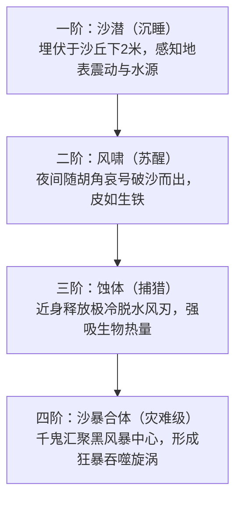

# 副本3：张掖将军——马踏飞燕

## 一、基础信息

| 项目 | 内容 |
|---|---|
| **副本编号** | 3/14 |
| **章节跨度** | 第 53 章 ~ 第 88 章（共 36 章） |
| **时代** | 东汉建初元年（公元 76 年）秋八月至十月（汉章帝即位之初，河西撤军与绝域守防的关键节点） |
| **地点** | 凉州河西走廊·张掖郡居延烽燧线至武威姑臧雷台要塞 |
| **核心事件** | **绝域孤军的死守与逆熵熔铸**：东汉明帝永平十八年北征匈奴设立西域都护，随后明帝崩逝、北匈奴反扑，汉军被围于疏勒城（耿恭）与柳中城（关宠）。汉章帝建初元年，朝廷下达撤回西域驻军诏令，河西走廊震荡。雷台守军（以“守张掖长/绝域校尉”为首）奉命扼守弱水咽喉，阻截匈奴“白灾”先锋与受地脉煞气侵蚀的死士。然而边地补给断绝，沙暴肆虐，士卒接连干涸异化。反派卢夏派遣暗桩破坏要塞熔炉地脉，企图让黄鬼吞噬最后汉军、夺取秦传国玉玺西北气运龙脉。将军带领全营残卒，集全军残存青铜兵刃与战马血魄，在绝境中逆天熔铸天马图腾【马踏飞燕】以镇压地脉，主角团必须在风沙绝域中协助完成逆熵平衡破局。 |
| **鬼怪类型** | **黄鬼（沙化干尸 / Dust Draugr）**：在河西极旱荒漠与因果煞气中脱水死去的古代士兵异化体。体内无血，充斥灼热细红砂；极度渴望生机水分与热量；接触活人瞬间造成“熵增脱水沙化”。白天潜伏于沙丘深处，黑风暴或夜间随军号鬼啸集体狂暴冲锋。 |
| **原著引子** | 《后汉书·耿弇列传附耿恭》：“恭以单兵固守孤城，当匈奴之冲……食尽穷困，煮铠弩食其筋革……吏士沦没，不堪其苦。” × 《汉书·礼乐志·天马歌》：“天马徕，从西极，涉流沙，九夷服。” |
| **国宝获取** | **铜奔马（马踏飞燕 / 鹰掠马真迹）**：东汉青铜力学与精神的巅峰孤品。 |
| **门票凭证** | **金石锈片**（取自铜奔马蹄下飞隼背部脱落的一丝带绿斑青铜碎屑，散发灼热阳刚之气，感应长安方向佛门法铃异动）$\rightarrow$ 副本4入场凭证。 |
| **核心机制** | **【热力学孤立系微观极速熵增】×【烽燧因果强观测光锥】**。主角团初入副本处于弱因果概率云状态（未被观测时免于风沙物理伤害）；一旦进入烽燧点燃的光辐射强观测区或与原住民产生宏观交互受力，将强行坍缩为可观测目标，被系统视为扰动变量并遭受因果排斥（瞬间体液蒸发、绝对脱水沙化）；将军颁布军令、全营歃血时全员显形为“绝域士卒”，直面真实生理绝境。 |
| **暗线** | 秦华作为反派顶级深潜暗桩，恪守卢夏“绝不擅动、全力潜伏”密令，多次以命相搏救助队友，甚至在城墙血战中替白艺挡下黄鬼沙化致命伤，极大加深全队对其信赖；要塞高炉破坏全由东汉先祖程延执行；秦华身份在此副本不仅毫无暴露，反而在顾君心中树立起崇高威信（疑点压至副本 6-8，大后期方暴雷揭底）；白艺首次携便携仪器记录下因果常数；老莫揭示雷台汉墓争议与陈寅恪考据背后的帝国边防代价；苏晚晴与张洋感情线经历生死考验逐步发酵。 |
| **“王栀之”角色** | **雷台要塞铁匠副官·程延（实为卢夏在东汉时代的伪装祖先线）**：表面竭力辅佐将军铸马，暗中在铜液中掺入阻碍相干态平衡的杂质石粉并卡死风阀，在终局对决中被顾君以代码逻辑比对物料收支揪出，秦华甚至主动协助将其制伏以绝后患。 |

---

## 二、八人战术编制与人物深度弧光

### 1. 核心入局幸存组（4 人生还）

| 角色 | 现代身份与特长 | 本副本核心任务与战术动作 | 角色弧光与心理暗线 |
|:---|:---|:---|:---|
| **顾君** | 领队 / 程序员排障思维 | 解构烽燧光锥时空视界；计算铜马力矩平衡点与浇铸时序；主导揪出熔炉破坏者程延。 | 兰亭手腕旧伤在白艺照料下包扎；在极旱环境中冷静依赖底层逻辑；目睹秦华舍身救下白艺负伤，彻底打消兰亭时的一丝违和感，对秦华产生极深厚的战友长兄信赖。 |
| **白艺** | 物理博士 / 理性量化派 | **首次携带便携微型物理探测套件**（数字磁强计、激光测距仪、红外热像仪）；量化孤立系熵增衰竭常数与退相干视界。 | 在兰亭经历洗礼后心境升华，深被顾君的决绝大义打动；两人感情在现实与险境中无声升温；在险些被黄鬼扑杀时被秦华撞开救下，深怀感佩。 |
| **秦华** | 自治区干部 / 反派顶级深潜暗桩 | 展现顶尖沙漠行军、野战工事构筑与刀盾格斗素养；关键时刻舍身救下白艺，左臂遭黄鬼沙化重创，浴血断后。 | **极深潜伏·信任神化**：恪守卢夏“绝不擅动、全力潜伏”最高密令。高炉破坏全由东汉先祖程延执行，秦华甚至大义凛然协助制伏程延并死守甬道，彻底洗脱兰亭的微弱违和感，在顾君心中树立起崇高威信（疑点延后至副本 6-8，大后期方暴雷）。 |
| **林栩** | 侦察兵退伍 / 边疆军事史博主 | 首次入局。精通两汉步骑阵法、环首刀与大黄弩机械力学；作为前卫尖刀拼杀黄鬼。 | 从初期的特战傲气与军事演习误判，到目睹规则杀后的重塑；在铜马失衡 3 毫米危局下，毫不犹豫将贴身佩戴的 48 克钛合金军牌投入马腹熔接定乾坤，成为生死铁核。 |

### 2. 留守现实后方支援组（3 人不入副本3）

- **张洋**：兰亭惨烈淘汰（目睹方远马川碎尸）引发重度急性应激障碍（PTSD），双手痉挛颤抖。顾君与秦华要求其在现实出租屋休养，负责在司隶校尉论坛监控舆情与异动。
- **老莫 (莫正阳)**：年逾花甲，兰亭大醮心力消耗过度，在现实中闭门调理，并在后方查阅整理西域都护府与居延汉简断代文献。
- **苏晚晴**：在现实中陪同照顾老莫，并主持文博考古研究所对两汉西北金石简牍的考据比对，为前线提供远程信息底座。

### 3. 首发淘汰路人组（4 人全数阵亡，揭示极旱大漠规则杀与残酷减员）

1. **程浩（32岁，资深高科技驴友）**：
   - **性格**：迷信现代高端户外装备与防风技术，遇险浮躁喧哗。
   - **死因**：夜半黄鬼围困烽燧时极度恐慌，违规点亮 2000 流明强光防爆手电筒干涉烽火强观测光锥，触发“脱水规则杀”，3 秒内毛孔向外喷发水雾汽化，眼球爆缩干瘪，骨骼脆断化为一具人形白砂（第一幕淘汰）。
2. **郑伟（40岁，西北地质勘探包工头）**：
   - **性格**：老油条、自负、烟瘾极大，对古人军令不以为然。
   - **死因**：耐受不住要塞断水绝粮的极致干渴，无视顾君“卤井有地脉煞毒”严厉告诫，深夜擅自潜入井底偷喝未经沙滤的苦咸卤水。高渗透压与煞气侵入微血管，全身毛细血管爆裂沙化，腹腔剧痛七窍喷砂暴毙（第二幕淘汰）。
3. **周斌（25岁，户外探险自媒体网红）**：
   - **性格**：贪图流量热度、投机取巧、心理素质极差。
   - **死因**：黑风暴全盲降临、万鬼围城时精神崩溃，尖叫着弃守城垣盲目向要塞外荒漠狂奔，瞬间脱离烽燧光锥庇护，被沙丘中潜伏的三头黄鬼拖入流沙坑中活活吸干体温撕裂（第三幕淘汰）。
4. **赵晓丽（28岁，商业徒步女领队）**：
   - **性格**：体力尚可但极易受幻觉误导。
   - **死因**：黄鬼借沙暴翻越土垒时，其耳膜被黄鬼摩擦产生的低频风啸催眠，误将冲锋的黄鬼当成现代救援搜救队而迎上前呼救，胸骨当场被黄鬼枯爪穿透，两秒内体液被彻底抽干沙化牺牲（第三幕淘汰）。

---

## 三、历史真实考据与学术支点

### 1. 雷台汉墓争议与“守张掖长”之谜
- **出土历史背景**：1969 年 9 月，甘肃武威县金羊公社雷台大队村民在挖防空洞时意外发现一座大型东汉砖室墓，出土了包括铜奔马在内的 99 件铜车马仪仗俑。
- **学术争鸣焦点**：
  - 墓室出土铜马胸前与马腹铭文刻有：**“张掖长守张掖武威绝域假司马”**、**“守张掖长”**；
  - **核心历史疑问**：为何官职为“张掖”的长官，其大型仪仗墓葬会出现在“武威”姑臧？
  - **正史深层脉络**：东汉经略西域时期，河西走廊屡遭羌乱与匈奴南下截断。守关将士常常“以少敌众，兼领绝域”。墓主正是当年奉命从张掖移防武威、孤军断后、战死荒塞的无名英雄；朝廷虽放弃西域，但边军将士以生命筑成了汉帝国的最后防线。

### 2. 居延汉简与汉代烽燧军事制度
- **汉简文书实录**：
  - 边塞以**“燧”**（烽火台）、**“障”**（小型城堡）、**“关”**形成纵深防御网络；
  - 烽火制度极其严苛：昼则举烟（名曰蓬），夜则点火（名曰烽）。遇胡寇数人至百人，举烽一柱；千人以上，举烽三柱，燔柴合积；
  - 汉兵编制：假司马、候长、燧长、伍长。军粮以穈粟为主，饮水全赖“天水”（积雪融水）或苦咸井。

### 3. 强汉军器考实
- **汉制环首刀**：百炼钢工艺，直刃单刃，厚背薄刃，配环首配重，劈砍力冠绝古代世界；
- **大黄弩与十石弩**：汉代床弩与蹶张弩，有效射程达两百步以上，贯甲杀敌，是汉军对抗游牧骑射的决定性科技碾压底牌。

---

## 四、理科规则与物理机制系统

### 1. 热力学孤立系统与微观极速熵增（绝对脱水）
- **物理数学模型**：
  $$\frac{dS}{dt} = \kappa_{\text{isolated}} \cdot \nabla^2 T + \sigma_{\text{desiccation}}$$
  在坍缩量子结界内，沙漠并非自然地理环境，而是一个受传国玉玺西北地脉残损扭曲的**微观高熵场**；
- 系统的自发趋势是不可逆地将一切有序结构（有机活体、水分子结合态）瓦解为无序自由粒子（风沙）；
- 活人在此环境中，水分散失速率是外界的数百倍。当未显形时，因处于概率云状态免于受力热交换；一旦显形或触发退相干，细胞渗透压瞬间归零。

### 2. 烽燧因果强观测光锥（Causal Light Cone）
- 汉代烽火不仅是燃烧，在此空间中被定义为**“宏观局域观测视界”**；
- 光子扩散的球面波前即为因果边界。任何进入该光锥的现代非守约实体，若无法提供与该时空匹配的因果标识（如汉军铜符、军籍木简），就会引发波函数强行坍缩，被时空曲率直接排斥抹杀。

### 3. 马踏飞燕的超绝力矩平衡与逆熵相干态
- **三维静力学与动力学奇迹**：
  - 铜奔马高 34.5 厘米，长 45 厘米，重约 7.15 公斤；
  - 三足腾空飞驰，仅右后蹄微点在一只疾掠展翅的飞隼（飞廉/龙雀）背上；
  - 其重心严格落在飞隼着力点的一根毫米级垂线上：
    $$\sum \mathbf{\tau} = \mathbf{r}_{\text{cm}} \times m\mathbf{g} + \mathbf{L}_{\text{dynamic}} = \mathbf{0}$$
- **破局逆熵意义**：
  - 在全域趋向熵增瓦解的沙暴结界中，这件青铜重器是全场唯一的**“力矩平衡与秩序锚点”**；
  - 将军与主角团合力以青铜熔铸天马，本质是用人类钢铁般的意志与精湛几何法则，人为创造出一个抵抗混沌地脉的“逆熵奇点”，从而撕开生门。

---

## 五、鬼怪与异象生态：黄鬼与黑风暴

### 1. 黄鬼（沙化干尸）的四阶生理状态



- **生理弱点**：
  - 惧怕刚阳烈火与军阵金石杀气；
  - 关节连接处虽硬实则脆，被环首刀精准斩击颈椎与膝关节可令其散架为一滩死砂；
  - 对王羲之《兰亭集序》真迹所散发的墨香意志有本能的畏惧退避。

### 2. 环境压迫机制
- **黑风暴（沙尘暴壁垒）**：风速超 12 级，夹杂金石碎屑，能见度不足半米，伴随强烈电磁与引力屏蔽；
- **断水绝粮困局**：井水苦咸含碱，需依靠苏晚晴推演的汉代简易蒸馏滤砂法取水。

---

## 六、场景地图与要塞空间布局

```
                       【北方：瀚海大漠·匈奴与黄鬼大营】
                                     │
                             (百里戈壁流沙陷阱)
                                     │
           ┌─────────────────────────┴─────────────────────────┐
           │                                                   │
     【左翼：居延一号烽燧】                             【右翼：弱水枯河障塞】
   (程浩规则杀发生地 / 观测视界)                     (引水暗渠 / 苏晚晴取水点)
           │                                                   │
           └─────────────────────────┬─────────────────────────┘
                                     │
                          【雷台中央军事要塞】
                ┌────────────────────┼────────────────────┐
                │                    │                    │
          【西侧甲胄兵器库】    【中央校场烽火台】   【东侧青铜熔铸高炉】
          (林栩寻获环首汉弩)   (将军拔剑歃血显形)   (程延破坏风道/林栩铸马)
                │                    │                    │
                └────────────────────┴────────────────────┘
                                     │
                         【地下中枢：雷台汉墓前身】
                   (99件铜车马原位基座 / 终极生门闭环)
```

---

## 七、伏笔总账与道具资产矩阵

| 编号 | 道具 / 伏笔事件 | 埋设位置 | 推进形态 | 终极回收方向 |
|:---|:---|:---|:---|:---|
| **FB3-01** | **白艺便携物测仪** | Ch 54 展开测试 | 测出沙暴区磁偏角异常与高熵常数 | 证实副本空间为量子微观孤立系，为后续大唐副本提供数据积累。 |
| **FB3-02** | **程延暗留的诡异青铜镞** | Ch 65 苏晚晴捡获 | 镞身带有非正规官炉的异样刻划与密道印记 | 成为顾君排障锁定铁匠副官程延内奸证据的铁证；秦华主动协助排查，更加洗白自身。 |
| **FB3-03** | **居延汉简断代谜团** | Ch 58 老莫研读 | 简牍字迹同时出现“建初”与“永元”年号拼合 | 揭示结界非单一时空，而是被反派卢夏强行缝合的历史断层。 |
| **FB3-04** | **苏晚晴金石护身符** | Ch 72 赠予张洋 | 西域绿松石与汉代五铢钱编织绳结 | 张洋生死血战中凭此挡住黄鬼致命沙化穿刺，感情线实锤。 |
| **FB3-05** | **铜奔马力矩配重块** | Ch 81 铸造关头 | 熔炉杂质导致马腹空腔重心偏移 3 毫米 | 顾君现场修改代码模型，林栩掷入贴身军牌补足重心配比，完成闭环。 |
