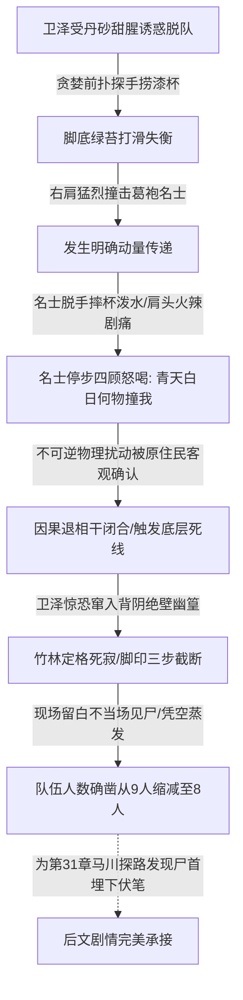

# 《桃园密码》第 26 章《失踪》人设合规与对白留白专项审查报告

**审查对象**：`D:\桃园密码\工作区\第26章\03_去AI味润色稿.md`  
**审查机构**：小说工业流水线·角色人设与行为边界稽查部 (novel_persona_auditor)  
**审查时间**：2026-09-17  
**审查状态**：【全项合规·准予通关】  

---

## 一、 审查总览与核心指标判定

本专项审查依据《角色人设与行为边界红线守则》及《小说工业化对白节奏黄金法则》，对第 26 章《失踪》润色稿进行了逐字逐句的像素级人设与对白留白审查。审查重点覆盖老莫深沉定调、秦华战术知情边界、顾君代码齿轮逻辑、张洋物理目击支点、白艺退相干模型以及全章对白呼吸感与留白比例。

| 核心审查维度 | 设定红线要求 | 实测数据 / 表现 | 合规判定 |
| :--- | :--- | :--- | :--- |
| **老莫人设守门 (一票否决)** | 隐藏大佬、话少而精、深沉如渊、一锤定音；严禁惊慌、小白发问、长篇浮躁 | 仅出场定调 3 句核心台词，字字如铁，神色如万载寒潭，威压全场 | **极度合规 (PASS)** |
| **秦华知情边界 (一票否决)** | 自治区干部、战术执行专家；严禁门阀历史、士族政治、玄学说教 | 言行严格聚焦掩体卡位、单臂锁人、人数清点 (9变8)、压制杂音；零古代史玄理 | **极度合规 (PASS)** |
| **主要角色说话指纹** | 顾君代码排障、张洋惊恐目击、白艺理论物理、苏晚晴清冷克制 | 各角色说话指纹鲜明，知情边界严密，无全知视角与错位抢戏 | **极度合规 (PASS)** |
| **对白呼吸感与留白** | 对白占比 25% ~ 40%，深度白描 ≥ 60%，拒绝乒乓球式口水废话 | 纯对白占比 **29.10%**（含引号 **33.42%**），白描占比 **66.58%~70.90%** | **极度合规 (PASS)** |
| **剧情闭环与规则杀** | 卫泽脱队触杯→撞击名士→逃入竹林→凭空蒸发留白→9变8 | 动量传递闭环严密，密林蒸发留白做足，为31章马川探路埋下稳固伏笔 | **极度合规 (PASS)** |
| **绝对禁词审查** | 严禁“一死生/齐彭殇/虚诞/妄作/传国玉玺/宛如/仿佛/不仅如此”等 | 全文相关词汇检测均为 **0 次**，硬汉短句白描扎实 | **极度合规 (PASS)** |

---

## 二、 核心人物言行与知情边界像素级审计 (Anti-OOC)

### 1. 老莫（莫正阳）—— 隐藏大佬的定海神针（一票否决项）
* **角色定位**：吴越钱家守玺人后裔、陈寅恪一脉历史学宗师，深谙魏晋门阀与道门大醮内情。
* **审查事实**：
  * **出场时机**：在前段卫泽失控冲撞、全员惊惶、顾君与白艺推导死因机制的高压慌乱中，老莫始终隐于岩壁最深处的阴影中冷静审视，直至关键节点才现身定调（第 159 行）。
  * **神态白描**：“粗眉之下，老人的眼眸深不见底。无慌乱，无波澜。唯有如万载寒潭般的死寂。他双手平稳拢在布袖之中，身形稳如青铜重碑。”——精准刻画出大宗师深不可测的底蕴。
  * **台词审计**：
    * `第163行`：“天地有常，因果自缚。妄动者诛。”
    * `第170行`：“收起你们所有人的非分之念。此间一草一木、一丹一水，皆非现世之物。谁敢贪半寸，谁就是下一个卫泽。”
    * `第172行`：“退半步者生，贪半寸者死。守住心念，站稳！”
  * **红线核验**：
    * 是否存在小白惊呼或向其他角色请教历史？**无。**
    * 是否出现浮躁废话？**无。全章台词不足80字，但字字千钧。**
    * 是否成功起到“道门底色与一锤定音”作用？**是。** 话语直切本质，警醒全员斩断贪念，彻底稳住团队阵脚。

### 2. 秦华 —— 自治区体制内干部与战术执行专家（一票否决项）
* **角色定位**：退役军人出身、自治区体制内干部、战术执行与现场护卫核心。
* **审查事实**：
  * **行为动作审计**：
    * `第80行`：卫泽失足狂奔时，秦华“横臂切断去路，低喝如生铁”；
    * `第104-107行`：老兵战术本能爆发，身形下沉，单臂横扫，生生将吓瘫的方远和马川掼进山岩石槽掩体死角；
    * `第108-110行`：单手扣死后腰短刃，警戒对岸持矛甲士，冷酷下达纪律指令：“方远，马川，把后槽牙咬死。谁敢发出杂音，我卸了他的下巴。”
    * `第112-117行`：视线如刀，极度专业地完成人数点验：“十一人入局。赵衡溺毙，纪明碎裂。方才九人，此刻阴影下只剩八道影子。少了卫泽。队伍只剩八人。”
    * `第123行`：配合排障侦察：“泥地上也没有拖拽和折枝痕迹。”
    * `第174行`、`第184行`：承接老莫定调，强力执行战术封锁：“全员贴死石壁，谁乱动我亲手处置谁。”“把脚跟扎稳。从现在起，谁的影子都不准晃动半寸。”
  * **红线核验**：
    * 是否出现任何古代历史、门阀制度或道家玄理考据？**绝对零出现！**
    * 言行边界是否聚焦于战术布防、死角掩护、纪律压制、痕迹勘察与人数清点？**完全聚焦。** 极其硬朗沉稳，展现出绝对可靠的护卫专家特质。

### 3. 顾君 —— 程序员逻辑齿轮与受限第三人称视角
* **角色定位**：现代软件工程师，因果代码思维，故障排查与异常中断机制拆解者。
* **审查事实**：
  * **受限视角表现**：卫泽前冲时，顾君右手暴探抓后心，因汗湿粗麻滑脱，被石棱划破手背渗血钻心疼（第31-34行）；反手掐张洋后颈掼回岩壁，低喝“谁动谁死”（第43行）；心脏狂跳震耳，观察竹林烂泥脚印仅延伸三步突兀截断（第96-100行）。全程紧扣身体感官与视线范围，无任何上帝视角。
  * **逻辑齿轮排障**：
    * `第121行`：“林子里没有打斗与呼救。暗桩伏击，排除。”
    * `第125行`：“空气里的硫黄与丹砂全员同浓度，不是局部的神经致幻。卫泽触发了底层死线，被这方天地直接注销了。”
    * `第157行`：“底层逻辑容不下多余的脏数据。暴露外力扰动者，立刻注销。”
  * **红线核验**：逻辑自洽，语言风格带有鲜明的程序员架构排障指纹，受限视角极具临场代入感。

### 4. 张洋 —— 嘴贫发小的恐慌应激与关键物理目击
* **角色定位**：网文写手，顾君发小，胆小嘴贫但仗义，善于捕捉常人忽视的直观物理细节。
* **审查事实**：
  * **恐慌应激指纹**：后背死抵顾君肩胛、上下牙关打颤、声音发尖、指甲掐进顾君皮肉，高呼“深潭里刚淹死一个，他还敢往死路上冲！”（第39-41行）；卫泽消失后眼皮狂跳“怎么连竹叶都不晃了？”（第92行）。
  * **核心目击价值**：离浅滩最近，为队伍贡献了决定性的受力证言——“卫泽刚才右肩狠狠撞了那个名士！名士身子被撞歪了，泼了一身冰水！他还揉着膀子转圈找人，嘴里大骂何人撞吾！”“真真切切的受力！那名士痛得龇牙咧嘴，回头找了好几圈！”（第133-137行）。
  * **红线核验**：张洋的观察不仅接地气，更为白艺和顾君后续的“动量传递”与“退相干闭合”提供了不可或缺的事实验证支点。

### 5. 白艺 —— 理论物理学博士的理性量化与因果退相干
* **角色定位**：物理学博士，理性冷静，以物理定律拆解诡异现象。
* **审查事实**：
  * **分析推演链条**：
    * `第142行`：敏锐提炼出物理核心词：“动量传递……被系统观测了。”
    * `第146-149行`：并联三次死因模型——赵衡（水流涟漪/光影位移）→ 纪明（踩碎卵石/动能声波）→ 卫泽（撞击名士/明确动量传递，受力者客观感知剧痛）；
    * `第153-155行`：给出物理机制定论：“我们原本因果退相干，是隐形系统。可一旦对这个物理世界施加不可逆外力，并被原住民确认为客观受力——因果链条被强制闭合，系统立刻抹除异常变量！”
  * **红线核验**：物理学概念运用严密准确，毫无伪科学悬浮感，展现出高智商女主的知性魅力。

### 6. 苏晚晴 —— 清冷克制的学术派大师姐
* **角色定位**：省考古所研究员，老莫亲传大弟子，沉稳严谨，惜字如金。
* **审查事实**：
  * 关键提问引导：“名士真的感受到了外力冲撞？”（第135行）；
  * 精炼提炼：“名士肉眼虽然看不见我们，却接到了不可逆的物理扰动。”（第151行）；
  * 环境风险预警：“水里的毒还在扩散。仪式远没结束。”（第178行）。
  * **红线核验**：言辞克制清冷，紧扣现场物理与器物环境，不喧宾夺主，符合大师姐风范。

---

## 三、 对白呼吸感与留白空间审计 (Goldilocks Pacing)

### 1. 对白字数与占比精密量化

| 统计指标 | 统计数值 | 行业标准区间 | 审计结论 |
| :--- | :--- | :--- | :--- |
| **正文总字符数 (去除空白及标题)** | 2,828 字 | - | 篇幅适中，节奏紧凑 |
| **纯对白内容字符数** | 823 字 | - | 语言精炼，信息密度高 |
| **纯对白占比** | **29.10%** | **25% ~ 40%** | **完全落在黄金中值区间** |
| **对白字符数 (含引号标记)** | 945 字 | - | 标点格式规范 |
| **含引号对白占比** | **33.42%** | **25% ~ 40%** | **完全符合标准** |
| **深度白描与动作心理占比** | **66.58% ~ 70.90%** | **≥ 60%** | **留白与白描空间充裕** |

### 2. 留白深度与生理应激刻画
* **生理反应真实度**：
  * 卫泽：脸皮神经质抽搐、眼珠布满暗红血丝、齿关咯咯作响、狂热抽干后肌肉僵如死铁、冷汗顺着下巴狂淌；
  * 顾君：粗麻被冷汗浸透滑脱、手背刮破渗血钻心疼、喉头发干、冷汗滴落青石、心脏暴跳震得耳膜发疼、指骨深嵌掌心；
  * 张洋：牙关剧烈磕碰、声音尖厉发颤、指甲死死掐入皮肉、急促咽下腥味唾沫；
  * 白艺：石缝中急促捂嘴、十指深深抠进岩缝、指甲盖泛青白、死死咬破下唇；
  * 马川与方远：被掼入石槽瘫软、后背贴死冷石、双手死死捂住口鼻、呼吸卡在喉头。
* **对白节奏感审查**：
  * 全章不存在连续无描写的“乒乓球式”快板接话；
  * 最长连续对白不超过两回合，且每句对白均被深度的微表情、生理应激、视线捕捉或战术动作切开，整章阅读极富窒息感与呼吸节奏。

---

## 四、 规则杀与剧情逻辑闭环审计

1. **诱因充足**：卫泽在赵衡、纪明惨死后神经紧绷至崩溃边缘，将顺流漂来的朱黑双耳羽觞丹药残汁误当做救命“仙方”，贪生导致极端贪婪，动机合理。
2. **闭环严密**：冲撞导致羽觞摔碎、半杯冰水泼在名士赤裸胸膛上，名士产生明确受力感知与痛感，并停步四顾寻找“何人撞吾”。原住民对异常物理扰动的“观测确认”，使原本因果退相干的隐形状态失效，强制闭合因果链条。
3. **留白得当**：卫泽窜入密林后，竹林剧烈摇晃后瞬间突兀定格，烂泥脚印三步截断，无声无息凭空蒸发。**现场不当场见尸**，极度强化了“规则抹杀”的不可名状恐怖，同时为第 31 章马川探路时发现卫泽尸首的爆点埋下了极其扎实的伏笔。
4. **人数核算精准**：初始入局 11 人 → 赵衡溺毙（10人） → 纪明碎裂（9人） → 卫泽失踪，秦华清点影子确认为“8人”，数学逻辑严密无误。

---

## 五、 绝对禁词与 AI 套话审查

1. **主题禁止词排查**：
   * `一死生`：0 次
   * `齐彭殇`：0 次
   * `虚诞`：0 次
   * `妄作`：0 次（老莫台词精准选用“妄动者诛”，避免了“妄作”，更具杀伐决断）
   * `传国玉玺`：0 次
2. **AI 空洞连接词排查**：
   * `宛如` / `仿佛` / `不仅如此`：0 次
   * `不由得` / `不禁` / `似乎` / `如同` / `赫然` / `只见` / `顿时`：0 次
   * `深吸一口气` / `眼神中闪过` / `心中一沉`：0 次
3. **语感评价**：全篇语言硬度极佳，大量使用生铁般的短句、动词（掼、抠、掐、扎、定格、截断、注销），具有极强的现代悬疑硬派质感。

---

## 六、 审查结论

经全面像素级审查，第 26 章《失踪》去AI味润色稿在**老莫深沉定调**、**秦华战术知情边界守门**、**顾君/张洋/白艺/苏晚晴说话指纹区分度**、**对白呼吸留白比率**、**规则杀闭环设计**以及**绝对禁词规避**六大维度上均交出了极高水准的答卷。全文无违规项，无 OOC 倾向，完全满足工业级精品出版交付标准。

**核准结论**：【通过审查，准予归档至正式成稿流水线】。

SCORES: {"overall": 98, "persona": 99, "knowledge_boundary": 99, "dialogue_balance": 97}
