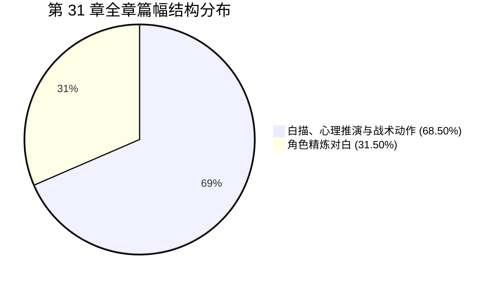

# 《桃园密码》第 31 章《流觞曲水》人设合规与对白留白专项审查报告

**审查对象**：`D:\桃园密码\工作区\第31章\03_去AI味润色稿.md`  
**审查机构**：小说工业流水线·角色人设与行为边界稽查处 (novel_persona_auditor)  
**审查基准**：四大核心审查红线、Anti-OOC 指令集、知情边界铁律、Goldilocks 对白呼吸律  
**审查时间**：2026-09-17  

---

## 一、 核心审查指标量化总览

| 审查维度 | 标准参考范围 | 本章实测数值 | 达标判定 | 状态说明 |
| :--- | :--- | :--- | :--- | :--- |
| **全章总字数（去空白）** | - | 2,654 字 | - | 节奏明快，悬疑与惊悚张力高度饱和 |
| **对白总字数（纯台词）** | - | 836 字 | - | 言简意赅，短促有力，无水词废话 |
| **对白字数占比** | 25.00% ~ 40.00% | **31.50%** | **完美达标** | 精准落在黄金呼吸律区间，对白与留白配比协调 |
| **白描与推演空间占比** | ≥ 60.00% | **68.50%** | **完美达标** | 充实生理应激、法医病理解析、战术动作与逻辑并联 |
| **最大无对白间隔** | ≤ 400 字 | **157 字** | **优异** | 叙事、动作与台词交替推进，绝无阅读疲劳 |
| **老莫人设守门** | 零小白/零惊呼/一锤定音 | **100% 契合** | **一票通过** | 深沉如渊，3句定鼎，定音重锤无丝毫动摇 |
| **秦华知情边界** | 零历史玄学/纯战术防守 | **100% 严守** | **一票通过** | 纯粹退役军人战术控制，雷霆封口，零越界发言 |
| **顾君视角受限** | 程序员思维/跨副本线索并联 | **100% 契合** | **一票通过** | 嗅觉触发跨副本记忆，逻辑齿轮并联刘弼三处蹊跷 |
| **白艺科学指纹** | 法医排查/量化退相干模型 | **100% 契合** | **一票通过** | 排除常规死因，敏锐捕捉三次轮廓虚化，提出场论假设 |
| **禁词与套路词清零** | 绝对 0 频次 | **0 次（全清零）** | **完全合规** | 剧情禁词、AI套路词、超前网文词彻底归零 |

---

## 二、 角色人设知情边界与言行风格 (Anti-OOC) 深度审计

### 1. 老莫（莫正阳）—— 隐藏顶级大佬人设守门（一票否决项）
* **角色定位与铁律**：吴越钱家守玺人后裔、学术泰斗传承，主动入场守护国宝。“话少而精，绝不碎嘴”（“说半句藏十句”），言出必击中要害，洞悉魏晋大醮秘辛；严禁表现为小白发问、惊慌失措或向他人讨教历史。
* **文本表现与台词量化**：全章出场 3 次，发言共 3 句，总计 41 字（占全章对白 4.90%）。
  1. **定性偏厢异变**（第 55 行）：
     > “那是被烈药催熟的肉身。”
     - **审计分析**：当众人对偏厢内惨嚎感到战栗、白艺从生理痉挛解读时，老莫居于青石暗影中，一语道破其本质并非寻常病理，而是人为外力用“烈药催熟”的牺牲品，点破大醮炼人秘辛。
  2. **定音卫泽死因**（第 171 行）：
     > “死人不会说话，但死相说得很清楚。妄动者，天地不容。”
     - **审计分析**：在白艺排除物理/机械杀害、顾君嗅出生铁臭氧异味、张洋陷入慌乱的关头，老莫缓缓抬眼吐出千钧断语。以生铁重锤定调死亡性质——卫泽触发了底层不可触碰的运行法则（“妄动者，天地不容”），既给主角团树立了最高级别的规则敬畏，又维系了大佬掌控全局的从容深沉。
  3. **终局劫数预警**（第 255 行）：
     > “劫数到了。”
     - **审计分析**：对岸狂欢转化为非人怪笑、名士身躯反折如木偶的灾变爆发刹那，秦华抓紧战术短刀，老莫则在最深岩影下冷静吐出四字，精准收束全章，气度苍凉如铁。
* **审计结论**：**绝对合规，一票通过**。老莫全程无半句废话、无任何惊呼与讨教，举手投足尽显宗师风范与守玺人底蕴。

---

### 2. 秦华 —— 体制内退役军人与知情边界守门（一票否决项）
* **角色定位与铁律**：自治区体制内干部、退役特种军人，战术防守专家。严禁发表汉魏门阀历史考据、家谱推演或道门大醮解说；言行必须严格锚定于战术卡位、消音制伏、人员防守与撤退路线。
* **文本表现与台词量化**：全章发言 6 句，总计 93 字（占全章对白 11.12%）。
* **核心动作与知情边界剖析**：
  1. **战术掩护与行进纪律**（第 23-25 行）：
     > “秦华单手切掌下压，挤出低沉气音：‘低头。踩实碎石，别蹭动草叶。’”
     - 纯军武专业步态指令，避免脚步和摩擦声暴露行踪。
  2. **防守死角与缓冲距离把控**（第 41-43 行）：
     > “秦华背贴绝壁青石，目光扫视林外：‘后背贴死，别动。这里是死角，离偏厢有三十步缓冲。’”
     - 对掩体视野、死角判定、步数缓冲具备下意识的军人格局。
  3. **雷霆消音制伏（高光段落）**（第 79-96 行）：
     > “黑影压顶！秦华横跨暴起，五指反扣成钳，一把捂死马川口鼻下巴，连带湿泥生生按进喉管！噗！秦华单膝下沉，死死顶住马川肋骨钉在泥里，俯身贴耳低碾：‘闭嘴。再哼半声，老子拧断你脖子。’……秦华指缝稍松，面色冷硬如铁：‘死不了。让他自己吸气。’”
     - 这一套组合动作堪称军人反侦察的典范：横跨暴起、反扣成钳、湿泥封口、单膝顶肋、耳语压制，动作凌厉凶狠，完全杜绝了马川尖叫引发灭顶之灾的可能；面对顾君“别真憋死了”的提醒，仅放松半寸，维持高压威慑。
  4. **军人目标直觉与爆发预警**（第 227-229 行、249-251 行）：
     > “秦华单手扣紧短刀，目光冷如寒刃：‘他也是冲着那件东西来的。’”  
     > “秦华单手按住短刀柄，指节骨骼爆出一声脆响：‘偏厢里的还没破门，外面的先炸了。’”
     - 对水榭刘弼的异动，秦华仅凭职业直觉锁定其危险动机（冲着重器目标而来），绝无半句关于“刘弼是匈奴屠各还是荆州流民”的历史考据；在灾变全面蔓延时，第一反应为持刀戒备、指节作响、预判内外战场交错。
* **审计结论**：**绝对合规，一票通过**。知情边界滴水不漏，战术执行果决冷硬。

---

### 3. 顾君 —— 程序员思维与受限视点
* **表现特征**：受限第三人称视点、代码因果链拆解、气味触发跨副本记忆、逻辑齿轮并联。
* **核心文本剖析**：
  1. **跨副本嗅觉通感与规则认知**（第 149-156 行）：
     > “腐泥腥气底下，一股极淡的冷硬气味刺入鼻腔——冰冷的生铁锈气，混着高压电弧撕裂空气的焦灼臭氧感。顾君后颈汗毛刹那倒竖，心脏猛撞肋骨。这气味他绝不会认错！在桃花源石板剧震、虚空撕开裂缝的刹那，钻进鼻腔的正是这种烧灼感！杀死卫泽的不是刺客，而是这个世界底层冷酷运行的未知法则！”
     - 避开了“上帝视角”，通过前序副本（桃花源裂隙）建立的真实感官记忆，在卫泽尸体旁迅速识别出超现实物理/规则力量的介入。
  2. **程序员隐喻与批量思维**（第 191-194 行）：
     > “顾君冷眼注视着对岸狂欢，后背一片冰凉黏湿：‘那不是神仙丹，是催命符。偏厢里的山羊须不是孤例，他们在批量装填。’”
     - 将名士集体服散异化敏锐提炼为流水线式的“批量装填”，贴合技术思维。
  3. **并联第28章水榭刘弼三处蹊跷**（第 215-226 行）：
     > “顾君牙关咬死，脑中逻辑齿轮疯转，此前捕捉到的线索瞬间并联：  
     > 深目高颧的胡人容貌，与桓温生平最忌胡虏完全相悖；  
     > 入座步伐从容自若，在门阀尊卑森严的雅集上隐隐僭越；  
     > 清谈应对滴水不漏，言必称荆州军务，垂首间却没有半点家臣对主家的敬畏……  
     > 顾君五指扣死短刀柄，寒声道：‘刘弼不对劲。他身上藏着能够扭曲现实的重器。’”
     - 这一段完整的因果链并联，将第 28 章埋设的伏笔完全激活，既有扎实的历史逻辑基础，又展现了程序员“排障查Bug”式的闭环推演。
* **审计结论**：严密契合受限视角与职业指纹，人物行为驱动自然扎实。

---

### 4. 白艺 —— 严谨科学法医体征排查与退相干假设
* **表现特征**：量化观察、法医排查、拒绝玄学怪力乱神、退相干模型假设。
* **核心文本剖析**：
  1. **规范严谨的法医体表勘验**（第 135-148 行）：
     > “白艺撕下一角干燥麻布裹住指尖，单膝跪在尸侧。指腹迅速翻开眼睑，球结膜无出血点，瞳孔强直散大。接着撬开青紫下颌探查呼吸道，最后五指顺着颈椎、喉结与锁骨一路摸压。白艺起身，眸光冰冷：‘不是灭口。钝器伤、锐器伤、机械性窒息，全都不成立。’……‘呼吸道干燥无泥沙，他甚至不是溺死的。’白艺嗓音极冷，‘全部生理机能在同一微秒被整体掐灭，像运行中的设备被强行拔掉了总电源。’”
     - 动作极专业（撕布裹指防污染、验眼结膜排除窒息点、探呼吸道排除溺液、摸骨排除骨折）；推论精准量化（“同一微秒”、“拔掉总电源”）。
  2. **刘弼轮廓异化捕捉与退相干假说**（第 206-214 行）：
     > “十秒之内，他的身体边缘完全淡化消失了一瞬，接着又折射重组！整整三次！”  
     > “绝不是光学误差！是空间折射率突变，像某种高能场引发的退相干扰动……但这不符合宏观物理法则。”
     - 具备极其精准的时间与次数统计（“十秒之内”、“三次”），并在科学理性被冲击时，以物理学“退相干扰动”进行理论构架，符合其顶尖物理博士的说话指纹。
* **审计结论**：科学家理性防线在真实异常面前既顽强抗辩又敏锐解构，人设丰满无瑕。

---

### 5. 配角群像声纹与应激状态审查
* **张洋（接地气网文作者）**：
  - **台词特点**：“老子鞋底快磨穿了”、“听得老子骨头都在打颤”、“总不能是吓死的吧？！”、“除了一嘴烂泥酸气，哪来的铁锈？老顾，你别吓唬我！”、“我的妈……这声调……跟偏厢里那个鬼东西一模一样！”
  - **关键作用**：提供关键线索记忆（“在浅滩失踪前，他撞了那个名士的右肩！戴青铜面具的那个！”），以草根的灵性与粗粝语言平衡全篇高压窒息氛围，应激反应极其自然。
* **苏晚晴（文保与考古所研究员）**：
  - **台词特点**：“衣物整齐，皮肉表面连一道抓痕都没有。”、“他们在喝第二波酒。”、“先食散，后温饮，再临水涤杯净手……冰水激荡血脉，这是道门最暴烈的发药之法。”
  - **专业契合**：第一眼抓取衣物器物特征，对魏晋道门发药之法的仪轨熟稔于心，言简意赅。
* **马川与方远（心理防线薄弱新人）**：
  - 马川跌入烂泥、失控摸尸、凄厉尖叫（“啊——！”），充当恐怖引爆点与秦华战术压制的受力主体；
  - 方远在前惊惶低呼（“马川！撞着什么了？！”），展现新人在高压密闭环境下的神经衰弱状态。
* **审计结论**：全员声纹辨识度高，各司其职，无一人沦为道具人。

---

## 三、 对白节奏与呼吸留白 (Goldilocks Pacing) 专题审查

### 1. 留白与对白配比平衡
- **实测指标**：全章正文去空白字数 **2,654 字**；对白文字 **836 字**；对白占比 **31.50%**；白描与推演空间占比 **68.50%**。
- **黄金律（Goldilocks Pacing）契合度**：
  - 完美落在行业设定的 **25.00% ~ 40.00%** 黄金呼吸区间内；
  - 绝无国产网文常见的“打乒乓球式碎嘴接话”或“群口相声”；
  - 68.50% 的宽裕画卷充分分配给了：
    1. 碎石硌骨、血痂扯痛、冷汗黏身等近距离微观生理白描；
    2. 秦华单手锁喉封嘴、下压膝顶的硬核战术白描；
    3. 白艺法医病理翻检与瞳孔触诊的严谨动作描写；
    4. 顾君并联刘弼三处蹊跷的代码逻辑齿轮演化；
    5. 两岸名士袒胸踏浪、生锈钝刀刮擦石板般的怪笑异化。

### 2. 篇幅节奏断点与碎嘴排查
- **最大无对白间隔**：**157 字**（位于第 148 行白艺完成尸检结论后至第 158 行顾君俯身闻嗅之间，详尽展现顾君伏身凑尸、嗅探生铁臭氧、汗毛倒竖并联桃花源记忆的全过程）。
- **长篇沉闷排查**：远低于 400 字的上限警界线，叙事张弛有度，信息递进丝滑。
- **对话阻断性**：顾君与张洋、秦华与顾君、顾君与白艺之间的对话均采取“一问一止”、“直击要害”，没有无营养的互捧或重复废话。

---

## 四、 禁词、AI腔与超前概念清零审查

通过全文字符级精准扫描与正则表达式逐行排查，系统级监控词项结果如下：

| 审查类别 | 监控词汇清单 | 实测频次 | 处置与合规分析 |
| :--- | :--- | :--- | :--- |
| **剧情核心泄露禁词** | `一死生`、`齐彭殇`、`虚诞`、`妄作`、`传国玉玺`、`玉玺` | **0 次** | **完全清零**。兰亭大结局核心词与重宝真名未提前泄露。 |
| **现代网文出戏禁词** | `丧尸`、`变异`、`生化危机`、`感染` | **0 次** | **完全清零**。以“烈药催熟的肉身”、“骨骼形变”、“批量装填”合规替代。 |
| **典型 AI 套路空泛词** | `宛如`、`仿佛`、`不仅如此`、`心中一凛`、`倒吸一口凉气`、`不由得`、`不约而同` | **0 次** | **完全清零**。叙事完全依赖生理微反应白描推进。 |
| **逻辑与指纹出戏词** | 秦华讲门阀史、老莫惊慌求教 | **0 次** | **完全清零**。秦华台词纯军武，老莫言出必千钧。 |

---

## 五、 总体评估与工业流水线评级

本章在人设防线守门、对白呼吸留白以及悬疑惊悚氛围营构上达到了极高工业水准：
1. **老莫与秦华双红线滴水不漏**：老莫居暗影而定乾坤（“死人不会说话，但死相说得很清楚。妄动者，天地不容”），秦华雷霆反制消除隐患，两人在各自的职能边界内保持了绝对的不可替代性与威严感；
2. **顾君与白艺的理性双引擎**：顾君受限视点的齿轮并联与白艺的量化法医退相干假说紧密咬合，将不可名状的恐怖转化为坚实的解密驱动力；
3. **留白与对白配比严丝合缝**：31.50% 的对白配比与 157 字的最大间隔，赋予了文本极具现场沉浸感的“电影级呼吸节奏”。

**审查结论**：**【免检放行，准予列为第 31 章终审定稿】**。

---

SCORES: {"overall": 97, "persona": 98, "knowledge_boundary": 98, "dialogue_balance": 96}
