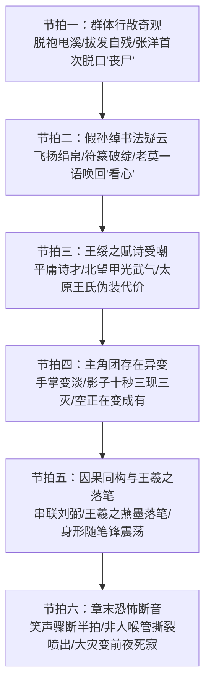

# 第32章《群贤毕至》前情探索与前置状态对齐任务卡

---

## 一、前章结尾事实总账与物理状态对齐 (Chapter 31 Ending Continuity Ledger)

### 1. 物理环境与时空坐标
- **精确时空坐标**：东晋穆帝永和九年（公元353年）三月初三，午后未时（约 13:00 ~ 13:45）。
- **光影与天象特写（毫厘不差接续第31章末尾第240-258行）**：
  - 正午炽烈的大日光轮开始朝西南倾斜，但斜照的日头依然酷烈刺白，惨白的光柱如泼洒的滚沸银浆，斜打在曲水乱石滩与嶙峋水榭之上；
  - 溪水湍急奔流，翻腾的雪白浪花与水面上无数细碎耀目的“浮金碎影”交织晃荡，直刺人眼；
  - 水汽蒸腾，带着浓烈熏鼻的熟艾、生硫黄、雄黄、朱砂与温热醇酒的甘甜腥气，在背阴处与腐烂竹叶的阴冷酸气死死胶着；
  - 偏厢沉重的木门死死锁闭，此前抽搐变异的山羊须被关在门后，门缝内幽暗幽冷；而曲水两岸的喧嚣沸反盈天，彻底淹没了偏厢内的隐患。
- **仪式动态临界点（群体行散全面爆发）**：
  - 朱黑双耳漆羽觞在湍急白沫中接连打旋顺流，穿行于两岸怪石之间；
  - 岸边数十名衣冠名士在经历“第二波以酒服散、临水涤杯净手”后，烈性药力借由冰水与体热迎头冲撞，药效全面发作；
  - 名士们不仅未觉异常，反而陷入群体病态狂欢——袒胸露腹、扒袍甩溪、披发赤足在鹅卵石滩上疯癫狂奔，高呼“合乎道法”、“大行之象”，整个会场彻底沦为荒诞而可怖的人形熔炉。
- **主角团潜伏动线与掩体坐标（对岸幽篁苦竹石沟）**：
  - 8人小组严格潜伏于曲水对岸的幽篁苦竹石沟之中，背贴湿冷高耸的深峭绝壁青石；
  - 此处为视线死角，苦竹密匝如铁栅，遮蔽天光；脚下是积年的发霉黑泥与腐烂竹叶，空气阴冷刺骨；
  - 与对岸主会场隔着宽约数丈的奔涌急流与漫天水雾，与关押山羊须的偏厢保有三十步以上的安全战术缓冲；
  - **卫泽尸体现场对账**：卫泽冰冷僵硬的尸体依然仰面瘫在队伍身后的乱草泥洼石缝中，双目暴突圆睁，双手僵死成横架胸前的防御姿态，周身散发着极淡的冷生铁锈与焦灼臭氧异味，无声提醒着不可触碰的底层规则。

### 2. 主角团存活编制连续性对账（严格保持 8 人）
- **入场总编制 11 人，已减员 3 人（事实铁账，严丝合缝）**：
  - **第18章**：赵衡擅自拔起悬空火把，因改变物理动量被原住民察觉，触发规则杀溺亡；
  - **第20章**：纪明在仓皇奔逃中踏碎乱石发出机械动能噪音，被原住民察觉，触发规则杀暴毙；
  - **第26章**：卫泽涉水冲撞名士右肩，名士感到外力并察觉异样，触发规则杀抹杀（留尸于石沟深草，已于第31章被马川触碰发现并经白艺排查）。
- **当前 8 人存活编制与战场物理/心理状态核算**：
  1. **顾君（受限第三人称视点、推演中枢、代码排障思维）**：
     - *物理状态*：右手背擦伤血痂干硬紧绷，粗麻单衣被泥浆和冷汗浸得透湿贴肉，瞳孔因强光与幽暗反复切换而微酸刺痛；
     - *心理与算力*：大脑如超频运算的底层排障引擎。牢记卫泽身上的生铁臭氧味，全神贯注凝视主会场；本章中第一个察觉到自身手掌在强烈日照下边缘淡化变虚，并由白艺测得影子闪烁，锁定王羲之落笔的因果同构。
  2. **老莫（莫正阳·定盘神针·吴越钱家守护者·隐藏顶级大佬）**：
     - *物理状态*：深灰麻袍下摆沾满湿泥，背靠青石暗影，双臂深拢于袍袖内，渊渟岳峙；
     - *心理与言行*：深不可测，少言寡语。一眼洞悉全场诡异名士的狂乱底色；在苏晚晴被假孙绰书法走神迷惑时，沉声吐出千钧警言唤醒徒弟：“看走眼了。别看字，看心”；冷眼看穿王绥之赋诗受嘲背后的伪装代价。
  3. **秦华（战术老兵·特战卡位·潜伏暗桩）**：
     - *物理状态*：单膝跪地卡在石沟最前哨，右手紧握牛角短刀，青筋如藤蔓暴起，目光如鹰隼排查两岸撤退路线；
     - *战术警戒*：全神戒备对岸发疯的名士，肌肉高度紧绷；
     - *【高压红线】*：只专注阵型防卫与战术隐蔽，绝对严禁发表汉晋门阀历史考据与家谱讲座！
  4. **白艺（理性科学分析中枢·物理学博士）**：
     - *物理状态*：衣襟紧扣，指尖沾有检查卫泽尸体留下的微量干泥，神色清冷锐利；
     - *科学实测*：凭借敏锐的光学感知与随身秒表，精确测出全队影子“十秒出现三次消失三次”的震荡规律，指出退相干屏障崩解、“空在变成有”，并将全队异变与上章水榭刘弼的虚化闪烁并联。
  5. **苏晚晴（考古严谨求证·金石器物专家·老莫门下大师姐）**：
     - *物理状态*：高马尾紧扎，手握石凿贴紧岩壁，脸色苍白但目光极其执着；
     - *专业洞察与走神*：凝视假孙绰题字，凭借深厚金石书法功底察觉其运笔钝滞与下意识的道门符篆回勾破绽，陷入学术沉思，被老莫沉声唤回。
  6. **张洋（市井嘴贫雷达·人间弹幕·生活化减压阀）**：
     - *物理状态*：后背贴紧竹干，双腿发软，嘴唇发青，冷汗顺着下巴滴落；
     - *【重大事件】首次脱口“丧尸”*：目睹两岸名士脱衣拔发自残狂奔的惨状，极度惊骇下脱口大骂：“这群人比丧尸还疯！”（**全书“丧尸”二字首次出现**，成为当代青年面对不可名状恐怖时的本能修辞）。
  7. **马川（恐慌边缘组·惊魂未定）**：
     - *物理状态*：刚经历第31章摸尸与秦华铁掌锁喉封叫，满脸青紫湿泥，整个人蜷在烂泥坑里筛糠般发抖，神经濒临断裂；
     - *行为*：死死咬住自己手腕不敢发出一点声音，眼神涣散，完全丧失行动主见。
  8. **方远（恐慌边缘组·信念动摇与执念萌芽）**：
     - *物理状态*：粗麻衣衫凌乱，缩在秦华与青石的夹角深处，双目失神直勾勾看着对岸；
     - *心理暗线*：眼看着心目中风流倜傥的魏晋名士做出如野兽般的下作癫狂举动，学院派的历史滤镜剧烈碎裂，内心的偏执与质疑开始疯狂发酵（为Ch33爆发“兰亭集序真伪”埋设心理引线）。

### 3. 因果法则与存在异变物理参数（本章核心转折）
- **【退相干隐形屏障的崩解表征】**：
  - 主角团此前一直处于与本世界完全绝缘的“退相干隐形态”（不干涉且被观测则绝对安全，NPC视若无物）；
  - **本章异变启动**：随着王羲之在主座案前落笔写序，主角团与本世界的因果线被强行编织拉紧；
  - **物理表象一（手掌变淡）**：强光之下，顾君低头发现手掌边缘开始失去血肉质感，呈现出一种透明变虚的折射率畸变；
  - **物理表象二（影子闪烁）**：白艺用秒表实测全队投影，在惨白日头下，投在黑泥上的影子“十秒内出现三次消失三次”；
  - **底层物理定性**：白艺定性为“退相干屏障正在破裂，我们与这个世界之间的‘空’正在变成‘有’”。
- **【与水榭刘弼的能量场呼应】**：
  - 第31章白艺目击刘弼轮廓在水榭虚化三次；
  - 本章白艺将自身队伍的闪烁与刘弼的身形异动直接并联，印证了整个兰亭溪谷正被某种高维重器（玉玺碎片）的能量场与因果律整体吞噬。

---

## 二、第32章核心剧情节拍规划 (Six Narrative Beats)

### 1. 节拍一（群体行散奇观·人性的病态癫狂与“丧尸”首度脱口）
- **溪谷全景与群体异化白描**：
  - 接续第31章末尾的怪笑，未时日光如洗，曲水两岸的大规模服药恶果如瘟疫般席卷开来；
  - 数十名名士面孔泛起诡异的赤红，体内如烈火焚烧，名士们尖叫着扯碎身上的宽袍大袖，将昂贵的罗绮长袍狠狠甩进溪水，任凭激流冲走；
  - 名士们披头散发、赤足在尖锐如刀的碎石滩上疯癫狂奔，脚掌磨得血肉模糊却毫无痛觉；
  - **特写一（对影狂笑）**：一名中年名士趴在巨大的湿冷岩壁前，对着石壁上被日光拉长的扭曲黑影，咧开流涎的嘴狂笑不止，将额头撞在石壁上砰砰作响；
  - **特写二（拔发自残）**：另一名年轻士子跪在水滩里，双手疯狂撕扯自己的发髻，连皮带肉生生拔下一绺绺带血的青丝，仰天长嘶，周围同伴不仅不救，反而抚掌大呼：“散发披襟，真神清气爽也！”、“行散行得透，大合道法！”；
- **主角团惊骇反应与张洋破防**：
  - 张洋缩在竹干后，浑身鸡皮疙瘩爆起，牙齿疯狂打颤，极度震骇之下破口骂出：
    - *“疯了……全他妈疯了！这群人……比丧尸还疯！”*
  - **【全书关键节点】**：这是“丧尸”二字在全书中第一次被说出，标志着现代人对眼前非人景象的惊恐定义；
  - 秦华目光冰冷，单手扣紧牛角短刀柄，指节隐隐泛白：“药性把他们的痛觉和脑子全烧烂了。退后，别被疯子冲撞”；
  - 苏晚晴脸色惨白如纸，唇瓣轻颤：“这不是求仙……这是自残。这药效，太邪门了”；
  - 老莫隐在最深的青石暗影里，脸色阴沉如铁，双眼微阖，一言不发。

### 2. 节拍二（假孙绰书法疑云·老莫一语千钧）
- **假孙绰的狂放表演**：
  - 曲水主客席旁，身着鹤氅的“孙绰”（孙绣所扮）手提粗大紫毫，满面红光，神情放浪狂傲至极；
  - 僮仆拉开雪白的尺幅生绢，“孙绰”一边仰脖猛灌烈酒，一边纵声长吟，笔蘸浓墨在绢帛上龙飞凤舞，引得周围士人连连叫好；
- **苏晚晴凝神走神与破绽捕捉**：
  - 苏晚晴透过苦竹缝隙，目光死死钉在“孙绰”悬腕落笔的动作上；
  - 凭借国家考古所的金石碑帖专业功底，苏晚晴的眉头越拧越紧，整个人陷入魔怔般的思索：
    - 字体虽模仿孙绰传世书风的飘逸潇洒，但笔锋入纸时带有极隐蔽的钝滞；
    - 尤其在转折与收笔处，隐隐带有道门朱砂画符时特有的“回勾挑按”习惯——那是长期绘制镇灵符才能烙印在肌肉深处的下意识小动作！
  - 苏晚晴不由自主地前倾身子，喃喃自语：“笔势浮而不沉……回锋带符意，这根本不是……”
- **老莫定盘沉喝**：
  - 就在苏晚晴心神被字迹牵引、险些挪动身形的刹那，老莫干枯有力的手掌如铁锚般扣在她肩头；
  - 老莫苍老沉哑的嗓音不高，却如洪钟大吕在苏晚晴耳畔炸响：
    - *“看走眼了。”*
    - *“别看字，看心。”*
  - 苏晚晴浑身剧烈一震，猛然收回视线，后背瞬间被冷汗湿透。老莫并未解释更多，目光深邃冷冽，将假孙绰的书法破绽作为伏笔牢牢埋入。

### 3. 节拍三（王绥之赋诗受嘲·太原王氏伪装代价）
- **羽觞停滞与王绥之入场**：
  - 一枚朱黑双耳漆羽觞顺流而下，在水流涡旋中一顿，不偏不倚撞在“琅琊王氏远房子弟”王绥之面前的白石边；
  - 满场名士目光齐刷刷投向王绥之，纷纷抚掌起哄，催促作诗；
- **赋诗受嘲与并州武气泄露**：
  - 王绥之身穿半旧湖蓝锦袍，面容忠厚微显局促，提笔作诗，念出的第一首五言诗平庸寡淡、辞藻陈腐，如同乡野私塾发蒙童蒙之作；
  - 名士们哄堂大笑，极尽讥讽：“琅琊王氏世代冠冕文秀，怎出了这等平庸笔墨？”；
  - 王绥之满面通红，似是急于挽回颜面，借着酒意又吟出第二首残句，诗句中竟硬生生带出“北望”、“风沙万里”、“铁甲生寒光”等极具金戈杀伐之气的词句；
  - 满场贵族名士笑得前仰后合，拍案嗤笑：“荒唐！此乃春水修禊雅集，王兄这诗，哪像高门清谈，倒像是边塞沙场吃土的并州武夫！”、“王兄莫不是走错了地方，要去随军北伐不成？”；
  - 王绥之不怒不恼，连连躬身陪笑，双手举杯将罚酒一饮而尽，讪笑着退回末席暗影中，重新泯然众人；
- **顾君与老莫的冷眼旁观**：
  - 顾君伏在对岸竹影中，程序员的逻辑齿轮迅速拼合：太原王氏出身并州军功门阀，家学重弓马谋略而轻玄理诗赋；王绥之故意写劣诗、受尽嘲弄，正是太原王氏暗探潜伏在琅琊王氏身侧所必须付出的伪装代价；
  - 老莫看着退回阴影的王绥之，嘴角掠过一丝极淡的冷意，与顾君心照不宣。

### 4. 节拍四（主角团存在异变·手掌变淡与影子闪烁）
- **顾君惊骇发现手掌变淡**：
  - 烈日透过竹叶筛下斑驳白斑，顾君正欲撑地调整姿态，目光落向自己的右手；
  - 刹那间，一股彻骨的寒意从尾椎骨直冲天灵盖——
  - 在酷烈白光的照射下，他伸出的五指与掌心边缘，竟然呈现出半透明的水晶质感！透过皮肉，竟能隐约看到身下湿黑发霉的竹叶脉络！
  - 顾君心脏骤停，猛地翻转手掌，手掌又瞬间恢复实体；
- **白艺实测影子异变数据**：
  - 白艺迅速伏到顾君身侧，低头凝视地面，一手按住腕间秒表；
  - 不仅是顾君，全队 8 人投射在潮湿泥洼中的深黑影子，竟然在日光下诡异地闪烁震颤！
  - 白艺盯着秒表，声线冰冷短促，语速极快：
    - *“十秒钟……影子出现三次，消失三次。”*
    - *“不是视网膜暂留，是物理衍射截面在周期性归零。”*
  - 白艺抬头盯着顾君，眼底掠过前所未有的骇然：
    - *“退相干屏障在崩溃。”*
    - *“我们跟这个世界之间的‘空’……正在变成‘有’。”*

### 5. 节拍五（因果同构与王羲之落笔）
- **串联刘弼异象**：
  - 白艺一把扣紧顾君小臂，指节发青：“还记得刚才水榭上的刘弼吗？十秒之内消失三次出现三次——我们现在的闪烁频率，和他一模一样！”；
  - 顾君脑中轰然巨响：刘弼不是孤立的异常，主角团也不是偶然的幻视，整个兰亭溪谷的因果法则正在发生某种同构巨震！
- **视线锁定主座王羲之**：
  - 顾君压低身形，视线穿透激流白沫与水榭珠帘，死死钉在高坐主位的右军将军王羲之身上；
  - 案几之上，王羲之面容清癯，神情肃穆宁静如万古寒潭。他左手轻轻抚平鼠须生绢，右手稳稳提起饱蘸浓墨的狼毫笔；
  - 笔锋悬停，旋即决绝地落在生绢之上！
- **落笔与肉身的共振震荡**：
  - **【致命视觉与体感联动】**：王羲之的毛笔每一次在砚台蘸墨、笔尖每一次在生绢上划出墨痕，顾君与白艺等人便感到胸腔心脏如遭重锤猛击！
  - 伴随着王羲之笔锋的游走，全队 8 人的身形与影子便随之剧烈虚化震颤一次！
  - 顾君牙关咬出鲜血，心中升起极度恐怖的明悟：王羲之写的不是普通的雅集诗序，那张绢帛就是勾连两个时空的因果仪轨！字成之时，便是全员彻底显形、从“虚空”跌落为“实相”的死期！

### 6. 节拍六（章末恐怖断音·非人喉咙撕裂喷出）
- **欢腾中的死寂断音**：
  - 曲水两岸，名士们的狂欢达到鼎沸，狂笑声、碰杯声、浪水击石声汇成震天喧嚣；
  - 就在这漫天声浪中，石滩下游一名披发狂奔的名士，喉咙里的尖利大笑突然毫无征兆地**“断”了半拍**；
  - 就像高速旋转的木偶齿轮突然卡死，空气骤然一滞；
- **声纹撕裂与非人异化特写**：
  - 仅仅半拍之后，那道笑声再次狂暴地喷涌而出！
  - 但那绝不再是人类声带所能发出的任何声音——声调骤然拔高数度，干瘪、阴冷、粗暴，像是从胸腔深处另一条腐烂多肉的非人食管里撕裂硬挤出来的破风尖啸：
    - *“咯……咯咯……赫——！！”*
  - 声音尖锐刺耳，如同一柄生锈的钝刀在粗粝青石上疯狂摩擦，直钻耳膜；
- **大灾变前夜的死寂恐怖**：
  - 诡异的是，周围数十名赤身裸袒的名士没有一个人回头看他，因为所有人都在仰天狂笑，拍水大呼；
  - 那名名士的身躯以完全反关节的角度剧烈扭曲抽搐，泛白的死眼珠死死转向对岸幽篁；
  - 秦华浑身肌肉绷成生铁，短刀出鞘一寸；老莫在暗影中眸光寒如万丈深渊；
  - 毁灭的风暴已撕开外壳，大灾变前夜最后的平静彻底崩塌。

---

## 三、人设行为与知情边界铁律 (Anti-OOC & Epistemic Boundaries)

### 1. 人物行为与言行红线矩阵 (Anti-OOC Matrix)

| 角色 | 核心身份底色 | 本章行为准则与台词风格 | 绝对严禁出现的 OOC 行为 (High-Voltage Red Lines) |
| :--- | :--- | :--- | :--- |
| **秦华** | 边疆特战老兵、自治区干部（反派极深潜伏暗桩） | **【纯特战警戒、动线卡位、暴力止险、台词短促冷硬】**。全程死盯周边掩体与退路，手不离刀。台词仅限于战术指令：“退后”、“别动草叶”、“刀握紧”。 | **【一票否决级高压红线】绝对严禁发表任何汉晋门阀历史考据、世家谱系讲座！** 绝不许解释“太原王氏与琅琊王氏恩怨”、“孙绰身世”！绝不露出反派恶意破绽。 |
| **老莫** | 吴越钱家守护者、魏晋断代史大家（隐藏顶级大佬） | **【沉渊如海、一语千钧、定舵点醒】**。少言寡语，双目微阖。在苏晚晴看题字走神时沉声唤回：“看走眼了。别看字，看心”；冷眼洞察王绥之。 | **绝对严禁惊慌失措！绝对严禁连珠炮发问！绝对严禁碎嘴插科打诨！** 严禁主动剧透玉玺底牌或提前揭穿幕后主谋。 |
| **顾君** | 国企程序员、高智商推演核心（受限第三人称视点） | **【代码排障思维、因果律观测、多线逻辑并联】**。第一个发现手掌变淡，将影子闪烁与王羲之落笔、水榭刘弼并联推导因果同构。 | **严禁全知全能！严禁提前预知“显形后免疫规则杀”！** 严禁脱离受限第三人称视点。 |
| **白艺** | 物理学博士、理性科学分析中枢 | **【秒表实测、客观数据说话、退相干理论推演】**。用秒表实测影子“十秒三现三灭”，得出“空在变有”的科学假说，串联刘弼异状。 | 严禁玄学神棍化，严禁使用超出其知识范畴的“修真瞬移”等网文玄幻用语。 |
| **苏晚晴** | 考古所研究员、金石器物专家（老莫门下大师姐） | **【严谨学术观察、书法细节解构】**。凭借金石功底捕捉假孙绰笔锋钝滞与道门符篆回勾习惯破绽，险些陷入执念。 | 严禁废话拖沓，严禁情绪化大喊大叫。 |
| **张洋** | 顾君发小、市井嘴贫雷达（生活化减压阀） | **【市井减压阀、人间弹幕、首度脱口“丧尸”】**。目睹名士狂乱，惊骇脱口“这群人比丧尸还疯”，用当代粗俗吐槽对抗极端恐惧。 | 严禁智商突变成历史学者；严禁台词过长冲淡生死惊悚张力。 |
| **马川** | 恐慌边缘组（惊魂未定） | 蜷在泥洼里瑟瑟发抖，咬手克制尖叫，满脸青紫泥水，彻底丧失理智。 | 严禁喧宾夺主，严禁擅自起身乱跑。 |
| **方远** | 恐慌边缘组（学院派名士幻象破碎） | 缩在石缝中直勾勾盯着名士自残，脸色惨白，三观剧烈震荡，为下章执念爆发埋线。 | 严禁提前站出质问王羲之（留待第33章）。 |

### 2. 秦华高压红线专门条款（一票否决）
- **违规判定标准**：凡正文中出现秦华口述诸如“太原王氏乃并州强族”、“东晋门阀讲究上品无寒门”、“孙绰长于玄言诗”等学术科普，一律判定为严重 OOC，质检一票否决！
- **合规行为规范**：秦华的所有言行必须严格受限于特战防御与身体本能：
  - *“刀锋朝外，贴死石头。”*
  - *“药性发狂了，别发出动静引过来。”*

### 3. 老莫高压红线专门条款（一票否决）
- **违规判定标准**：老莫绝不能表现出慌乱、急躁、向他人索求答案或大篇幅叹息。
- **合规行为规范**：老莫本章言行精炼如铁石，核心台词严格锁定：
  - *“看走眼了。别看字，看心。”*
  - 他的目光穿透风浪，一切尽在胸中，但半句不多言。

### 4. 知情边界绝对铁律 (Epistemic Boundaries)
- **【“丧尸”词汇的知情边界】**：
  - **仅限张洋脱口而出**（作为现代青年面对食生人肉、疯狂自残怪物的本能市井比喻）；
  - **在场其他NPC与主角团绝不具备“丧尸系统认知”**；名士们意识里这依然是“五石散大行之象”、“合乎道法”。
- **【假孙绰书法破绽的知情边界】**：
  - 苏晚晴只看出笔法生硬、暗含道门画符回勾习惯，**绝对不知道他是孙恩先祖孙绣**；
  - 老莫点醒苏晚晴“看心”，同样不点破其真实身份。
- **【王绥之赋诗的知情边界】**：
  - 顾君与老莫仅推演出其“刻意藏拙、带有军功门阀武气、受嘲是伪装代价”，**绝对不知道他暗中调包了解药并暗通谢安**。
- **【王羲之写序与显形的知情边界】**：
  - 顾君与白艺仅观测到“落笔引发身形震荡、退相干崩溃”，**绝对不知道兰亭集序是召令仪式，绝不知道写完就会显形，更不知道显形后免疫规则杀**。
- **【绝对禁止涉密的身份】**：
  - 严禁知晓侍卫是桓温；严禁知晓刘弼是卢夏祖先卢华；严禁知晓三面具人是天师道三人。

---

## 四、对白呼吸感与篇幅控制准则 (Dialogue Pacing & Narrative Space)

### 1. 对白比例与篇幅分配铁律
- **纯正文字数区间**：严格控制在 **1800 ~ 2500 字**。
- **对白字数占比严格红线**：**全篇对白字数严格控制在 25% ~ 40% 区间**！
- **杜绝低幼乒乓球式对接**：每一句台词必须承担“战术警戒”、“科学测定”、“市井破防”或“大佬定舵”的核心功能。
- **留足 60%+ 篇幅给感官惊悚白描、生理应激与高维心理推演**：

| 节拍序号 | 节拍核心事件 | 预计字数 | 预计对白占比 | 叙事与感官重点 |
| :--- | :--- | :--- | :--- | :--- |
| **节拍一** | 群体行散奇观与张洋脱口“丧尸” | 350 ~ 450 字 | 25% ~ 30% | 扒袍甩溪、对影狂笑、拔发自残白描；张洋极度恐惧破口大骂；秦华战术戒备。 |
| **节拍二** | 假孙绰书法疑云与老莫一语点醒 | 300 ~ 400 字 | 20% ~ 25% | 假孙绰挥毫狂态；苏晚晴观察笔锋钝滞与符意；老莫铁掌按肩一语定海神针。 |
| **节拍三** | 王绥之赋诗受嘲与伪装代价 | 350 ~ 450 字 | 30% ~ 35% | 羽觞停滞、粗鄙平庸诗、沙场风沙甲光武气；名士哄笑嘲弄；王绥之赔笑隐匿；顾君推演。 |
| **节拍四** | 手掌变淡与影子十秒三现三灭 | 350 ~ 400 字 | 30% ~ 35% | 顾君手掌半透明惊骇白描；白艺秒表实测影子闪烁数据；“空在变成有”科学假说。 |
| **节拍五** | 因果同构与王羲之落笔共振 | 300 ~ 400 字 | 25% ~ 30% | 串联水榭刘弼；王羲之提笔写序特写；蘸墨落笔与肉身心跳共振震荡。 |
| **节拍六** | 章末恐怖断音与非人撕裂笑声 | 250 ~ 350 字 | 15% ~ 20% | 名士笑声骤断半拍；另一条非人喉咙撕裂喷出；钝刀刮青石声纹回响；大灾变死寂逼近。 |

### 2. 呼吸节奏与叙事推进技巧（200字红线模型）
- **【一票否决红线】**：正文中凡出现**连续超过 200 字没有引号对白**的段落，一律判定为旁白拖沓说教，质检一票否决！
- **交替呼吸节奏模型**：严格遵循**“感官惊悚白描（100~120字） $\rightarrow$ 短促交锋对白（1~2句） $\rightarrow$ 心理齿轮推演（100~120字）”**的交替循环。
- **短句破进规范**：在手掌变淡、影子闪烁与章末断音处，多用 3~8 字短单句连续推进动词：
  > “手抬起。日光透了过去。皮肉变成水晶。身下的竹叶清晰可见。顾君五指猛地收拢。心脏狂跳。”

---

## 五、文风声纹与感官白描执行标准 (Voice Standards)

### 1. 语言底色与比例
- **现代通俗白话主导（90%~95%）**：行文干净、利落、现代通透，以现代悬疑、心理推演与战术反应推进，坚决拒绝学术化论文腔。
- **半文半白仅占 5%~10%（点睛气氛）**：仅用于岸边名士的狂乱吟哦、王绥之的拙诗残句、以及老莫的千钧断语（“看走眼了。别看字，看心”）。

### 2. 生理恐惧与应激白描（《诡舍》质感）
- 拒绝空洞形容词，必须通过具象物理生理反应展现恐惧：
  - 看到名士拔发自残时头皮如针扎般的发麻收缩感；
  - 发现自己手掌在日照下变淡透明时血液逆流的极度冰冷；
  - 视网膜上全队影子生硬灭失又重组带来的时空错位呕吐感；
  - 听闻那声骤断后撕裂喷出的非人狂笑时耳膜与心脏的疯狂共振；
  - 汗水浸泡后背粗麻衣衫紧贴青石的阴冷滑腻感。

### 3. 高智商逻辑齿轮超频推演（《十日终焉》质感）
- 顾君的大脑如同超频运转的代码调试引擎：
  - 从王绥之赋诗的平庸与武气，逆推出其军功门阀背景与刻意藏拙伪装；
  - 将白艺测出的影子闪烁频率，与此前水榭刘弼的身形异化并联，建立能量场模型；
  - 从王羲之蘸墨落笔的频率与自身身形震荡的同步性，锁定底层因果同构，预判灾变来临。

---

## 六、绝对禁忌词与高压红线清单 (Taboo & Prohibition List)

### 1. 绝对禁词表（0 容忍，命中即废）
- ❌ **《兰亭集序》名句（严禁提前泄露）**：
  - `一死生`、`齐彭殇`、`虚诞`、`妄作`
- ❌ **重器真名（严格隐去）**：
  - `传国玉玺`（统一指代为“重器”、“四方相持之物”、“赌局筹码”）
- ❌ **AI 烂俗套话与油腻网文腔（全篇零容忍）**：
  - `宛如`、`仿佛在诉说着`、`在这一刻时间凝固`、`不仅如此`、`更重要的是`、`殊不知`、`嘴角勾起一抹弧度`、`倒吸一口凉气`、`眼神中闪烁着坚定的光芒`
- ❌ **超前概念词（除张洋特定语境外的台词禁用）**：
  - `丧尸`（**本章特许且仅许张洋在节拍一惊骇脱口一次**，其他任何角色及旁白绝对严禁使用）、`生化危机`、`行尸走肉`、`规则杀`

### 2. 视角与知情高压线
- ❌ **【一票否决】严禁秦华发表古代门阀世家谱系、汉晋历史或家谱宗族讲座！**
- ❌ **严禁老莫惊慌失措、小白提问或碎嘴叹气！老莫台词必须沉如万钧磐石！**
- ❌ **严禁提前向主角团揭穿侍卫是桓温真身！**
- ❌ **严禁提前向主角团揭穿刘弼就是卢夏祖先卢华！**
- ❌ **严禁提前向主角团揭穿假孙绰是孙绣！**
- ❌ **严禁提前向主角团揭穿王绥之是太原王氏暗探且已调包解药！**
- ❌ **严禁任何NPC产生脱离物理交互的灵异感知（“背后发凉”、“隐隐感到被注视”等）！**

---

## 七、章节任务卡自查清单 (Pre-Draft Checklist)

- [x] **物理时空无缝衔接**：东晋穆帝永和九年三月初三午后未时，烈日斜照惨白酷烈，碎金浮荡，两岸行散狂欢，8人潜伏于对岸幽篁苦竹石沟，卫泽尸体在后方泥洼。
- [x] **存活编制严格对账**：严格保持 8 人（赵衡、纪明、卫泽已减员），8 人战术站位与心理状态严密核算。
- [x] **节拍一（群体行散奇观）**：名士脱袍甩溪、赤足狂奔、对影狂笑、拔发自残高呼“合乎道法”；张洋惊骇脱口“这群人比丧尸还疯”（首次出现）；秦华戒备，苏晚晴呼邪门，老莫脸色阴沉。
- [x] **节拍二（假孙绰书法疑云）**：假孙绰挥毫飞扬，苏晚晴察觉笔锋钝滞与道门符篆回勾习惯破绽陷入沉思，老莫沉声唤回“看走眼了。别看字，看心”。
- [x] **节拍三（王绥之赋诗受嘲）**：羽觞停在王绥之面前，诗才平庸粗鄙，二吟带出“北望/风沙/甲光”并州武气，遭全场嘲笑；王绥之赔笑隐匿；顾君老莫洞察伪装代价。
- [x] **节拍四（主角团存在异变）**：顾君发现右手在日光下变淡半透明；白艺秒表实测影子“十秒出现三次消失三次”，指出退相干屏障崩解，“空正在变成有”。
- [x] **节拍五（因果同构与王羲之落笔）**：白艺串联“刘弼也是这样”；顾君锁定主座王羲之落笔写序，每一次蘸墨落笔全队身形震荡一次，因果律加速绑定。
- [x] **节拍六（章末恐怖断音）**：名士狂笑中一人笑声骤断半拍，再响起时从另一条非人喉咙撕裂喷出，如生锈钝刀刮青石，无人察觉，大灾变前夜死寂逼近。
- [x] **Anti-OOC与知情铁律**：秦华绝不讲门阀历史考据，纯特战戒备；老莫沉稳老道一锤定音；顾君受限第三人称代码排障；张洋首创“丧尸”比喻；绝无前知剧透。
- [x] **对白呼吸感与篇幅达标**：纯正文 1800~2500 字，对白占比 25%~40%，严禁连续超200字无对白，留足 60%+ 篇幅给感官惊悚白描与心理推演。
- [x] **绝对禁词零容忍**：0 命中《兰亭序》名句、传国玉玺、AI套话及超前概念词。
