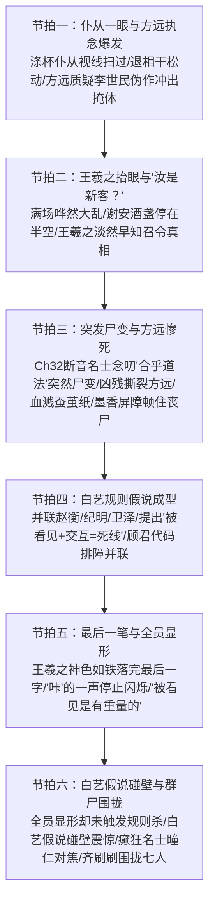

# 第33章《新客》前情探索与状态对齐任务卡

---

## 一、前章结尾事实总账与物理状态对齐 (Chapter 32 Ending Continuity Ledger)

### 1. 物理环境与时空坐标
- **精确时空坐标**：东晋穆帝永和九年（公元353年）三月初三，午后未时末（约 14:00 ~ 14:30）。
- **光影与天象特写（毫厘不差接续第32章末尾）**：
  - 日头偏西，惨白刺目的强光斜打在湍急的曲水溪流上，泛起大片晃眼破碎的浮光碎金，将对岸幽篁的竹影拉得极长极深；
  - 溪水激流翻卷，空气中弥漫着浓烈的熟艾、生硫黄、雄黄、朱砂与温酒发酵后的甜腥水汽，与幽篁背阴处潮湿发霉的烂泥竹叶腐酸味死死粘连；
  - 幽篁掩体与曲水主会场隔溪相望（距离约十至十五米），其间乱石密布、水声喧豗。
- **仪式与会场动态接续**：
  - 对岸数十名名士在大规模服下第二剂五石散后陷入癫狂行散，裸袒狂奔、尖叫大笑；
  - 主位之上，会稽内史、右军将军王羲之端坐案前，手执狼毫，已然在生绢蚕茧纸上蘸墨落笔，正在书写《兰亭集序》；
  - 第32章末尾爆发的关键异变：下游一名狂奔名士的尖笑骤然“断了半拍”，随即从胸腔撕裂挤出非人的金属破风尖啸（“咯……咯咯……赫——！！”），颈骨反关节扭曲，泛灰死眼珠直直钉向对岸主角团潜伏的幽篁！
- **主角团潜伏掩体对账**：
  - 主角团隐匿于曲水对岸的苦竹深草与巨石死角；
  - 卫泽冰冷的尸体依然僵死在后方泥洼乱草中，手呈格挡姿态；
  - 队伍处于极度戒备状态，秦华短刀已出鞘一寸，老莫隐入最深阴影，全员神经绷至极限。

### 2. 主角团存活编制连续性对账（入场 8 人 $\rightarrow$ 章末减员至 7 人）
- **入场总编制对账（8人全员在场）**：
  - 副本11人入场，前置已减员3人：赵衡（Ch18火把规则杀）、纪明（Ch20碎石声响规则杀）、卫泽（Ch26冲撞名士感知规则杀，留尸）；
  - **当前入场编制（8人）**：顾君、老莫、秦华、白艺、苏晚晴、张洋、马川、方远。
- **本章重大减员铁账**：
  - **方远**：在本章节拍三中，因学者执念狂暴失控蹚水冲向主座，惊呼出声被全场看见交互，被突发尸变的名士当场凶残扑杀撕裂，血溅蚕茧纸；
  - **章末存活编制（7人）**：顾君、老莫、秦华、白艺、苏晚晴、张洋、马川。
- **入场 8 人物理与生理应激状态明细**：
  1. **顾君（受限第三人称视点、程序员代码排障中枢）**：
     - *物理/生理状态*：胸口剧痛，伴随王羲之笔锋游走如遭生铁重锤猛砸，牙关咬破渗血；手掌处于半透明与实体的剧烈拉扯中；
     - *心理算力*：大脑如超频运算的纠错引擎，死死盯着王羲之的笔势与对岸异动，极度恐惧中保持冰冷理性。
  2. **老莫（莫正阳·定盘神针·吴越钱家守护者·隐藏顶级大佬）**：
     - *物理/言行状态*：深灰麻袍沾泥，立于死角暗影，下颌如生铁铸死，双眸冷若寒潭深渊，双臂拢袖，一言不发，威压内敛；
     - *知情底色*：深知玉玺赌局与召令因果，洞悉仪轨走向，冷眼旁观生死大劫。
  3. **秦华（战术防卫老兵·潜伏暗桩）**：
     - *战术状态*：单膝跪石，右手紧扣反握短刀，青筋暴凸，视线如刀刃切分战术路径；
     - *【高压红线】*：绝对严禁发表门阀历史与家谱讲座！只负责近战防御与动作卡位。
  4. **白艺（理性科学分析中枢·物理学博士）**：
     - *物理/推演状态*：五指紧扣顾君小臂，另一手死攥秒表；根据全队影子周期性闪烁提出退相干假说；
     - *心理剧变*：在本章经历“根据方远之死提出‘被看见=触发死线’假说”到“全员显形却未死导致假说碰壁”的剧烈科学认知挫败。
  5. **苏晚晴（严谨考古金石专家·老莫门下大师姐）**：
     - *物理状态*：高马尾被冷汗浸透贴在颈侧，死死贴住冰冷岩壁，强行克制对假孙绰与墨香文物的考究冲动。
  6. **张洋（市井嘴贫雷达·人间弹幕·兄弟情义担当）**：
     - *生理状态*：后背死撞竹干，双腿筛糠，牙齿疯狂磕碰；眼见方远冲出去想拉却抓了空，极度自责惊恐。
  7. **马川（恐慌边缘组·心理防线坍塌）**：
     - *生理状态*：蜷缩泥坑，咬住手腕齿痕渗血，满脸涕泪泥浆，精神濒临断裂。
  8. **方远（死者·学院派狂热与偏执执念爆发）**：
     - *心理异化*：受魏晋名士非人丑态刺激，三观粉碎，被“李世民伪造兰亭序”的学者执念反噬吞噬，陷入癫狂偏执，成为本章剧情爆炸引信。

### 3. 因果法则与存在状态核算（退相干松动 $\rightarrow$ 彻底实体显形）
- **退相干屏障崩解临界点**：
  - 接续第32章，全队影子“十秒内出现三次消失三次”，物理截面周期性归零；
  - 随着王羲之书写深入，因果纠缠急剧加深，虚实界限剧烈动摇，光线折射开始发生肉眼可见的微弱畸变（促使涤杯仆从投来无意识的一瞥）。
- **终局显形机制（本章核心转折）**：
  - **仪式收官**：王羲之落完最后一字，整篇《兰亭集序》成稿；
  - **物理蜕变**：“咔”的一声，退相干震荡骤停，全员停止闪烁，影子稳稳钉死在地上；
  - **感官质感**：“被看见原来是有重量的”——空气阻力、风的压迫、气味与温度全面压在皮肤上，主角团彻底变成这个世界的“存在之人”；
  - **灾变连锁**：显形后丧尸得以“看见”并锁定主角团，全场名士首次对焦围拢。

---

## 二、第33章核心剧情六大节拍深度规划 (Six Narrative Beats)

### 1. 节拍一（涤杯仆从的一眼与方远执念爆发）
- **感官白描与退相干松动特写**：
  - 溪水轰鸣，日影如血金斜刺。水边一名蹲着洗涤漆杯的青衣小仆，擦拭杯沿时，无意间抬头朝对岸幽篁苦竹林扫了一眼；
  - 阳光穿透竹叶，恰好打在顾君与白艺半透明的手背上，折射出一抹极怪异的虚光。小仆的目光竟在此处**停滞了半秒**，揉了揉眼睛，似乎看出了虚空中的光影折痕；
  - 隐形屏障正在瓦解，他们正在被这方世界“隐约观测”！
- **方远的学术魔障与癫狂失控**：
  - 这一眼还未引爆，掩体深处的方远却彻底疯魔。他眼珠暴突，死死钉在主座王羲之那张平铺的生绢蚕茧纸上；
  - 学院派的偏执在死亡恐惧与历史冲击下全面畸变，脑海中几百年来的学者公案疯狂轰鸣：
    - *“不对……那张纸不对！神龙本是唐人摹的！李世民为了掩盖兵变夺嫡伪造了全篇兰亭！原本根本不存在……他凭什么在写？！他在写假序！他在骗所有人！”*
  - 方远喉咙里发出尖锐狂躁的嘶鸣，根本不顾身侧秦华伸出的铁掌与张洋惊骇的拉拽，猛地挣脱枯竹掩体，“哗啦”一声撞碎枯枝，赤足蹚进湍急刺骨的溪水，手舞足蹈地朝着主座疯癫冲去！

### 2. 节拍二（王羲之抬眼与“汝是新客？”）
- **满场哗然与名士震怒**：
  - 狂奔蹚水的水花四溅，方远现代的短发、破碎的粗麻布衣与癫狂的尖叫，如同一记炸雷将流觞雅集的喧嚣生生撕裂；
  - 岸边数十名衣衫不整的名士惊愕停步，执杯仆从失手将羽觞摔进溪流，满场哗然炸响：
    - “何方狂生？！”、“此是何人？！怎敢擅闯内史主席？！”、“护卫！快拿下！”
- **谢安与王羲之的极致反差特写（反衬笔法）**：
  - 会客首席之上，陈郡谢安正欲举杯，酒盏在半空中**生生停顿凝固**，一双深邃清冷的黑眸微微眯起，冷冷注视着冲到阶下的异人，指尖没有一丝颤抖；
  - 唯独正中主位上的右军将军王羲之，神色从容平淡如万古深潭。案前喧哗扑面，王羲之悬腕之手甚至没有晃动分毫，饱蘸浓墨的狼毫停在半空半拍；
  - 他缓缓抬起清癯苍老的面容，目光穿透扑面而来的水雾与尘嚣，淡淡落在方远脸上，语气无悲无喜，如同见到了早已预定的故友：
    - *“汝是新客？”*
  - **【作者底牌与深层暗线】**：王羲之早知传国重器以《兰亭集序》为召令仪轨，此序落成之日，便是裁决玉玺归属的“后世之人”应召之时！“新客”二字，重如千钧，他知道他们会来，故而全场独他不惊！

### 3. 节拍三（突发尸变与方远惨死）
- **非人异变突袭爆发**：
  - 方远冲至案前数步，张口欲嘶吼出李世民与赝品的质疑，可喉咙尚未成声，杀机骤降！
  - 第32章末尾那个笑声断裂、反关节扭曲的中年名士，浑身湿透，跌跌撞撞从乱石堆里晃出，恰好横插在方远与王羲之案几之间；
  - 那名士嘴角挂着白沫，灰白泛青的皮肉剧烈抽搐，喉管里还在机械地含混念叨：
    - *“散发披襟……畅叙幽情……大合……合乎道法……”*
  - 话音未绝，其颈骨突然发出一声刺耳的“咔嚓”暴响！头颅以不可思议的角度歪折，喉咙深处猛然喷出一声尖锐刺骨的破风狂啸！
- **血腥扑杀与血溅蚕茧纸**：
  - 根本没有任何反应时间！尸变名士的身躯化作一道青黑残影，双臂如铁钩枯爪，携带着狂暴非人的巨力狠狠扑倒方远！
  - “噗嗤！”
  - 枯爪瞬间撕开方远的咽喉与胸膛，皮肉崩裂，滚烫黏稠的鲜血化作一片血雾狂喷而出！
  - 方远的惊呼被生生掐死在血沫里，眼珠凸出，身躯剧烈抽搐两下便彻底瘫软；
  - **【关键道具印记】**：大蓬滚烫的猩红鲜血“啪”的一声激射在王羲之面前的紫檀案几上，狠狠溅在正在书写的蚕茧纸生绢边缘，墨色与血色瞬间渗入纤维，触目惊心！
- **墨香屏障护体细节（伏笔埋设）**：
  - 尸变名士撕碎方远，嗜血浑浊的灰白死眼猛地转向三步外的王羲之，足底蹬碎青砖，刚欲向前猛扑；
  - 突然，王羲之案头砚池与笔端，幽幽散发出一缕极纯粹、极沉凝的古墨幽香；
  - 空气仿佛在王羲之身前三尺化作无形铁壁，尸变名士撞在虚空中猛然一顿，喉咙发出狂躁的嘶嘶漏风声，竟硬生生被无形墨香定在原地，无法寸进！

### 4. 节拍四（白艺规则假说成型）
- **掩体内的极度惊骇与战术压制**：
  - 幽篁巨石后，目睹方远被活生生撕碎分尸，马川吓得当场尿了裤子，死死咬住手腕险些昏厥；张洋双目赤红，想要拔刀冲出，被顾君与秦华用全身力气死死按死在烂泥中：
    - *“别动！上去也是送死！”*
- **白艺逻辑归纳与“死线”提出**：
  - 白艺脸色惨白如纸，但剧烈收缩的瞳孔中透出物理学家的极度冷静，她死死掐住秒表，语速急促压抑：
    - *“方远刚才做了什么？他出声大喊了！他蹚水了！他被那个小仆看见了，被所有名士看见了，还被王羲之问了一句话！”*
    - *“他在这个世界产生了‘物理交互’，被原住民确认为‘存在’！”*
  - 白艺的大脑飞速串联起前三起死亡事实：
    - 赵衡拿起漂浮火把，被原住民看见火把异动，死；
    - 纪明踩碎枯枝乱石发出声响留痕，被原住民听见，死；
    - 卫泽涉水撞击名士右肩，被对方感知到外力冲撞，死；
  - 白艺咬牙断定：
    - *“被看见、被听见，并被这个世界交互……就会触发死线！因果闭环的一瞬间，规则就会将‘外来者’彻底撕碎！”*
- **顾君代码排障并联**：
  - 顾君趴在泥坑里，心脏狂跳如鼓，程序员的异常排查逻辑迅速咬合：前三起是无形规则杀，方远是由尸变名士执行规则杀；只要不被看见、不被交互，队伍就是安全的“退相干幽灵”。

### 5. 节拍五（王羲之落完最后一字与全员显形）
- **泰山崩于前的落笔一瞬**：
  - 案前血流成河，名士溃散惊呼，尸变怪物嘶吼咆哮，整座兰亭主会场彻底炸锅；
  - 唯独王羲之面容如铸铁青铜，甚至没有垂眼看一眼脚下死不瞑目的方远。他目光如炬，右臂肌肉沉凝如岳，提起紫毫笔，在溅血的蚕茧纸上行云流水般划下最后一记顿笔与飞白——
  - 决绝落完《兰亭集序》的最后一个字！
- **显形巨变——“被看见是有重量的”**：
  - 就在最后一笔墨迹干涸浸透生绢的刹那，整座兰亭溪谷仿佛陷入无声的凝滞；
  - 虚空深处猛然传来一声清脆刺耳的机括咬合巨响——
    - *“咔！”*
  - 幽篁掩体内，全队七人胸腔内肆虐撕扯的重锤剧痛骤然消散！
  - 顾君急促喘息着抬起手掌——半透明的水晶质感瞬间褪去，皮肤下青色血管与粗粝指纹凝实无瑕；
  - 白艺低头看向地面，秒表指针还在跳动，但泥洼里的七道影子**不再闪烁、不再泯灭**，如同被浓稠宿墨狠狠泼在地上，深沉凝实，纹丝不动！
  - **【物理感官觉醒】**：
    - *“被看见……原来是有重量的。”*
    - 空气不再是虚无的背景，湿黏的水汽沉甸甸地压在肩头，腐烂竹叶的刺鼻酸臭狠狠撞入鼻腔，甚至连山风刮过皮肤的粗糙阻力，都真实得令人发指！全员彻底坠入现实，实体显形！

### 6. 节拍六（白艺假说碰壁与群尸围拢）
- **白艺科学假说的惨烈碰壁**：
  - 全员彻底显形，完完全全暴露在午后惨白的日头之下；
  - 按照白艺刚才刚刚建立的严密假说——“被看见、存在于此世=触发死线抹杀”，此刻全员皆显形，应当当场被规则抹杀撕碎！
  - 然而，一秒、两秒、三秒过去，天空没有裂隙，虚空没有抹杀之力降临！
  - 白艺双眸呆滞，指节掐进掌心，声音带上了前所未有的剧烈震颤与迷茫：
    - *“我们……没死？为什么抹杀没有发动？我们已经实体化了，我们被看见了……为什么？！”*
  - 假说瞬间破产！她引以为傲的理性逻辑在这一刻撞上了无法解释的认知铁壁！（埋线：显形=被时代正式接纳，规则杀免疫，真相留待Ch52复盘）。
- **群尸对焦围拢，大灾变降临**：
  - 还没等主角团从死里逃生的迷茫中回神，更绝望的寒意从尾椎骨炸裂开来！
  - 显形并非恩赐，而是猎杀的号角——失去了隐形庇护，他们成了活生生的“血肉目标”！
  - 空气中方远的浓烈血腥味扩散开来，曲水两岸数十名正在癫狂起舞、自残拔发的名士，身躯猛然同时一僵；
  - 那几十双原本灰白、涣散、毫无焦点的浑浊死眼珠，如同受到某种统一磁场的牵引，**在这一刻，齐刷刷地第一次找到了焦距！**
  - “咔吧、咔吧……”
  - 令人牙酸的颈椎扭动声连成一片，数十个名士以诡异反关节的姿态，齐刷刷将沾满血沫与泥浆的面孔，转向了对岸幽篁中的七人；
  - 他们咧开流淌涎水的青黑嘴唇，喉管里挤出密密麻麻的蜂鸣嘶吼，如同潮水般缓缓跨入湍急的溪流，朝着七人围拢而来；
  - 秦华短刀完全出鞘，雪亮刀锋倒映着惨白日光；老莫眼眸寒芒万丈——第三幕大灾变，彻底降临！

---

## 三、人设行为与知情边界铁律 (Anti-OOC & Epistemic Boundaries)

### 1. 人物行为与言行红线矩阵 (Anti-OOC Matrix)

| 角色 | 核心身份底色 | 本章行为准则与台词风格 | 绝对严禁出现的 OOC 行为 (High-Voltage Red Lines) |
| :--- | :--- | :--- | :--- |
| **秦华** | 特战老兵、自治区干部（反派暗桩） | **【战术卡位、暴力止险、台词短促如生铁】**。飞身按死张洋与马川，短刀出鞘护住侧翼。台词：“按住他！”、“退后，拔刀！” | **【一票否决级红线】绝对严禁发表任何汉晋门阀历史考据、世家谱系讲座！** 绝不许分析谢安、王羲之家族背景。 |
| **老莫** | 吴越钱家守护者、断代史宗师（隐藏顶级大佬） | **【沉渊如海、洞悉仪轨、一语千钧】**。全程稳如磐石，冷眼看方远赴死与王羲之落笔；章末群尸围拢时横身卡位。 | **绝对严禁惊慌失措！绝对严禁连珠炮质问！** 严禁提前剧透“显形是因为序文成了召令”。 |
| **顾君** | 国企程序员、高智商推演核心（受限第三人称视点） | **【代码排障思维、感官应激、理性压制恐惧】**。承受落笔胸痛，与白艺并联死亡样本，体验“被看见是有重量的”。 | **严禁全知全能！严禁提前知道显形能免疫规则杀！** 严禁脱离受限第三人称视点。 |
| **白艺** | 理性物理学博士、科学分析中枢 | **【数据归纳、假说构建、认知碰壁震颤】**。提出“被看见+交互=死线”，章末因假说破产而陷入理性重创。 | 严禁玄学迷信化，台词必须围绕“观测、因果闭环、物理交互”展开。 |
| **苏晚晴** | 考古所研究员、金石专家（老莫门下） | **【严谨学术克制、敏锐细节捕捉】**。捕捉到王羲之案头的清幽墨香与屏障细节，按捺惊恐。 | 严禁圣母心泛滥盲目冲出去救方远，严禁长篇大论背诵文献。 |
| **张洋** | 顾君发小、市井嘴贫雷达（生活化减压阀） | **【市井应激、极度恐惧、兄弟义气】**。想拉方远没拉住的自责狂怒，面对尸变群的本能战栗。 | 严禁智商突变成逻辑大师；严禁过度插科打诨破坏恐怖压迫感。 |
| **马川** | 恐慌边缘组（心理崩溃） | 吓尿失禁，死死咬住手腕在泥洼中抽搐，完全丧失战斗力。 | 严禁突然勇敢拔刀，严禁抢戏。 |
| **方远** | 恐慌边缘组（执念狂魔，本章领便当） | 学院派学术执念反噬，狂呼“李世民伪造兰亭序”，蹚水送死。 | 严禁表现得冷静理智，必须是歇斯底里的偏执狂。 |
| **王羲之** | 右军将军、雅集召集人（博弈中和者） | **【从容淡然、气度如岳、深知内幕】**。对大乱视若无睹，淡然道出“汝是新客？”，坚决落完最后一笔。 | 严禁惊慌失措逃跑，严禁大喊大叫呼唤卫兵救命。 |
| **谢安** | 东山隐士、顶级政治家（最冷棋手） | 酒盏停在半空，目光冷峻深沉，静观事态演变。 | 严禁表露慌乱或主动下场厮杀。 |

### 2. 秦华高压红线专门条款（一票否决）
- **违规判定标准**：凡正文中出现秦华口述诸如“太原孙氏与陈郡谢氏结盟”、“东晋门阀政治以琅琊王氏为首”、“王右军此举乃是道门仪轨”等学术科普，一律判定为严重 OOC，质检一票否决！
- **合规台词与动作示范**：
  - *“按住马川，别让他发出动静！”*
  - *“刀拔出来，背靠石头，别留死角。”*

### 3. 老莫高压红线专门条款（一票否决）
- **违规判定标准**：老莫绝不能出现“天哪这怎么可能”、“我们该怎么办”等小白式发问，严禁情绪失控。
- **合规言行规范**：老莫立于阴影中，眼眸如古井寒冰，千钧一发之际唯有一句沉哑低喝：
  - *“凝神。大乱才刚开始。”*

### 4. 知情边界绝对铁律 (Epistemic Boundaries)
- **【王羲之“汝是新客？”的知情边界】**：
  - 王羲之知晓写序是召引后世之人裁决玉玺（但他不知道具体来的是谁、几个人）；
  - 主角团七人**绝对不知道自己是被召来的裁决者**，只当王羲之将方远误认成了普通来客或狂生。
- **【显形免疫机制的知情边界】**：
  - 白艺与顾君**完全不知道“显形=被时代接纳=免疫规则杀”**这一底层物理真相；
  - 白艺只能停留在“假说碰壁、无法理解为什么没被规则抹杀”的震惊与困惑中（完整机制Ch52复盘）。
- **【反派与涉密人物隔离】**：
  - 绝对严禁主角团知晓护卫中有桓温；
  - 绝对严禁知晓刘弼是卢夏祖先卢华；
  - 绝对严禁知晓三面具人是天师道三人。

---

## 四、对白呼吸感与篇幅控制准则 (Dialogue Pacing & Narrative Space)

### 1. 对白比例与篇幅分配铁律
- **纯正文字数区间**：严格控制在 **1800 ~ 2500 字**。
- **对白字数占比严格红线**：**全篇对白字数严格控制在 25% ~ 40% 区间**！
- **杜绝低幼乒乓球式对接**：每句对白必须承担战术警戒、极端应激或认知碰撞功能。
- **留足 60%+ 篇幅给极致感官惊悚白描、生理应激与高维物理心理推演**：

| 节拍序号 | 节拍核心事件 | 预计字数 | 预计对白占比 | 叙事与感官重点 |
| :--- | :--- | :--- | :--- | :--- |
| **节拍一** | 涤杯仆从一眼与方远执念爆发 | 350 ~ 400 字 | 25% ~ 30% | 仆从视线停顿特写；方远学术魔障碎碎念；蹚水扑出的狂躁动作白描。 |
| **节拍二** | 王羲之抬眼与“汝是新客？” | 300 ~ 350 字 | 20% ~ 25% | 满场名士哗然；谢安停盏凝固；王羲之淡然落语“汝是新客？”的反差压迫感。 |
| **节拍三** | 突发尸变与方远惨死 | 400 ~ 450 字 | 15% ~ 20% | 尸变名士反关节扑杀；撕裂咽喉血雾狂喷；血溅蚕茧纸特写；无形墨香屏障震慑。 |
| **节拍四** | 白艺规则假说成型 | 350 ~ 400 字 | 35% ~ 40% | 掩体内死死按压；白艺秒表与四大死亡并联；提出“被看见+交互=死线”假说。 |
| **节拍五** | 王羲之落完最后一字与全员显形 | 350 ~ 400 字 | 20% ~ 25% | 泰山崩于前落完最后一字；“咔”声异响；手掌凝实、影子钉死；“被看见是有重量的”感官白描。 |
| **节拍六** | 白艺假说碰壁与群尸围拢 | 350 ~ 400 字 | 25% ~ 30% | 假说碰壁震惊自语；数十名士死眼齐刷刷对焦转头；蜂鸣嘶吼围拢；大灾变降临。 |

### 2. 呼吸节奏与叙事推进技巧（200字红线模型）
- **【一票否决红线】**：正文中凡出现**连续超过 200 字没有引号对白**的段落，一律判定为旁白拖沓说教，质检一票否决！
- **交替呼吸节奏模型**：严格遵循**“感官惊悚白描（100~120字） $\rightarrow$ 短促对白（1~2句） $\rightarrow$ 生理恐惧/心理推演（100~120字）”**的交替循环。
- **短句破进规范**：在方远被扑杀、王羲之落笔与全员显形处，大量使用 3~8 字短单句连续推进动词：
  > “笔锋顿住。手落下。最后一划拉出枯墨。虚空中传来机括合拢的脆响。咔。顾君低头。手掌不再透光。影子落进泥洼，黑得像凝固的生铁。”

---

## 五、文风声纹与感官白描执行标准 (Voice Standards)

### 1. 语言底色与比例
- **现代通俗白话主导（90%~95%）**：行文冷冽、凌厉、现代通透，心理推演与战术动作拉满，彻底杜绝半文半白的堆砌。
- **半文半白仅占 5%~10%（气氛点睛）**：仅用于王羲之的千钧发问（“汝是新客？”）、名士断气前的癫狂呓语（“大合道法……”）与满场名士的惊呼。

### 2. 生理恐惧与应激白描（《诡舍》质感）
- 严禁空洞形容词，聚焦肌肉与神经的真实痉挛：
  - 看到方远咽喉被撕开时，喉结不由自主的剧烈痉挛与干呕感；
  - 滚烫的血滴隔溪飞溅在草叶上带来的浓重铁锈腥味；
  - 全身实体显形时，空气阻力与水汽压迫在皮肤上的沉重钝痛感；
  - 数十双灰白死眼珠齐刷刷对焦转向自己时，头皮炸裂、毛孔倒竖的冰冷麻痹。

### 3. 高智商逻辑齿轮超频推演（《十日终焉》质感）
- 顾君与白艺的思维交互：
  - 白艺在极度惊恐下依然维持数据测算，用物理学退相干模型与逻辑链强行稳定心率；
  - 顾君将四名死者（赵衡、纪明、卫泽、方远）作为错误日志进行代码排障并联；
  - 遭遇“全员显形却未死”的假说悖论时，思维防线崩溃带来的强烈真实震撼。

---

## 六、绝对禁忌词与高压红线清单 (Taboo & Prohibition List)

### 1. 绝对禁词表（0 容忍，命中即废）
- ❌ **《兰亭集序》名句（严禁提前泄露）**：
  - `一死生`、`齐彭殇`、`虚诞`、`妄作`
- ❌ **重器真名（严格隐去）**：
  - `传国玉玺`（统一指代为“重器”、“赌局筹码”、“召令源头”）
- ❌ **AI 烂俗套话与油腻网文腔（全篇零容忍）**：
  - `宛如`、`仿佛在诉说着`、`在这一刻时间凝固`、`不仅如此`、`更重要的是`、`殊不知`、`嘴角勾起一抹弧度`、`倒吸一口凉气`、`眼神中闪烁着坚定的光芒`
- ❌ **超前概念词（旁白与NPC绝对禁用）**：
  - `生化危机`、`行尸走肉`、`基因突变`、`NPC`、`降维打击`

### 2. 视角与知情高压线
- ❌ **【一票否决】严禁秦华发表古代门阀世家谱系、汉晋历史或家谱宗族讲座！**
- ❌ **严禁老莫惊慌失措、小白提问或碎嘴叹气！老莫台词必须沉如万钧磐石！**
- ❌ **严禁提前向主角团揭穿侍卫是桓温真身！**
- ❌ **严禁提前向主角团揭穿刘弼就是卢夏祖先卢华！**
- ❌ **严禁提前向主角团揭穿假孙绰是孙绣！**
- ❌ **严禁提前向主角团揭穿显形免疫规则杀的真实原理（必须让白艺假说碰壁震惊）！**

---

## 七、章节任务卡执行前自查清单 (Pre-Draft Checklist)

- [x] **物理时空无缝衔接**：东晋穆帝永和九年三月初三午后未时末，烈日斜照惨白酷烈，浮光碎金，幽篁掩体与曲水隔溪交互，卫泽尸体在后方泥坑。
- [x] **存活编制严格对账**：入场8人（顾君、老莫、秦华、白艺、苏晚晴、张洋、马川、方远），方远本章被杀，章末减员至7人。
- [x] **节拍一（仆从一眼与方远执念爆发）**：涤杯仆从视线短暂停留，退相干松动；方远学者执念魔障爆发，狂呼“李世民伪造兰亭序”冲出掩体蹚水奔向主座。
- [x] **节拍二（王羲之抬眼与“汝是新客？”）**：满场哗然大乱；谢安举杯停在半空；王羲之神情淡然落语“汝是新客？”（反衬写法，深知召令内幕）。
- [x] **节拍三（突发尸变与方远惨死）**：Ch32断音名士念叨“合乎道法”突然尸变，凶残扑杀撕裂方远，血溅蚕茧纸；丧尸欲扑王羲之被无形墨香屏障顿住。
- [x] **节拍四（白艺规则假说成型）**：白艺结合方远出声被看见交互而死，并联赵衡、纪明、卫泽，提出“被看见+交互=死线”；顾君代码排障并联。
- [x] **节拍五（王羲之落完最后一字与全员显形）**：王羲之神色如铁落完最后一笔，“咔”的一声停止闪烁，全员实体显形，“被看见原来是有重量的”。
- [x] **节拍六（白艺假说碰壁与群尸围拢）**：全员显形却未触发规则杀，白艺假说碰壁震惊；全场癫狂名士瞳仁首次对焦，齐刷刷围拢七人，第三幕大灾变降临。
- [x] **Anti-OOC与知情铁律**：秦华绝不讲门阀历史，纯战术防御；老莫沉稳老道一语千钧；顾君受限第三人称代码排障；绝无前知剧透。
- [x] **对白呼吸感与篇幅达标**：纯正文 1800~2500 字，对白占比 25%~40%，严禁连续超200字无对白，留足 60%+ 篇幅给感官惊悚白描与生理应激。
- [x] **绝对禁词零容忍**：0 命中《兰亭序》名句、传国玉玺、AI套话及超前概念词。
