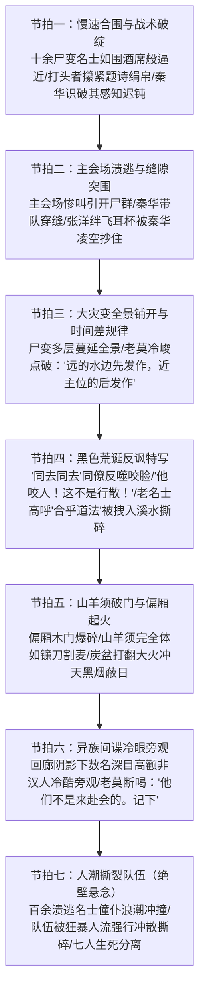

# 第34章《大灾变》前情探索与状态对齐任务卡

---

## 一、前章结尾事实总账与物理状态对齐 (Chapter 33 Ending Continuity Ledger)

### 1. 物理环境与时空坐标接续
- **精确时空坐标**：东晋穆帝永和九年（公元353年）三月初三，午后未时末向申时转换（约 14:45 ~ 15:15）。
- **光影与天象特写（毫厘不差接续第33章末尾）**：
  - 午后烈日偏斜，白晃晃刺目，却被蒸腾而起的血腥气、生硫黄与丹砂热浪遮蔽得昏黄压抑；
  - 溪水已被大量鲜血染出一条条翻卷扩散的暗红丝带，顺水漂流的漆制耳杯打着旋儿撞击乱石，散落踩烂的题诗生绢、折断的毛笔在泥浆与血沫中沉浮；
  - 偏厢方向传来焦糊味与爆裂声，浓黑烟柱拔地而起，热风卷着草木灰屑四处飞散。
- **当前受困阵地**：
  - 主角团隐蔽掩体已从原先幽篁苦竹林被迫收缩至乱石滩背阴的**狭窄岩角死角**；
  - 背靠坚硬冰冷的湿滑岩壁，两侧为丛生苦竹与乱石，退路被堵死；
  - 正前方十丈开外，数十名发生尸变的名士与仆从踏碎水花碎石，呈半月形慢速合围。

### 2. 主角团存活编制连续性对账（严格保持 7 人，方远已死）
- **副本编制演变账本（11人 $\rightarrow$ 7人）**：
  - 初始入场：11人；
  - Ch18 赵衡：违规捡起浮空火把，因果被观测，触发规则杀溺死；
  - Ch20 纪明：踩碎乱石发出机械声响留痕，因果被察知，触发规则杀坠崖亡；
  - Ch26 卫泽：涉水冲撞名士右肩产生受力感知，触发规则杀暴烈溺亡（尸体仍遗弃在后方泥水乱草中）；
  - **Ch33 方远（重大事实锚定）**：因执念爆发蹚水冲向主案咆哮“李世民伪造全篇”，打破一切交互边界，被突发变异的名士当场以非人铁爪贯穿锁骨撕裂胸膛、分尸惨死，滚烫鲜血泼溅在王羲之蚕茧纸上，当场断气！
  - **本章存活编制（严格锁定 7 人）**：顾君、老莫、秦华、白艺、苏晚晴、张洋、马川。
  - **严厉铁律**：本章严禁任何已故角色复活或以任何形式出声！全章活动人员严格限制为此7人与现场原住民NPC。

### 3. 各角色物理与心理应激状态明细核算

| 角色 | 物理/生理状态（接续第33章末） | 武器/道具装备 | 心理算力与知情边界底色 |
|---|---|---|---|
| **顾君**<br>*(POV视点)* | 实体化皮肉凝实，胸腔因因果闭合产生的绞痛消退，但心脏剧烈撞击耳膜；手心冷汗湿透刀柄缠绳，牙龈紧咬渗血，呼吸压至极薄。 | 反握牛角短刀，手背青筋暴凸。 | 程序员代码排障逻辑超频运转；深知全员已被锚定为“实体”，白艺“被看见触发死线”假说碰壁，当前面临的是最原始凶残的肉体撕裂危机。 |
| **秦华**<br>*(战术先锋)* | 脚步如铁钉入泥石，背脊微弓，肌肉如弓弦拉紧；卡在岩角最前沿突前位，将全队护在身后。 | 短刀完全出鞘，雪亮刀锋倒映烈日。 | 纯战术老兵状态；【严禁任何历史门阀讲座】！专注观察尸群合围间隙与步态破绽，战术敏锐度极高。 |
| **老莫**<br>*(定盘神针)* | 衣角沾泥，立于岩壁最深阴影处，下颌如生铁浇铸，面容冷酷如深渊古井。 | 双手拢袖，袖中暗扣护身短锥。 | 吴越钱家守护者，知晓玉玺与召令内幕，看穿尸变蔓延由远及近的时间差，捕捉到异族间谍的异常，少言寡语，一锤定音。 |
| **白艺**<br>*(科学中枢)* | 跌坐泥泞后被拉起，脸色苍白如纸，双唇无血色，指节因用力掐秒表而发白脱力。 | 手持高精度机械秒表，记录影子不再闪烁。 | 科学认知遭遇重挫：推导出的“被看见=因果闭环抹杀”假说被现实击碎，陷入剧烈困惑；但强迫自己保持数据记录与客观观察。 |
| **苏晚晴**<br>*(考古严谨)* | 高马尾被冷汗浸透贴紧后颈，背靠冻石，呼吸急促但死死咬住下唇避免失声。 | 手握一根折断削尖的坚硬苦竹枝。 | 目睹方远惨死与名士异化的惨剧，内心受到巨大冲击，但保持考古学者的严谨，紧随老莫与白艺，言简意赅。 |
| **张洋**<br>*(市井雷达)* | 浑身筛糠般发抖，两排牙齿疯狂磕碰，脸上泪水、冷汗与烂泥糊成一团，小腿神经性痉挛。 | 紧握一柄开山小直刀，手抖得拿捏不稳。 | 极度恐惧中带着市井义气与神经质贫嘴；在突围中险些因慌乱绊飞耳杯，被秦华救下后后怕至极。 |
| **马川**<br>*(濒临崩溃)* | 裤裆彻底湿透（失禁），瘫软在烂泥里，牙齿在手腕上咬出深深血印，喉间发出绝望呜咽。 | 毫无武器，完全失去自理防御能力。 | 心理防线已彻底瓦解，本章全程由苏晚晴与张洋半架半拖前行，为其在第35章产生“否认机制（集体催眠/整蛊/道具血）”埋设心理伏笔。 |

### 4. 因果法则与存在状态核算（实体化与物理杀伤）
- **退相干停止与全面显形（接续第33章末尾事实）**：
  - 随着王羲之写完《兰亭集序》最后一笔，退相干震荡彻底终止，主角团七人的影子牢牢钉在地上，不再闪烁；
  - “被看见原来是有重量的”：空气阻力、风沙摩擦、血腥味扑面、泥水的冰冷刺骨，主角团七人已完全成为这方历史时空的“实体物理存在”；
- **规则杀与丧尸杀的分界线**：
  - 原先的无形“因果抹杀规则”未在显形时触发（白艺无法理解，实为被时代接纳）；
  - 但实体化后，七人彻底暴露在尸变原住民的感官视界中，成为丧尸眼中可被撕咬、吞噬的“活物”；
  - 危险从“虚空因果抹杀”彻底转换为最血腥暴烈的“肉体物理撕裂”！

---

## 二、第34章核心剧情七大节拍深度规划 (Seven Narrative Beats)



---

### 1. 节拍一：慢速合围与战术破绽 (Slow Encirclement & Tactical Blindspot)
- **核心事件**：
  - 刚刚完成尸变的十多名名士踏着碎石与血泥，向岩角包抄；
  - 顾君与全队被逼至绝境死角，准备以死相拼；
  - 秦华凭借老兵实战经验，敏锐发现尸变早期的感官缺陷，稳住军心。
- **极致感官白描与动作细节**：
  - **慢速合围的诡异感**：“围得很慢，像围一桌酒。”名士生前的宽袍缓带被血污泥浆浸透，行动僵硬笨拙，每迈出一步，反折的膝骨与踝骨便发出令人牙酸的“咔吧”脆响；
  - **特写道具细节**：打头那名中年名士面皮泛灰，下巴滴落浑浊的涎水与黄黑胆汁，但他青紫肿胀的右手，竟还死死攥着生前在曲水流觞时写下的**题诗绢帛**！指甲深陷入绢丝纤维，墨迹与血污糊成一团，残存着生前附庸风雅的执念，显得分外可怖荒诞；
  - **生理应激**：张洋后背紧贴岩壁粗粝青苔，冷汗顺着下巴砸在短刀刃上，牙齿磕碰如鼓点；顾君喉咙干裂得像被生铁锉过，掌心冷汗几乎握不住牛角短刀；
  - **秦华战术点拨**：秦华单膝微沉，刀刃斜向前推，视线如冰刀般切割尸群动线，声线压得极低极稳：
    > “别乱动。看它们的眼珠——焦点是散的。它们刚刚起尸，视线涣散，听觉迟钝，目标一多就分不清哪个更近。只要不主动撞上去，它们咬不齐整！”

### 2. 节拍二：主会场溃逃与缝隙突围 (Chaos Distraction & Mid-Air Cup Snatch)
- **核心事件**：
  - 远处主会场爆发第一波混乱声浪，引开合围尸群注意力；
  - 秦华抓住战术真空期，果断带队突围；
  - 张洋因恐慌踢飞耳杯险酿大祸，秦华展现神级空手抄杯化解危机。
- **情节推进与战术动作**：
  - **声浪诱饵**：曲水上游主会场突然炸开几名侍童凄厉至极的破音惨叫，紧接着是铜壶砸碎在青石上的脆响与桌案掀翻声。合围岩角的十多具尸变名士头颅猛然顺着声响反向扭转，注意力瞬间被主会场的狂暴声浪拉走；
  - **果断穿插**：秦华低喝一声：“走！踩着我的脚印，别踩水花！”带队贴着最左侧两名丧尸之间的半米缝隙疾步穿出；
  - **惊魂一瞬（凌空抄杯）**：
    - 张洋在极度恐慌中慌不择路，脚尖猛地踢中一只搁在草滩乱石上的红漆羽觞耳杯！
    - 耳杯被踢得翻滚腾空，打着旋儿飞向半空，一旦砸在对面的凸岩上必定发出清脆击石声，瞬间就会将两米外的数具丧尸重新拉回头；
    - 张洋吓得心胆俱裂，整个人僵在原地；
    - **高光动作**：身前秦华甚至没有回头，左臂如铁钳暴探而出，五指在半空中精准轻巧地一扣，竟将旋转的耳杯硬生生截停在掌心！
    - 没有激起一丝撞击脆响！秦华反手将耳杯塞入怀中布囊，右脚顺势在张洋后背猛推一把：“看路！别发呆！”队伍险之又险地穿透包围圈，冲上乱石高坡。

### 3. 节拍三：大灾变全景铺开与时间差规律 (Panoramic Catastrophe & Delay Pattern)
- **核心事件**：
  - 队伍登上乱石斜坡高点，俯瞰整座兰亭集会，大灾变全景式呈现在视野中；
  - 尸变蔓延呈现出严密的物理空间与时间规律；
  - 老莫深沉开口，一语点破关键时间差。
- **全景铺陈与老莫一锤定音**：
  - **空间蔓延图谱**：
    - 异变并非全场同频爆发，而是如墨滴落入清水般**由外向内、一片一片铺开**：
    - ① 最先尸变狂暴的是最外围、靠近下游溪水滩涂的名士与浣纱僮仆（服药早且浸水深）；
    - ② 紧接着蔓延至本岸的灌木丛与修禊石台；
    - ③ 随后是西侧回廊偏厢；
    - ④ 而靠近内史长案、王羲之与谢安所在的核心主位区域，名士们虽然也开始抽搐呕吐，发作时间却明显迟滞了半刻钟以上！
  - **顾君大脑推演**：程序员的代码排障思维迅速抓取空间热力图——“这绝不是单纯的急性毒发，毒素在体内被某种外力干预阻滞了……发作时间呈现出明显的同心圆梯度！”
  - **老莫高光台词**：老莫立于乱石阴影中，目光深邃如万古寒潭，眼皮甚至没有眨动，嗓音沉缓苍凉，一锤定音：
    > “远的水边先发作，近主位的后发作——有什么东西在拖。”
  - *(注：此系天师道杜子恭预设的镇灵符在主会场压制药效的时间差，此处老莫看出规律但绝不剧透符箓与法阵内幕)*。

### 4. 节拍四：黑色荒诞反讽特写 (Tragicomic Satire & Philosophical Irony)
- **核心事件**：
  - 展现魏晋玄学与名士风骨在生死血肉危机面前被击碎的残酷荒诞景象；
  - 穿插三个极具视觉冲击与思想深度的反讽特写镜头。
- **三大荒诞反讽切片（文眼段落）**：
  - **切片一：“同去同去”的生死背叛**：
    - 两名平日自诩“生死契阔、形影相随”的中年竹林名士，披发狂奔，手挽着手跌跌撞撞逃向廊柱，嘴里还彼此喘息打气：“同去！同去！避此妖魔！”；
    - 下一瞬间，左侧名士喉间猛然爆开一声非人的尖锐抽搐，眼白暴翻，反手一把死死钳住同伴的双肩，张开满嘴黑黄尖牙，凶残地一口撕下同伴的半边面颊与喉管！
    - 鲜血狂飙，被咬者撕心裂肺的嚎叫与生前誓言交织在一起，讽刺至极。
  - **切片二：“这不是行散！”的幻灭**：
    - 一名年轻世家子跌坐在泥水中，看着昔日推崇备至的长辈匍匐在地上疯狂啃食僮仆的内脏，吓得下身失禁，抓破头皮发出刺破云霄的凄厉悲鸣：
    - *“他咬人！这不是行散！这他娘的根本不是行散！！”*
    - 魏晋名士用“服药行散、合乎道法”粉饰太平的遮羞布，被淋漓鲜血生生扯得粉碎。
  - **切片三：狂热名士的道法殉葬**：
    - 一名白发苍苍的老名士满面潮红，踉跄倒退，面对扑来的数具尸变僮仆，竟犹自手舞足蹈大笑高呼：“天地为庐，万物为刍狗！畅叙幽情……此乃大合乎道法——”；
    - 话音未落，三具尸体踏破水花一拥而上，枯槁如铁的手指直直插进他的眼眶与前胸，将这位高呼“合乎道法”的老者整个人猛力拖入湍急浑浊的溪水中，瞬间撕成漫天碎肉！

### 5. 节拍五：山羊须破门与偏厢起火 (Bearded Fiend Unleashed & Inferno)
- **核心事件**：
  - 偏厢完全体尸变爆发，前期核心伏笔人物“山羊须名士”破门而出；
  - 展现绝对碾压级别的物理屠杀；
  - 偏厢失火，形成冲天黑烟与火海，战场环境彻底恶化。
- **伏笔回收与狂暴杀戮**：
  - **木门爆碎**：只听“轰隆”一声巨响，西侧偏厢两扇厚重包铜的柏木大门被一股非人的恐怖蛮力生生撞成漫天碎木屑！
  - **山羊须登场（伏笔回收）**：
    - 冲出来的正是第24章第一个带头服药、第30章变异、第31章被扶入偏厢的“清瘦山羊须名士”！
    - 此时他已彻底蜕变为Ⅳ期完全体凶煞：身躯非自然地拔高暴涨，皮肤呈现出死铁般的青灰色，十指指甲泛着幽蓝光泽长达数寸，喉咙里发出滚雷般的轰鸣；
    - 速度快得拉出残影！冲入慌乱逃窜的仆从与卫士群中，“像镰刀割麦子一样”，双爪横扫，人头滚滚，残肢漫天抛飞！
  - **偏厢烈焰**：偏厢内被打翻的炼丹炭盆与取暖火炉引燃了浸泡桐油的帷幔与木架，大火轰然窜起数丈之高，与滚滚浓烟直刺苍穹，将整片修禊胜地化为人间焦狱。

### 6. 节拍六：异族间谍冷眼旁观 (Foreign Spies in the Shadows)
- **核心事件**：
  - 在黑烟与烈焰的掩护下，顾君与老莫敏锐捕捉到回廊阴影下的非汉人可疑身影；
  - 老莫发出关键预警；
  - 间谍迅速没入乱潮消失。
- **镜头特写与悬念埋设**：
  - **异常的静止点**：在全场几百人疯狂奔逃、血肉横飞的人间地狱中，唯有一处呈现出死一般的冷酷静止；
  - 通往后山竹径的青石回廊廊檐下，三个身影抱胸而立。他们没有穿汉家宽袍大袖，内里紧扎胡服短打；
  - **面部特写**：火光斜照下，顾君看清了那三张脸——**深目、高鼻、宽颧骨，眼眸泛着灰褐色的阴冷光泽**，绝非南方江左汉人士族，亦非中原汉人！
  - 他们神色冷漠麻木，居高临下地注视着名士被撕碎、火海吞噬兰亭的惨剧，嘴角甚至隐隐挂着一丝森冷嘲弄；
  - **老莫冷语**：老莫脚步猛然顿住，浑身散发出前所未有的森寒戾气，低声自语，声音沉如万钧生铁：
    > “他们不是来赴会的。记下。”
  - 顾君心头如遭雷击，再定睛看去，那三道身影已经极其敏捷地顺着廊柱阴影一闪而退，彻底混入溃乱的人流之中，再无踪影。*(注：埋设前燕/胡族暗探长线线索)*。

### 7. 节拍七：人潮撕裂队伍（绝壁悬念） (The Crushing Stampede & Party Split)
- **核心事件**：
  - 突围队伍刚转过回廊乱石，迎面遭遇溃逃人潮的狂暴冲击；
  - 狂暴的求生洪流彻底碾碎队伍防线；
  - 七人被强行冲散撕开，章节在极致危机中戛然而止。
- **高潮崩解与章末定格**：
  - **溃逃洪流冲撞**：从主会场和偏厢方向逃出的数百名名士、披发披巾的僮仆、丢盔弃甲的护卫，早已失去了全部理智。在火海与尸群的驱赶下，化作一股狂暴至极的人体洪流，尖叫着朝着这处唯一的狭窄后山石径迎面撞来！
  - **绝望对抗**：
    - 秦华怒目圆睁，嘶吼暴喝：“结阵！手拉手！顶住别散！！”
    - 顾君左手死死抓住身侧白艺的衣袖，右手拼命探向身后的张洋与马川；
    - 但数以百计陷入癫狂的人群带来的动能如同一柄攻城重锤！
  - **撕裂瞬间**：
    - “刺啦！”布料崩裂的脆响被震耳欲聋的号哭尖叫彻底吞没！
    - 顾君只觉得手腕剧痛，白艺单薄的身影被三个狂奔的名士硬生生撞开；
    - 张洋与苏晚晴架着瘫软的马川被狂暴的僮仆人群直接冲向石径右侧的断坎；
    - 老莫在汹涌人流中被推向另一侧青石桥头；
    - 秦华反手横刀试图逆流阻挡，却被汹涌的浪潮生生推离！
  - **章末定格金句（接轨大纲）**：
    - 奔涌的人潮如同一柄无形钝刀，像撕开一张被鲜血浸透的单薄宣纸一样，硬生生将七个人撕得粉碎！
    - 漫天火光、呛人浓烟与尸变怪物的长啸吞没了一切视线。

---

## 三、Anti-OOC 铁律与各角色知情边界管控 (Character Voice & Cognitive Ledger)

### 1. 核心角色知情边界与高压禁区清单

```
┌─────────────────────────────────────────────────────────────────────────────┐
│                          角色言行红线与知情边界约束看板                        │
├─────────────┬───────────────────────────────────────┬───────────────────────┤
│ 角色姓名    │ 此时允许的认知与合法行动              │ 绝对高压禁止（违者即OOC）│
├─────────────┼───────────────────────────────────────┼───────────────────────┤
│ **秦华**    │ 专注突围指令、凌空抄杯、短刀开路、     │ 【严禁发表任何汉晋门阀│
│             │ 观察丧尸破绽、战术断后。              │ 历史考据、家谱讲座】！│
│             │                                       │ 严禁显露特务/暗桩底牌│
├─────────────┼───────────────────────────────────────┼───────────────────────┤
│ **老莫**    │ 深沉如渊，洞悉大势；只提两点：        │ 严禁长篇大论；严禁剧透│
│             │ ①时间差“远的水边先发作，近主位后发作”│ 杜子恭镇灵符、玉玺法阵│
│             │ ②异族间谍“不是来赴会的。记下”。     │ 与幕后投毒元凶真相！  │
├─────────────┼───────────────────────────────────────┼───────────────────────┤
│ **顾君**    │ 受限第三人称视点；程序员异常逻辑排查；│ 严禁全知视角；严禁无视│
│             │ 强烈的真实生理恐惧（心跳、冷汗、窒息）│ 身体伤痛应激；严禁脱离│
│             │ 绝境中保持冰冷推演，寻找生路。        │ 现场物理现实。        │
├─────────────┼───────────────────────────────────────┼───────────────────────┤
│ **白艺**    │ 记录秒表数据，承认假说碰壁与困惑；    │ 严禁提前知晓“显形=被   │
│             │ 用严谨科学态度面对未知，紧跟顾君。    │ 时代接纳”（留待Ch52）；│
│             │                                       │ 严禁歇斯底里大喊大叫。│
├─────────────┼───────────────────────────────────────┼───────────────────────┤
│ **张洋**    │ 市井话痨但讲义气，绊飞耳杯极度自责；  │ 严禁过度英勇单挑丧尸；│
│             │ 腿软发抖但生死关头绝不抛弃同伴。      │ 严禁使用后世网络梗。  │
├─────────────┼───────────────────────────────────────┼───────────────────────┤
│ **苏晚晴**  │ 严谨克制，紧护老莫，协助架住马川；    │ 严禁长篇考据文物器皿；│
│             │ 虽震撼于礼崩乐坏但绝不拖后腿。        │ 严禁脱离队伍单独行动。│
├─────────────┼───────────────────────────────────────┼───────────────────────┤
│ **马川**    │ 精神崩溃边缘，尿裤子、瘫软、被架走；  │ 严禁突然恢复清醒冷静；│
│             │ 为Ch35“整蛊/道具血”铺设病态心理基础。 │ 严禁持刀英勇反击。    │
└─────────────┴───────────────────────────────────────┴───────────────────────┘
```

### 2. 严厉防范前知剧透（零吃书红线）
1. **反派身份与暗线机密**：
   - 绝不可剧透卢华（刘弼）的匈奴后裔与幕后黑手身份；
   - 绝不可剧透周彦与韩卓换药交易（尚未到目击章节）；
   - 绝不可剧透假孙绰（孙绣）、王绥之（太原王氏）的真实底牌；
   - 绝不可剧透桓温易容隐匿于护卫之中的事实。
2. **异族间谍处理准则**：
   - 仅作为会场大乱中极诡异的背景特写出现；
   - 老莫与顾君仅能看出其“面相深目高颧非江左汉人”、“神态冷酷不逃命”，绝对不可直接叫出“前燕特务”或“慕容氏探子”。
3. **镇灵符机制准则**：
   - 老莫仅指出发作时间的空间顺序差异（“有什么东西在拖”），主角团无人知晓回廊柱子上贴着杜子恭的镇灵符，更不知符箓被暗中撕毁的隐情。

---

## 四、绝对红线与一票否决禁词清册 (Negative Constraints & Taboo Lexicon)

### 1. 题材核心与历史禁词（绝对 0 命中）
- ❌ **绝对禁止出现《兰亭集序》核心名句与哲思词汇**：
  - **“一死生”**
  - **“齐彭殇”**
  - **“虚诞”**
  - **“妄作”**
  *(原因：此等字眼为后续核心主题转折与思想碰撞之关键钥匙，本章为纯肉体灾变恐怖峰值，严禁提前稀释与滥用！)*
- ❌ **绝对禁止泄露终极主线道具名称**：
  - **“传国玉玺”**、**“始皇玺”**、**“和氏璧”**
  *(原因：此时主角团完全处于被动逃命状态，未到揭露玉玺争夺阶段！)*

### 2. AI 套路假大空与腔调禁词（质检一票否决）
正文中一经检索出以下词汇或句式，即刻判定为不合格：
- ❌ “宛如”
- ❌ “仿佛在诉说着”
- ❌ “在这一刻时间凝固”
- ❌ “不仅如此”
- ❌ “更重要的是”
- ❌ “殊不知”
- ❌ “嘴角勾起一抹弧度”
- ❌ “倒吸一口凉气”
- ❌ “眼神中闪烁着坚定的光芒”
- ❌ “空气中弥漫着绝望的气息”

### 3. 结构性硬指标红线
- ❌ **非对白连续区间严禁超过 200 字**：
  - 凡是出现连续 200 字以上纯旁白、无引号对白或无人声短促呼喝交互的段落，一律判定为拖沓说教，直接返工！
  - 必须用短对白、战术短语、喉间嘶吼切断长篇描写，保持生死竞速的窒息压迫感。

---

## 五、主笔写作执行关键参数与交付标准 (Execution Parameters)

### 1. 篇幅、对白比例与节奏分布
- **纯正文字数目标**：`1800 ~ 2500 字`（纯正文，不计 frontmatter）；
- **对白占比区间**：`25% ~ 40%`（密集、短促、带刺、战术呼喝）；
- **感官白描与生理应激占比**：`60%+`（重度投入生理应激描写、骨骼碎裂、血肉横飞、烟熏火燎）；
- **句式风格**：3~8 字短句连续破进，动词密集推进，坚决拆解 30 字以上复合从句。

### 2. 生理恐惧白描质检清单（《诡舍》×《十日终焉》标准）
- [ ] 是否写透心脏跳动震击耳膜的剧烈痛感？
- [ ] 是否写透极度恐惧下咽喉如吞火炭生铁屑的干裂？
- [ ] 是否写透冷汗浸透刀柄牛皮绳导致的湿滑手感？
- [ ] 是否写透反关节折断、肌肉撕裂与皮肉翻卷的硬核物理声响（“咔吧”、“噗嗤”）？
- [ ] 是否写出顾君超频运转的大脑齿轮与微表情捕捉？

### 3. 章节末尾交接状态
- **落点**：七人队伍在狂暴人潮冲击下被硬生生冲散撕开，顾君与白艺脱手，张洋、苏晚晴、马川被卷向断坎，老莫、秦华各自被阻断，火海与浓烟吞没视线；
- **下一章挂钩**：精准对齐第35章《假的》开篇（土坡汇合、老莫预设集合点、马川心理防御机制爆发产生“否认三连”）。

---
*(本任务卡经前情探索与状态对齐总账员严密核验，无任何设定冲突与逻辑断层，可立即进入主笔撰写阶段。)*
