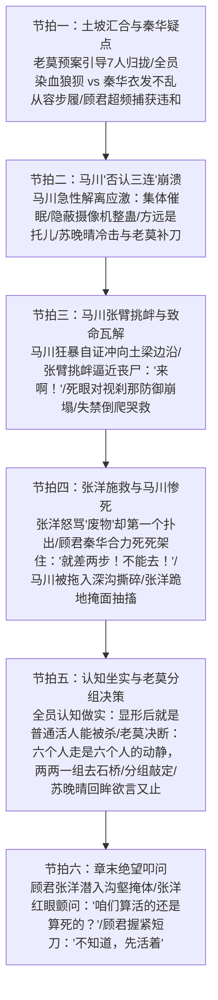

# 第35章《假的》前情探索与状态对齐任务卡

---

## 一、前章结尾事实总账与物理状态对齐 (Chapter 34 Ending Continuity Ledger)

### 1. 物理环境与时空坐标接续
- **精确时空坐标**：东晋穆帝永和九年（公元353年）三月初三，午后申时初（约 15:15 ~ 15:45）。
- **光影与天象特写（毫厘不差接续第34章末尾大灾变）**：
  - 偏厢熊熊烈火直蹿数丈，浓黑的烟柱裹挟着灰烬在西北风下翻卷，遮蔽了整个天幕，将午后的惨白日光压制成昏黄诡异的血色；
  - 空气中充斥着刺鼻的草木焦糊味、生硫黄与丹砂灼烧的恶臭，以及浓重到令人作呕的皮肉焦烂与生铁般的血腥味；
  - 山风猎猎，不时将下方主会场数百名士仆从的惨烈哀嚎、丧尸撕咬断骨的“咯吧”脆响、重甲步卒的呼喝从山谷深处倒灌而上。
- **当前受困地形与地貌特征**：
  - **兰亭后山高坡土梁（背阴处沟壑）**：
    - 地势陡峭狭窄，风化严重的干裂黄土坡梁夹杂着凸起的青灰色嶙峋坚石，稀疏生长着被火星灼焦的刺芒草与枯干荆棘；
    - 土梁脊线后方是一条深达两丈余的陡峭乱石断坎与干涸冲沟，沟底乱石堆叠，杂草丛生，视线死角极多；
    - 坡下十多丈外是回廊碎石径的尽头，数具循声游荡的青黑皮肉丧尸正顺着血泥踩碎枯枝，慢速往高处搜寻；
  - **汇合机动逻辑**：
    - 接续第34章末尾：数百名发狂溃逃的名士与僮仆形成人体狂潮，将突围队伍硬生生冲散撕裂；
    - 借着老莫与秦华在奔逃中预先吼出的应急预案——**“走散了就往高处走，后山土坡汇合”**，七人在极度混乱中各自翻滚规避，陆续顺着土梁背阴面的斜坡攀爬至这处黄土梁避险。

### 2. 主角团存活编制连续性对账（入场 7 人 $\rightarrow$ 本章减员至 6 人）
- **副本编制演变全账本（11人 $\rightarrow$ 7人 $\rightarrow$ 6人）**：
  - 初始入场：11人；
  - Ch18 赵衡：触碰浮空火把，因果被观测，触发规则杀溺死；
  - Ch20 纪明：踩碎乱石留痕，因果被察知，触发规则杀坠崖亡；
  - Ch26 卫泽：涉水冲撞名士右肩产生受力感知，触发规则杀暴烈溺亡；
  - Ch33 方远：执念爆发冲向主案惊呼咆哮，打破交互边界，被变异名士当场分尸撕裂，滚烫鲜血溅落王羲之绢帛，首例丧尸杀；
  - **Ch35 马川（本章重大事实锚定，规则教学第五死）**：
    - 心理防线彻底崩溃，产生严重的急性心理防御应激（解离与狂躁否认）；
    - 坚决否认现实，张开双臂狂笑挑衅逼近的丧尸；
    - 丧尸死眼直视逼近，否认防御瞬间被物理死亡压迫击穿，吓至失禁倒爬哭救；
    - 张洋舍命施救不及，马川被铁爪钩住拖入深沟撕碎分尸惨死！
  - **本章存活编制演变**：
    - 章节开篇入场：**7 人**（顾君、老莫、秦华、白艺、苏晚晴、张洋、马川）；
    - 章节末尾出场：**6 人**（顾君、老莫、秦华、白艺、苏晚晴、张洋）；
  - **严厉铁律**：本章严禁赵衡、纪明、卫泽、方远任何已故角色复活或以任何形式出声！马川在本章中段死亡后彻底出局，章末严格为 6 人两两分组。

### 3. 各角色物理与心理应激状态明细核算

| 角色 | 物理/生理状态（接续第34章末） | 武器/道具装备 | 心理算力与知情边界底色 |
|---|---|---|---|
| **顾君**<br>*(POV视点)* | 右手腕在第34章末被人潮冲散时严重挫伤红肿，指关节青紫；浑身泥浆草屑，冷汗混着草木灰刺激眼眶；喉管干涩如火烧，胸口心脏如擂鼓般撞击肋骨。 | 反握牛角短刀，手心冷汗把缠柄生皮泡得黏湿滑腻。 | 程序员代码排障与异常捕获机制全功率运转；清晰认知到自身已是物理实体；第一线捕捉到秦华“衣发不乱”的致命破绽并在心中标记；在张洋冲动救人时与秦华死死按住张洋。 |
| **秦华**<br>*(战术先锋/暗桩伏笔)* | **【核心破绽】** 在数百人狂暴践踏踩踏中逆流脱身，却**衣发不乱、步履从容、呼吸绵长平稳**，仅衣角沾了点灰；动作利落沉稳，毫无常人的生理脱力和恐慌颤抖。 | 直裰内束紧身战术软护，手握开刃短刀，刀锋微斜封锁斜坡。 | 伪装成靠谱的老兵与行动主心骨，【严禁发表任何汉晋门阀历史考据与家谱讲座】；专注战术清点人数、地形卡位；在张洋扑出时与顾君合力如铁钳般锁死张洋。 |
| **老莫**<br>*(定盘神针)* | 灰布长袍下摆沾满黄土，两鬓斑白发丝被汗水打湿贴在额角；站在土梁最高处的坚石后方，下颌线条如青铜浇铸般冷峻。 | 双手拢在袖中，暗扣护身短锥，呼吸压得极沉极长。 | 吴越钱家暗中守护者，深知局势已滑向全面失控；冷语击碎马川的幻象（“方远的血溅在绢上”）；在马川死后一锤定音决断“六个人走是六个人的动静，两两一组去石桥”。 |
| **白艺**<br>*(科学中枢)* | 羊毛开衫在人潮冲撞中被扯烂半边衣袖，手肘擦破渗血；脸色煞白如纸，唇角被自己咬出两道血痕；剧烈喘息，双腿肌肉神经性痉挛。 | 单手死扣高精度机械秒表，发条紧绷，外壳沾染血泥。 | 用严谨的数据与物理法则抵抗恐怖：确证“实体化=因果排斥解除=等同于普通活人”，眼睁睁看着马川惨死，更加坚定“显形后会死于物理撕裂”的认知。 |
| **苏晚晴**<br>*(考古严谨)* | 高马尾散落披肩，前额沁满冷汗，右侧脸颊被荆棘划出一道血痕；指节抠进泥土，胸口起伏剧烈。 | 反握一根折断削尖的坚硬苦竹杆，杆头残留绿汁与泥巴。 | 严谨克制，注重现实逻辑；面对马川的胡言乱语予以最冷冽的一击（“摄像机能拍死人吗”）；在张洋不顾一切扑出去救马川时被深深震撼，章末回眸欲言又止，埋下感情线种子。 |
| **张洋**<br>*(市井真男人)* | 浑身沾满黄土烂泥，两眼通红充血，鼻涕眼泪与冷汗糊脸；两排牙齿在风中打颤，小腿筛糠般抖动，但浑身透着一股急红了眼的戾气。 | 死死攥着开山小直刀，刀刃因砍劈硬物略有微卷。 | 贫嘴与胆小在极度危机中被市井义气压倒；嘴上骂马川“废物”，身体却本能扑出施救；被顾君秦华死死按住、眼睁睁看着马川被撕碎后心理遭受重创，跪地掩面抽搐。 |
| **马川**<br>*(急性解离崩溃)* | 裤裆浸透腥臊黄尿，双膝磨破皮肉外翻，手掌在黄土里抓得指甲翻起流血；瞳孔散大，面容扭曲如恶鬼，涕泪横流。 | 毫无防具与武器，处于手无寸铁的癫狂自毁状态。 | **【急性否认机制爆发】** 无法承受同伴横死与自身沦为猎物的现实，心理防御机制极端反弹：坚信是全息整蛊、集体催眠、道具血；歇斯底里挑衅丧尸，直至被死眼对视瞬间防御崩塌，惨死深沟。 |

### 4. 因果法则与存在状态核算（实体化、普通活人与可被击杀）
- **退相干与实体化不可逆**：
  - 自第33章末尾王羲之写毕《兰亭集序》最后一笔，主角团身上的退相干现象彻底终结；
  - 全员影子钉死在地表，具备完全的物理交互性：受重力牵引、会受风阻、会流血、骨骼会折断、肉体会被尖牙铁爪撕烂；
- **从“规则杀”到“物理杀”的认知坐实**：
  - 赵衡、纪明、卫泽的死，源于“改变物理世界被观测”后的世界规则虚空抹杀；
  - 方远与马川的死，则是“显形之后成为物理实体，被丧尸视为有血有肉的原住民NPC而展开的肉体猎杀”；
  - **本章核心认知增量**：马川用生命完成第五次规则教学——**“显形后我们就是彻头彻尾的普通活人，会疼、会流血，能被彻底杀死！”**

---

## 二、第35章核心剧情六大节拍深度规划 (Six Narrative Beats)



---

### 1. 节拍一：土坡汇合与秦华疑点 (High Ridge Regroup & Qin Hua's Anomaly)
- **核心事件**：
  - 狂暴人潮退去，7人依托老莫先前定下的“走散就往高处走”预案，从不同逃亡路线上陆续登上后山黄土梁；
  - 顾君与白艺先登上土梁，随后张洋与苏晚晴半拖半拽着瘫软的马川翻上斜坡，老莫亦从另一侧断岩攀上；
  - 秦华最后登顶，顾君在极度混乱中敏锐察觉到全队与秦华之间格格不入的巨大反差。
- **极致感官白描与微表情推演**：
  - **狼狈的全员特写**：
    - 顾君手腕脱臼般刺痛，衣袍被荆棘扯成布条，满脸是血与草木灰；
    - 白艺半跪在碎石地上，胸口剧烈起伏，手肘擦得鲜血淋漓，秒表挂绳被冷汗浸透；
    - 张洋脸上涕泪横流，后背被发狂名士踩出的脚印清晰可见，嘴唇干裂得起了一层白皮；
    - 苏晚晴发丝凌乱，下唇咬破渗血，手中的苦竹杆已被捏得微微弯曲；
    - 马川整个人瘫倒在黄土泥浆中，下半身散发着恶臭的骚味，牙齿把手背咬得稀烂；
    - 老莫布袍沾满污泥，眼眶深陷，胸膛沉重起伏。
  - **秦华的异常从容（关键暗线伏笔）**：
    - 灌木丛轻响，秦华反握短刀疾步踏上土梁；
    - **【异样特写】**：他身上的靛蓝直裰除下摆蹭了些泥点外，前襟平整，发髻未散，连粗布发带都束得整整齐齐；
    - 在刚刚那场数百人推搡践踏、断肢横飞的人肉磨盘里，他是唯一一个没有大口喘粗气的人，鼻息悠长平稳，眼神如寒铁般深敛；
    - 顾君背靠干裂黄土，瞳孔猛地收缩了一刹那——这绝非一个普通历史爱好者的体能与应激状态！代码排障思维疯狂报警，顾君将这一处“过分完美、违背物理熵增”的违和感死死压在心底，未露半点声色。

### 2. 节拍二：马川“否认三连”崩溃 (Acute Denial & Psychotic Breakdown)
- **核心事件**：
  - 众人在土梁背阴处伏低身子喘息，马川的心理防线彻底炸裂；
  - 极端的死亡恐惧激发出人类最强烈的急性心理防御应激——狂暴的现实否认；
  - 苏晚晴与老莫用冰冷铁一般的事实无情击碎其幻想。
- **心理机制与带刺对白**：
  - **急性解离与现实否认**：
    - 马川猛地抱住脑袋，神经质地扯断自己的头发，双眼布满血丝，在泥浆里疯癫大笑：
      > “假的……全是假的！老子明白了，全他妈明白了！”
    - 他手脚并用扑向顾君，口水喷溅：“这是整蛊！隐蔽摄像机在哪？全息投影？还是集体催眠？！你们全是被雇来演我的对不对？！”
    - 他死死拽住张洋的领口，声嘶力竭：“方远！方远那小子根本没死！他是托儿！他身上装了血包对不对？！好莱坞道具血！那股血腥味是生粉和红曲素调出来的！！”
  - **苏晚晴与老莫的冷静回击**：
    - 苏晚晴眼神冰冷如霜，居高临下地盯着瘫在泥里的马川，声音不高却字字如尖刀扎肉：
      > “摄像机能拍得死人吗？刚才撕下来的那是人脸上的真皮真肉，黄黑胆汁溅到你鞋面上，你闻不到焦烂臭味吗？”
    - 老莫站在土梁背风处，居高临下俯视着他，眼底没有一丝波澜，声如深渊玄铁：
      > “方远的血溅在王羲之的绢上。你看见了吗？”
    - 马川整个人剧烈抽搐，像被毒蛇噬咬般疯狂后缩，尖叫道：“道具血！王羲之也是演员！全是他妈演员！你们想吓死老子，老子不上当！不上当！！”

### 3. 节拍三：马川张臂挑衅与致命瓦解 (Suicidal Bravado & Instant Collapse)
- **核心事件**：
  - 马川为了在精神上自证“一切皆虚”，狂躁症彻底暴发；
  - 他猛力甩开试图按住他的张洋，冲上毫无遮挡的土梁顶端，向着下方循声围拢而来的丧尸张开双臂癫狂挑衅；
  - 丧尸死眼锁定的刹那，虚假的狂妄如肥皂泡般破灭，马川坠入极度瘫软与绝望。
- **动作节奏与生理应激白描**：
  - **歇斯底里狂冲**：
    - “拉住他！”顾君低吼，但扭伤的手腕慢了半拍；
    - 马川像发了疯的野狗，一肘撞开身旁的张洋，跌跌撞撞冲上了土梁最开阔的脊线！
    - 他站在狂风呼啸的坡顶，迎着下方黑烟滚滚的火海，张开双臂，仰天狂笑咆哮：
      > “来啊！咬我啊！！你们这帮群演有种冲老子脖子咬啊！！我倒要看看是真是假！是不是老子一伸手你们就喊卡！！”
  - **死眼锁定的恐怖降临**：
    - 坡下枯灌木丛中，三具浑身布满血污、反折着膝骨的尸变名士猛然停住脚步；
    - 咔吧、咔吧。
    - 扭曲的头颅顺着声浪整齐划一地抬起，浑浊青灰、毫无生气的死眼死死聚焦在土梁上的马川身上！
    - 喉间发出宛如破风箱拉动般的腥臭低吼，四肢着地，如癫狂恶犬般扒开乱石血泥，以极其反常的爆发力逆着斜坡疯狂向上攀爬！
  - **防御瓦解与失禁倒爬**：
    - 在那双浑浊死眼隔着数丈距离死死扎进马川视网膜的千分之一秒内，所有的心理代偿机制瞬间被粉碎；
    - 那不是演戏的眼神，那是捕食者锁定烂肉的纯粹死寂！
    - 恶臭扑面，马川的笑声直接卡死在喉咙里，眼珠暴凸，眼眶撕裂渗血；
    - “哗啦”一声，他双腿彻底化为面条，整个人软倒在斜坡边缘，又是一股滚烫的臊水从裤腿涌出；
    - 他四肢并用在黄土泥水里疯狂反向倒爬，十指抠得满地是血，喉咙里爆发出破音的凄厉哀嚎：
      > “救我……张洋！老顾！救我啊啊啊——！！”

### 4. 节拍四：张洋施救与马川惨死 (Desperate Rescue & The Abyss Kill)
- **核心事件**：
  - 张洋怒骂着却出于发小义气本能扑出施救；
  - 顾君与秦华反应极速，死命按住张洋，阻止无谓牺牲；
  - 马川被丧尸铁爪拖入断崖深沟，分尸撕碎；
  - 张洋心理崩溃跪地。
- **生死撕扯与硬核动作**：
  - **张洋的本能飞扑**：
    - “操你大爷的马川！你个傻逼废物！！”
    - 张洋双目赤红，嘴里怒骂着最粗俗的脏话，但整个人却毫无犹疑地第一个如离弦之箭般从石头后暴冲而出，反握直刀扑向土梁边缘；
  - **死命架阻（两步死线）**：
    - “张洋！别去！！”顾君双足猛蹬地面，不顾挫伤手腕的剧痛，整个人横身飞扑，双臂如铁箍般死死抱住张洋的腰腹！
    - 秦华电光石火间杀到，铁钳般的大手一把锁死张洋持刀的右手手腕，借力向后猛拽，两人将张洋狠狠掼倒在土梁背阴面！
    - 张洋在黄土里疯狂蹬腿挣扎，脖颈青筋如毒蛇暴起，声嘶力竭地嚎叫：“就差两步！放开我！老顾你放开我！！就差两步我就能拽住他了！！”
    - “不能去！下去全得死！！”顾君嘴里满是生铁锈般的血沫，用尽全身重量死死压在张洋身上。
  - **惨绝人寰的深沟分尸**：
    - 就在马川哭喊着伸出右手的一刹那，两只发黑干瘪、长着乌青尖甲的手爪从土坡下如同铁锚般暴探而出，精准凶残地抠穿了马川的两个脚踝骨！
    - “咔吧！”皮肉穿透与骨裂声清脆刺耳！
    - “啊啊啊啊——！！”
    - 马川整个人被一股蛮横的巨力生生从土梁边缘扯落，坠入后方深达两丈的断坎冲沟！
    - 撕扯、啃咬、咀嚼的闷响伴随着骨头被利齿硬生生嚼碎的“咔嚓”声，从沟底不断回荡传来；
    - 马川的求救声被一股狂涌的鲜血硬生生堵在喉间，化作“咕嘟、咕嘟”的窒息气泡音，数息之后彻底死寂。
  - **张洋的情绪重创**：
    - 悬崖边只剩下一摊拖曳的浓稠污血和几片沾血的破布；
    - 挣扎停滞了。张洋僵硬地半跪在泥地里，持刀的手垂落，整个人被抽空了所有骨血；
    - 他慢慢低下头，将整张脸死死埋进沾满黄泥与冷汗的双掌中，指缝间溢出压抑到极点的神经性抽噎，双肩剧烈耸动。

### 5. 节拍五：认知坐实与老莫分组决策 (Hard Reality & Mo's Strategic Division)
- **核心事件**：
  - 马川的惨死将冷酷的物理死亡铁律死死烙印在每个人心头；
  - 沟底的血腥味开始引诱更多的变异名士向土梁汇聚，高处已成死地；
  - 老莫展现定盘神针的决断力，提出“化整为零”的突围策略；
  - 苏晚晴回眸张洋，埋下感情线种子。
- **战术推演与台词博弈**：
  - **认知彻底坐实**：
    - 白艺看着深沟下升起的淡淡血雾，低头看着秒表，声音干涩：“显形之后……因果纠缠合法化，我们就是这方天地的血肉凡躯。丧尸不是冲着异样来的，它们是冲着活人肉体来的。”
    - 顾君抹了一把脸上的冷汗，眼神冷冽如刀：“没有复活，没有免死。挨一爪子，就是死。”
  - **老莫沉渊决断**：
    - 老莫从石后收回目光，山风吹乱他的白发，嗓音如古钟敲击：
      > “六个人走，是六个人的动静。目标太大，下不了这道梁子。两两一组，散开去石桥。”
  - **战术分组设定与各组职责**：
    1. **老莫 + 秦华**（【先锋突击组】：沉稳智囊与战力天花板结合，正面开路或压制侧翼强敌）；
    2. **白艺 + 苏晚晴**（【科学敏锐组】：白艺负责动线测算与秒表计时，苏晚晴身手矫健且冷静，走相对平缓的乱石侧翼）；
    3. **顾君 + 张洋**（【发小生死组】：顾君负责看护心神大乱的张洋，利用程序员的拓扑直觉寻找沟壑死角穿插）。
  - **苏晚晴的情感种子**：
    - 动身前夕，苏晚晴反手握紧削尖的苦竹，转过身来看向依旧跪在地上的张洋；
    - 看着这个平日里嘴贫下流、遇事就缩，却在生死关头第一个为了同伴豁出命扑出去的男人；
    - 她的清冷眼眸中闪过一丝极为复杂的微芒，下唇动了动，欲言又止，最终化作低沉的一句：
      > “张洋。活着到石桥。别让我给你收尸。”
    - 说罢，她转身拉起白艺，两道纤细的身影迅速借着灌木阴影滑下缓坡。

### 6. 节拍六：章末绝望叩问 (The Desolate Abyss Inquiry)
- **核心事件**：
  - 顾君拉起张洋，两人滑入干涸断沟的阴影掩体，规避尸群；
  - 张洋经历世界观崩解后的终极哲学迷茫与生存质问；
  - 顾君短刀出鞘，冷硬作答，全章在肃杀中收官。
- **心理对白与氛围定格**：
  - 两人弓身蜷缩在背阴的岩缝中，冰冷岩石透过单薄的粗麻直刺骨髓；
  - 张洋眼眶通红如血，整个人在阴影里筛糠，他转过头，看着顾君，嗓音颤抖沙哑得几乎听不出原调：
    > “老顾……咱们现在……到底算活的，还是算死的？”
  - 顾君手指骨节死死扣紧牛角短刀，手背青筋如虬龙暴突，掌心的冷汗彻底被生皮刀柄浸透；
  - 他抬起满是血灰的脸，望向弥漫在山谷中的漫天烈焰与黑烟，眼底深沉如不见底的古潭，声音压在齿缝间：
    > “不知道。先活着。”
  - 刀锋无声横推半寸，寒光倒映在两人泛着冷汗的瞳孔中，定格入夜前最绝望的暗影。

---

## 三、Anti-OOC 铁律与各角色知情边界管控 (Character Voice & Cognitive Ledger)

### 1. 核心角色知情边界与高压禁区清单

```
┌─────────────────────────────────────────────────────────────────────────────┐
│                          角色言行红线与知情边界约束看板                        │
├─────────────┬───────────────────────────────────────┬───────────────────────┤
│ 角色姓名    │ 此时允许的认知与合法行动              │ 绝对高压禁止（违者即OOC）│
├─────────────┼───────────────────────────────────────┼───────────────────────┤
│ **秦华**    │ 专注战术架阻张洋、清点人数动向、冷静  │ 【绝对严禁发表汉晋门阀│
│             │ 警戒。暗线伏笔：全员狼狈唯独他衣发不乱│ 历史考据、家谱讲座】！│
│             │ 步履从容，退身极快。                  │ 严禁显露任何特务/暗桩底牌│
├─────────────┼───────────────────────────────────────┼───────────────────────┤
│ **老莫**    │ 沉稳如山，洞悉大局；冷声指出方远流血  │ 严禁长篇独白；严禁剧透│
│             │ 事实，一锤定音决断“两两一组去石桥”。  │ 杜子恭符箓、玉玺归属、│
│             │                                       │ 幕后投毒及桓温在场真相│
├─────────────┼───────────────────────────────────────┼───────────────────────┤
│ **顾君**    │ 受限第三人称视点；程序员排障捕捉秦华  │ 严禁全知视角；严禁无视│
│             │ 破绽（心中存疑不言）；死命架住张洋；  │ 手腕挫伤疼痛；严禁脱离│
│             │ 终局回答“不知道，先活着”。          │ 现实说教。            │
├─────────────┼───────────────────────────────────────┼───────────────────────┤
│ **白艺**    │ 科学克制，秒表记录；确证显形后肉体可  │ 严禁提前知晓“显形=被   │
│             │ 被物理撕碎；与苏晚晴配合撤离。        │ 时代接纳”（留待Ch52）；│
│             │                                       │ 严禁恐慌失声哭叫。    │
├─────────────┼───────────────────────────────────────┼───────────────────────┤
│ **张洋**    │ 市井话痨但讲真义气，扑出救马川；救援  │ 严禁过度开挂独战丧尸；│
│             │ 失败后精神大创掩面哭泣；章末绝望发问。│ 严禁使用无厘头现代流行梗│
├─────────────┼───────────────────────────────────────┼───────────────────────┤
│ **苏晚晴**  │ 严谨冷冽，一语戳破马川摄像机妄想；    │ 严禁长篇考据晋代器物；│
│             │ 见证张洋拼命救人后心境触动，回眸留话。│ 严禁圣母心泛滥盲目冲动│
├─────────────┼───────────────────────────────────────┼───────────────────────┤
│ **马川**    │ 极度恐惧导致急性解离否认；张臂挑衅；  │ 严禁中途神勇觉醒反杀；│
│             │ 对视瞬间吓尿倒爬求救；被拖入深沟撕碎。│ 严禁死而复生。        │
└─────────────┴───────────────────────────────────────┴───────────────────────┘
```

### 2. 秦华人物防塌房专项指南 (Qin Hua Anti-OOC & Foreshadowing)
1. **秦华的核心定位**：
   - 表面是热心、干练、经验丰富的退役老兵，团队前期的行动骨干；
   - 真实身份是反派阵营核心特务（卢夏直属部下）；
   - **绝对红线**：秦华绝不是老教授，【绝对禁止发表任何汉晋门阀历史考据、家谱讲座】！凡是讲历史细节的，一律视为严重 OOC！
2. **本章暗线伏笔处理（衣发不乱的战术破绽）**：
   - 在狂暴人潮冲击下，全员被撞得翻滚挂彩、灰头土脸，唯独秦华衣发不乱、从容登坡；
   - 这并非写秦华“武功高强”，而是反派特务提前熟悉地形撤退路线、身怀特制防护、心理素质极度冷血的破绽外露；
   - 这一细节由顾君在暗中捕获并记录在脑海中，成为第四幕（Ch40、Ch51）怀疑秦华的伏笔起点。

### 3. 严厉防范前知剧透（零吃书红线）
1. **终极势力与幕后黑手严守封口**：
   - 绝不可剧透卢华（刘弼）的真幕后身份与匈奴后裔背景；
   - 绝不可剧透周彦与韩卓换药之事（主角团此时毫无线索）；
   - 绝不可剧透王绥之（太原王氏）与假孙绰（孙绣）；
   - 绝不可剧透桓温隐匿于护卫之中的事实；
2. **法阵与玉玺道具隐匿**：
   - 全员此时只知兰亭突发暴乱尸变，绝不可在脑内推演“玉玺争夺”、“召令真相”、“生门赌局”等终局设定！

---

## 四、绝对红线与一票否决禁词清册 (Negative Constraints & Taboo Lexicon)

### 1. 题材核心与历史禁词（绝对 0 命中）
- ❌ **绝对禁止出现《兰亭集序》核心名句与哲思词汇**：
  - **“一死生”**
  - **“齐彭殇”**
  - **“虚诞”**
  - **“妄作”**
  *(原因：此等字眼为后续终局思想交锋之核心锁钥，本章为纯肉体撕裂与逃亡，严禁提前稀释与滥用！)*
- ❌ **绝对禁止泄露终极主线道具名称**：
  - **“传国玉玺”**、**“始皇玺”**、**“和氏璧”**
  *(原因：主角团处于仓皇求生阶段，玉玺赌局真相严守至Ch48之后揭晓！)*

### 2. AI 套路假大空与腔调禁词（质检一票否决）
正文中一经检索出以下词汇或句式，即刻判定为不合格：
- ❌ “宛如”
- ❌ “仿佛在诉说着”
- ❌ “在这一刻时间凝固”
- ❌ “不仅如此”
- ❌ “更重要的是”
- ❌ “殊不知”
- ❌ “嘴角勾起一抹弧度”
- ❌ “倒吸一口凉气”
- ❌ “眼神中闪烁着坚定的光芒”
- ❌ “空气中弥漫着绝望的气息”

### 3. 结构性硬指标红线
- ❌ **非对白连续区间严禁超过 200 字**：
  - 凡是出现连续 200 字以上纯旁白、无引号对白或无人声短促呼喝交互的段落，一律判定为拖沓说教，直接返工！
  - 必须用短对白、战术口令、喉间低吼、痛苦呻吟打断长篇白描，保持生死竞速的窒息压迫感。

---

## 五、主笔写作执行关键参数与交付标准 (Execution Parameters)

### 1. 篇幅、对白比例与节奏分布
- **纯正文字数目标**：`1800 ~ 2500 字`（纯正文，不计 frontmatter）；
- **对白占比区间**：`25% ~ 40%`（密集、短促、带刺、战术呼喝与心理崩溃爆发）；
- **感官白描与生理应激占比**：`60%+`（重度投入生理应激描写、心理崩溃解离、失禁瘫软、骨裂撕碎）；
- **句式风格**：3~8 字短句破进，动词密集推进，坚决拆解 30 字以上复合长从句。

### 2. 生理恐惧与心理崩溃白描质检清单（《诡舍》×《十日终焉》标准）
- [ ] 是否写透极度恐惧下人类心理防御机制崩溃的“解离否认”（整蛊、摄像机、道具血）？
- [ ] 是否写透对视死眼刹那间的极度失禁与四肢瘫软？
- [ ] 是否写透肌肉撕裂、踝骨被铁爪刺穿的硬核物理声响（“咔吧”、“噗嗤”）？
- [ ] 是否写透张洋施救时的赤红双目与救援失败后的掩面抽搐？
- [ ] 是否写出秦华“衣发不乱”在狼狈全员中的违和刺点？
- [ ] 是否写出苏晚晴回眸张洋时欲言又止的微表情细节？

### 3. 章节末尾交接状态
- **落点**：全员 6 人分为三组（老莫+秦华／白艺+苏晚晴／顾君+张洋），顾君与张洋隐蔽于土梁冲沟阴影下，张洋绝望发问“咱们算活的还是算死的？”，顾君握紧短刀沉声作答“不知道，先活着”，刀锋微出，全章定格；
- **下一章挂钩**：精准对接第36章《血流成河》（石桥被血洗、桥洞俯瞰、大屠杀全景、各大门阀军队亮底牌）。

---
*(本任务卡经前情探索与状态对齐总账员严密核验，无任何设定冲突与逻辑断层，可立即进入主笔撰写阶段。)*
