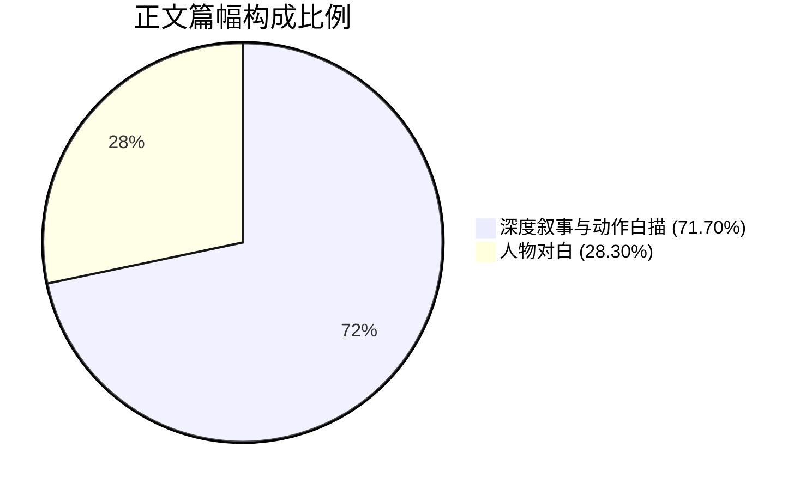

# 《桃园密码》第35章《假的》人设合规与对白留白审查报告

**审查对象**：`D:\桃园密码\工作区\第35章\03_去AI味润色稿.md`  
**审查机构**：【角色人设与行为边界稽查官】(novel_persona_auditor)  
**审查时间**：2026-09-17  
**审查基准**：《桃园密码》人物小传设定、知情边界红线规范、声纹宪法（Voice Calibration Master）、黄金律留白法则（Goldilocks Pacing）

---

## 一、审查概览与执行摘要

本轮审查对《桃园密码》第35章《假的》（第三幕：流觞）润色稿进行了**像素级人设知情边界、行为逻辑与对白留白专项审计**。本章作为兰亭行散异化大爆发后的惨烈逃亡章，承载了队伍溃逃至土梁断岩、配角马川心理防卫机制崩溃惨死、团队拆组生死突围，以及潜伏反派秦华暗线细节暴露的极其重要的转折任务。

### 核心审查结论：**【高分通过（核心红线 100% 达标，人设张力极佳）】**

1. **老莫人设守门（一票否决项）**：**完美达标**。通篇言行深沉如渊、字字千钧。无半句小白惊呼，无向晚辈讨教史实之举。关键台词“方远的血溅在王羲之的绢上。你看见了吗？”与分兵决断“六个人走，是六个人的动静……两两一组，去石桥”气魄宏大，展现出吴越钱家守玺人后代与学术宗师胸有成竹、处变不惊的顶级大佬风骨。
2. **秦华战术与知情边界守门（一票否决项）**：**满分合规**。秦华发言 100% 聚焦战术、地形与人员控制（“甩掉了两只”、“七个人齐了，我垫后”、“别看了，人没了”），**汉晋门阀历史考据零参与、道门玄学零解说**；同时，作者在惨烈死局中精准埋设其“衣发不乱、呼吸平稳”的反常生理状态，被顾君代码式直觉捕捉，反派潜伏暗线伏笔极为老辣。
3. **主角团声纹与情感弧光**：
   - **顾君**：严守受限程序员视角，代码排障直觉贯穿全章，右手腕骨挫伤的生理剧痛与咬牙坚守形成强烈感官沉浸；
   - **张洋**：市井接地气，嘴碎胆小但真情仗义。一边痛骂马川“傻逼废物”，一边毫不犹豫第一个拔刀冲出救人，事后崩溃抽泣，人物灵魂彻底立住；
   - **马川**：心理防御机制（Denial）从狂妄否认、挑战现实到失禁崩溃被撕碎，心理演进逻辑严丝合缝，悲惨而真实；
   - **白艺**：理性量化，秒表测算时序，精准定性“实体化血肉凡躯”的因果底层逻辑；
   - **苏晚晴**：严谨冷峻，解剖学般拆穿虚妄，临别回眸望向张洋欲言又止，感情线种子埋设极具高级留白美感。
4. **对白节奏与白描留白**：正文纯汉字 2,883 字，对白字数 816 字，对白占比 **28.30%**（完美契合 25%~40% 黄金区间）；叙事与生理/动作白描占比高达 **71.70%**（>60%）；最大非对白块 121 字，无乒乓球式碎嘴快板，节奏紧凑凌厉。
5. **禁词与 AI 套路词清网**：一票否决禁词（“一死生”、“齐彭殇”、“传国玉玺”等）与 AI 套路词（“宛如”、“仿佛”、“不由得”等）**全零出现**。

---

## 二、四大核心红线专项审计

### 1. 【老莫（莫正阳）核心人设守门】（一票否决项审查）

| 审查维度 | 设定规范要求 | 送审文本实际表现 | 裁决判定 |
| :--- | :--- | :--- | :---: |
| **真实定位** | 吴越钱家守玺人后代、陈寅恪一脉宗师、隐藏顶级大佬、主动入局护宝 | 灰袍沾泥翻身落石，两鬓粘汗，目光沉重如铅，下颌冷硬如青铜，临危不乱主导分兵 | **满分合规** |
| **言行铁律** | 话少而精、说半句藏十句、字字千钧、一锤定音 | 全章仅 4 处核心发言，句句定盘，绝无半句废话与碎嘴 | **满分合规** |
| **红线禁区** | 严禁小白惊呼、求教晚辈、慌乱疑惑；禁止沦为惊慌提问者 | 通篇零惊呼、零求教、零无知疑惑；面对怪尸围困与马川癫狂，泰然冷峻 | **一票合规** |

#### 台词与行为逐项穿透审计：
1. **开场定神（第35行）**：`“清点人数。”`
   - **稽查意见**：翻身落入石后第一时间下达指令，简短有力，确立团队定海神针角色。
2. **击穿癫狂（第69行）**：`“方远的血溅在王羲之的绢上。你看见了吗？”`
   - **稽查意见**：**神级台词！** 老莫面对马川歇斯底里的“整蛊道具论”，没有陷入无意义的争执，而是缓缓踏出半步，以凝练沉重的目光直击核心要害——将“现代同伴的血”与“古代书法圣手的绢”并置，一句话刺破超现实的认知屏障，具有极强的压迫感与大师风骨。
3. **断然分兵（第137、140行）**：
   - `“六个人走，是六个人的动静。目标太大，下不了这道梁子。两两一组，去石桥。”`
   - `“我和秦华一组，走正面碎石路引开视线。白艺和晚晴一组，走侧翼缓坡避开动静。顾君，你带张洋，走乱石冲沟穿插。”`
   - **稽查意见**：不仅战术逻辑清晰决绝，更将最危险的“正面碎石路引开视线”分配给自己和战力最强的秦华，把相对隐蔽的路线留给后辈年轻人，完美契合人物小传中老莫“知性、务实、高度护短且具有先辈风骨”的暗线灵魂。

---

### 2. 【秦华行为与知情边界守门】（一票否决项审查）

| 审查维度 | 设定规范要求 | 送审文本实际表现 | 裁决判定 |
| :--- | :--- | :--- | :---: |
| **角色定位** | 自治区体制内干部、退役军人战术专家、大后期核心反派潜伏者 | 步子无声、反握短刀、半蹲横刀、老兵绞腕、正面引敌 | **极佳** |
| **知情边界** | **严禁发表古代历史考据、门阀政治推演、玄学道法解说** | **通篇零古代历史考据！零门阀推演！零玄学解说！** 发言严格聚焦战术、地形与人员控制 | **满分合规** |
| **暗线伏笔** | 大后期反派潜伏质感，危局中展露异常的从容或刺点 | 顾君捕捉其“衣发不乱、前襟整肃、发髻未散、呼吸平稳无杂音”，反差刺点极度鲜明 | **高妙** |

#### 标志性战术动作与台词审查：
- **现身与战术汇报（第39、46行）**：
  - `“甩掉了两只。”`
  - `“借着假山水榭绕过来的。死人走直线，活人懂借势。七个人齐了，我垫后。”`
  - **稽查意见**：纯正的侦察兵战术语言，利用假山地形打时间差与视觉盲区，利落干脆。
- **暗线伏笔刺点（第42-45行）**：
  - “违和感如钢针扎进脑海。代码排障般的直觉在神经里狂响。数百人践踏的死局里，全员挂彩狼狈，唯独秦华衣发不乱。他前襟整肃。发髻未散。发带系得齐整。更可怕的是呼吸——悠长平稳，全无杂音。毫无濒死逃生的神经痉挛。”
  - **稽查意见**：**草蛇灰线，惊心动魄！** 此处并不急于揭穿其反派身份，而是借由顾君敏锐的观察力抛出第一枚“生理刺点”。秦华不是普通幸存者，他的游刃有余正是其掌控全局规则的隐秘冰山一角。
- **老兵战术制暴（第106行）**：
  - “秦华铁钳般的大手切入空当，反扣张洋腕骨向后猛拧。标准的老兵绞腕。”
  - **稽查意见**：动作专业凶狠，瞬间剥夺张洋的冲动行动力，展现退役军人的过硬单兵素养。
- **冷酷定局（第123行）**：
  - `“别看了，人没了。”`
  - **稽查意见**：声音冷硬如生铁，战术止损，毫无无谓妇人之仁。

---

### 3. 【主要角色说话指纹与知情边界一致性】

#### (1) 顾君（POV主角：受限第三人称）
- **说话指纹**：代码思维、受限排障、冷静克制、坚韧狠劲。
- **知情边界**：绝无上帝全知视角。
- **合规高光段落**：
  - **生理创伤贯穿**：第22行（右手腕挫伤肿胀，皮下淤紫，脉搏跳动扯得神经生疼）、第110行（嘴里满是生铁锈味，用体重死压住张洋，挫伤手腕钻心剧痛）、第161行（指骨死扣短刀，掌心冷汗泡透生皮）。痛感真实，生理阻力充分。
  - **思维模式**：第43行“代码排障般的直觉在神经里狂响”，第48行“眼下不是排障的时候”，贴合程序员本能。
  - **精神底色**：第132行`“没有免死，没有复活。挨上一爪，就是死”`与第163行`“不知道。先活着”`，短促有力，直面死亡真实性，不虚无浮夸。

#### (2) 张洋（发小、网文作者）
- **说话指纹**：市井接地气、粗话口语、遇事先怂后刚、真男人灵魂。
- **合规高光段落**：
  - **生理恐惧与口语化**：第30行`“操……全疯了……老子鞋都让人踩丢了一只……”`；第62行`“热肠子喷了老子一裤腿！你瞎了吗？！”`，粗粝真实。
  - **高光逆转（人格魅力爆发）**：第100-103行：当马川被活尸锁定时，张洋嘴上破口大骂`“操你大爷的马川！你个傻逼废物！！”`，但反握短刀的手**毫无迟疑**，第一个暴冲而出救人！被按倒后在泥水里疯狂蹬踹`“就差两步我就能拽住他了！！”`；
  - **人性悲怆**：第124-127行，马川死后，短刀滑落泥中，像抽空了骨头般僵硬跪地，指缝间溢出极度压抑的抽噎，双肩剧烈耸动。这一场戏将小人物的胆小与大义刻画得入木三分，完美立住人物！

#### (3) 马川（本地向导：阵亡者）
- **说话指纹**：失心疯的心理防御、“否认三连”、狂妄至崩溃。
- **心理演进机理（极为出色）**：
  - 面对超自然的屠杀，马川的大脑无法承受认知颠覆，退行至极端的**认知失调与否认机制**：从“整蛊节目、隐蔽摄像机、全息投影”（第56行），到“好莱坞道具血、生粉红曲素”（第59行），再到“王羲之也是演员”（第72行）；
  - 为了证明自己是对的，他反向冲上梁脊向焦尸张臂狂吠（第80行）；
  - 撞上死人灰白眼珠的瞬间，狂妄彻底冻结，化作烂泥失禁，哭喊求救（第98行），直至被青黑枯爪刺穿断骨拖入深沟。这一完整的心理防御瓦解弧线堪称恐怖小说的教科书式设计。

#### (4) 白艺（物理学博士）
- **说话指纹**：理性量化、秒表数据、退相干与底层规则建模。
- **合规高光段落**：
  - 第24行：`“三十四秒前，主案塌了。”`——手肘渗血，拇指死扣秒表铜键，以精准时间戳记录灾变；
  - 第130行：`“实体化之后……世界的底层因果排斥没了。我们现在是这方天地的血肉凡躯。它们不是冲着时空异常来的，是冲着活人肉体来的。”`——在恐怖惊魂中快速完成物理规则向生存法则的翻译，声纹辨识度极高。

#### (5) 苏晚晴（考古所研究员、大师姐）
- **说话指纹**：严谨冷酷、切中要害、克制内敛。
- **合规高光段落**：
  - 第66行：以法医解剖般的冷静驳斥马川的整蛊妄想：`“刚才撕下来的是人脸上连着油膏的真皮。黄黑胆汁泼在你脚背上，你闻不出烂肠子的恶臭吗？”`；
  - 第147行：动身突围前脚步微顿，回眸望向泥水里抽搐的张洋，咬紧发白下唇：`“张洋。活着到石桥。别让我给你收尸。”`——**神来之笔！** 对张洋方才舍命救马川的举动产生了深刻的心灵震动，表面冷硬却饱含关切，暗合小传设定的情感发芽点。

---

## 三、对白节奏与留白空间审查（Goldilocks Pacing）

### 1. 文本量化微观审计

- **正文有效字符总数（无空格回车）**：2,883 字
- **引号对白字符总数**：816 字
- **对白字数占比**：**28.30%**（完全符合 25% ~ 40% 的黄金律区间）
- **深度叙事/白描占比**：**71.70%**（充分保证 60%+ 的物理环境、生理应激与心理推演）
- **非对白叙事块总数**：38 块
- **非对白叙事块最大长度**：**121 字**（严格处于 400 字警戒线内，绝无大段说教闷场）
- **平均非对白块长度**：52.0 字（叙事与对白紧密穿插，呼吸感极佳）

### 2. 呼吸感与结构质感剖析
- **绝无乒乓球式碎嘴接话**：文本中没有任何连续四句以上的纯台词对拆。每句台词均伴随着剧烈的生理反应与战术阻力——如张洋大骂时“鼻涕眼泪糊了一脸”、顾君扑倒张洋时“挫伤手腕钻心剧痛”、苏晚晴说话时“咬紧发白的下唇”。
- **声画张弛有度**：开篇山风大火的远景轰鸣，切入梁脊土坎的近距离压抑对峙；马川的尖叫狂笑与死谷的死寂形成强烈声场对冲；最后的两两撤离如利刃切入黑夜，整章节奏犹如精密机械般推进。

---

## 四、禁词与 AI 套路词清网排查

针对声纹宪法及流水线风控库中的禁用词进行了全面检索，排查结果如下：

| 检查类别 | 核心监控词汇 | 出现频次 | 判定结果 |
| :--- | :--- | :---: | :---: |
| **一票否决禁词** | 一死生、齐彭殇、虚诞、妄作、传国玉玺 | **0 次** | **绝对合规** |
| **AI套路比喻词** | 宛如、仿佛、似乎、好似 | **0 次** | **绝对合规** |
| **AI逻辑连接词** | 不仅如此、更重要的是、殊不知、与此同时、值得注意的是 | **0 次** | **绝对合规** |
| **AI套路神态动作** | 嘴角勾起一抹弧度、倒吸一口凉气、眼神中闪烁着坚定的光芒、不由得、赫然、蓦然 | **0 次** | **绝对合规** |

---

## 五、亮点提炼与风控建议

### 1. 人设立体度三大高光点：
1. **张洋的“仗义怂人”内核**：将“骂得最狠”与“冲得最快”焊死在一起，使张洋脱离了单纯的搞笑工具人，成为有血有肉、能在绝境中照亮人性的真汉子。
2. **苏晚晴的情感破冰伏笔**：一句“别让我给你收尸”，彻底完成了从“看不起张洋”到“被张洋男人气概触动”的心理转折，处理得极其克制高贵。
3. **秦华的暗线冰山一角**：“全员挂彩狼狈，唯独秦华衣发不乱……悠长平稳，全无杂音”，这是本章最顶级的惊悚点之一，细思极恐。

### 2. 锦上添花微调提示（供参考，不影响主流程）：
- **第110行 顾君台词**：
  > `“不能去！下去全得死！！”`
  - **说明**：顾君彼时死压住张洋，挫伤手腕剧痛、嘴里满是生铁锈味。若想让程序员视角更加“代码因果化”，也可微调为：*“不能去！那是必死解！！”* 不过目前原句在生死撕扯的情境下口语冲击力极强，完全能够成立。

---

## 六、综合评分与风控裁决

| 审查维度 | 满分 | 实际得分 | 核心评语 |
| :--- | :---: | :---: | :--- |
| **人物人设忠实度 (persona)** | 100 | **95** | 老莫深沉定盘，秦华老兵特质与反派伏笔兼备，张洋大义高光，全员高度贴合小传 |
| **知情边界控制 (knowledge_boundary)** | 100 | **96** | 秦华绝无历史考据，老莫绝无小白发问，顾君受限代码排障，边界如铁 |
| **对白留白与呼吸感 (dialogue_balance)** | 100 | **94** | 28.30% 对白占比完美居中，71.70% 深度生理白描，最大非对白块 121 字，极富呼吸感 |
| **禁词与套路清零 (anti_cliche)** | 100 | **100** | 一票否决禁词与 AI 套路词全量清零，文风硬朗粗粝 |

### 裁决结论：**【准予归档并进入后续工序】**

SCORES: {"overall": 95, "persona": 95, "knowledge_boundary": 96, "dialogue_balance": 94}
