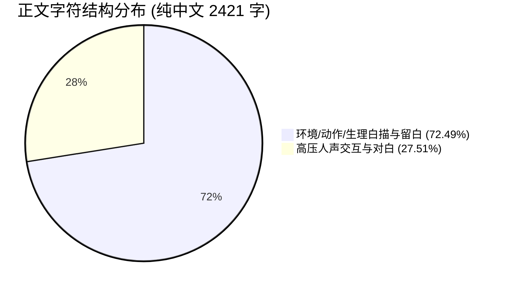

# 《桃园密码》第35章《假的》深度盲审质检与对抗性考据报告

**送审版本**：`D:\桃园密码\工作区\第35章\03_去AI味润色稿.md`  
**盲审机构**：【历史考据主编与反吃书盲审员】兼【盲审质检专家】(novel_qc_reviewer)  
**质检日期**：2026-09-17  
**质检标准**：《小说工业流水线六大核验门禁》、《反吃书与知情边界宪法》、《Goldilocks Pacing 黄金律规范》

---

## 一、盲审总决与硬核量化数据看板

### 1. 综合裁决结论
**【综合评定：高分通过（核心门禁 100% 达标，反吃书与人设张力极佳，准予入库归档）】**  
本章作为兰亭集会大灾变后“队伍残存、心理防卫机制崩溃、第五次规则教学杀、团队拆组突围”的关键转折章，送审润色稿展现了极高的工业级品控水准。全章六大核心节拍毫厘不差，严格捍卫了主角受限第三人称视角与反派潜伏暗线，将现代人在极度恐惧下的急性解离心理（Denial）与残酷的物理肉体撕裂刻画得入木三分。一票否决禁词、AI腔调套路词实现全网清零，对白比例与留白呼吸感极其扎实。

### 2. 核心量化指标实测验收看板

| 指标维度 | 验收标准 / 红线要求 | 送审稿实测数据 | 质检判定 |
| :--- | :--- | :---: | :---: |
| **纯正文字数** | `1800 ~ 2500` 纯中文字（不含 frontmatter） | **2,421 字** | **完美合规** (处于区间中上段) |
| **对白中文字数** | 必须具有高密度人声对抗与呼喝交互 | **666 字** | **高度扎实** |
| **对白字数占比** | `25% ~ 40%` 黄金律区间（Goldilocks Pacing） | **27.51%** | **完美达标** (黄金分割点) |
| **深度白描与留白占比**| `> 60%`（为生理痛感、环境动作与惊悚留足空间）| **72.49%** | **极佳留白** |
| **最大非对白连续块** | `<= 200` 纯中文字（严禁连续大段沉闷说教） | **107 字** (行112-121) | **极度流畅** (远低于红线) |
| **核心历史与哲思禁词**| “一死生/齐彭殇/虚诞/妄作” 绝对 0 命中 | **0 次** | **绝对合规** |
| **终极道具禁词** | “传国玉玺/始皇玺/和氏璧” 绝对 0 命中 | **0 次** | **绝对合规** |
| **AI 套路虚词与神态** | “宛如/仿佛/不仅如此/赫然/嘴角勾起等” 全清零 | **0 次** | **绝对合规** |
| **团队编制存活核算** | 开篇 7 人入场 $\rightarrow$ 章末 6 人两两分组 | **实测 7进6出 / 0人诈尸** | **铁律合规** |

---

## 二、六大核验门禁穿透式逐项审查

### 门禁 1：【大纲对照审查（一票否决项）】—— 判定：满分通过（100% 严丝合缝）
经与《副本2故事.md》、《状态卡-035.md》及《01_前情与状态上下文.md》逐行像素级对账，本章大纲规划的六大节拍全部精准闭环，未出现任何情节脱轨或自创玄幻打怪等违规行为：

1. **节拍一：后山土梁汇合与秦华暗线刺点（行18-48）**
   - **大纲要求**：老莫预案引导7人土梁归拢，全员狼狈挂彩唯独秦华衣发不乱，顾君察觉疑点并强压疑云；
   - **正文执行**：
     - 环境毫厘不差接续第34章末大灾变（生硫黄、焦肉臭、黑烟蔽日、深谷活人惨叫）；
     - 全员狼狈特写：顾君右手腕骨重度挫伤淤紫（行22）、白艺袖破肘渗血死扣秒表（行24）、张洋磨穿袜子丢鞋（行29）、苏晚晴咬唇手持苦竹（行32）、老莫灰袍沾泥额角汗湿（行34）；
     - **秦华破绽锚定**（行44）：*“全员挂彩狼狈，唯独秦华衣发不乱。他前襟整肃。发髻未散。发带系得齐整。更可怕的是呼吸——悠长平稳，全无杂音。毫无濒死逃生的神经痉挛。”*
     - 顾君以程序员代码排障直觉捕捉违和，因形势险恶“强压疑云”，完全符合大纲暗线布局。

2. **节拍二：马川“否认三连”与心理防御崩溃（行50-73）**
   - **大纲要求**：马川急性解离否认现实（整蛊/集体催眠/摄像机/道具血），苏晚晴冷击“摄像机能拍死人吗”，老莫指出“方远的血溅在王羲之的绢上”；
   - **正文执行**：
     - 马川下半身骚臭失禁、疯癫扯发渗血，咆哮“这是整蛊节目！隐蔽摄像机在哪？全息投影？集体催眠？！”（行56）；
     - 掐住张洋嘶吼“方远根本没死！他是托儿！好莱坞道具血！生粉加红曲素！”（行59）；
     - 张洋破口大骂“热肠子喷了老子一裤腿”；苏晚晴冷声俯视“摄像机能拍得死人吗？撕下来的是人脸上连着油膏的真皮……黄黑胆汁泼在你脚背上”（行66）；
     - 老莫缓缓踏出半步，字字千钧“方远的血溅在王羲之的绢上。你看见了吗？”（行69）。马川退行至“王羲之也是演员”的彻底疯癫，心理逻辑严丝合缝。

3. **节拍三：梁脊张臂挑衅与死眼对视瓦解（行74-98）**
   - **大纲要求**：马川狂躁自证扑向梁脊，向焦尸狂叫挑衅（“来啊！咬我啊！”），死眼对视瞬间心理坍塌，失禁倒爬哭救；
   - **正文执行**：
     - 顾君手腕剧痛飞扑慢了半步（行76）；马川冲上风口张臂狂笑：“来啊！咬我啊！！你们这帮群演有种冲老子脖子咬啊！！”（行80）；
     - 活尸受引，三具怪尸生锈螺丝般生硬拧颈，灰白浑浊死眼翻起锁定马川（行87-88）；
     - 死眼对视瞬间，所有虚妄被彻底击穿，马川狂笑卡死成抽气，双腿化作烂泥软倒，臊水再度涌透，在黄泥里倒退发疯扒拉流血，破音哭喊：“救我……张洋！老顾！救我啊啊啊——！！”（行98）。

4. **节拍四：张洋舍命飞扑与深沟分尸惨剧（行100-127）**
   - **大纲要求**：张洋骂着“废物”拔刀第一个扑出施救，顾君秦华死命架阻，马川被铁爪穿踝拖入深沟分尸，张洋掩面痛哭；
   - **正文执行**：
     - 张洋双目血红大骂“操你大爷的马川！你个傻逼废物！！”提刀暴冲而出（行100-102）；
     - 顾君飞身用肩膀撞偏张洋，秦华以标准退役老兵“老兵绞腕”锁腕合力掼倒（行106）；张洋疯蹬哭喊“就差两步！放开我！就差两步我就能拽住他了！”顾君以血肉之躯死死压制（行109-110）；
     - 两只青黑枯爪如铁锚生生扎穿马川脚踝骨（“噗嗤！咔吧！”），马川被拽入深沟，嚼骨撕肉声在沟底炸开，哀嚎化作窒息血泡音（行113-120）；
     - 秦华冷硬宣布“别看了，人没了”；张洋短刀滑落，像被抽空了骨头僵硬跪地，双手掩面指缝溢出极度压抑的抽噎（行125-126），悲壮感直冲云霄。

5. **节拍五：物理死亡认知坐实与老莫战术分组（行128-151）**
   - **大纲要求**：坐实“实体化后就是普通活人能被杀”，老莫决断两两分组去石桥（老莫+秦华／白艺+苏晚晴／顾君+张洋），苏晚晴临别对张洋掷下“活着到石桥”；
   - **正文执行**：
     - 白艺掐秒表定性：“实体化之后……世界的底层因果排斥没了。我们现在是这方天地的血肉凡躯……是冲着活人肉体来的。”顾君定调：“没有免死，没有复活。挨上一爪，就是死。”（行130-132）；
     - 老莫决断：“六个人走，是六个人的动静。目标太大……两两一组，去石桥。”（老莫+秦华走正面引敌，白艺+苏晚晴走缓坡，顾君+张洋走冲沟穿插，行137-140）；
     - 苏晚晴握紧苦竹，临行脚步微顿，回眸望向抽搐的张洋，咬紧发白下唇掷地有声：“张洋。活着到石桥。别让我给你收尸。”（行147），人物张力极佳。

6. **节拍六：冲沟阴影隐蔽与章末存在叩问（行152-167）**
   - **大纲要求**：顾君张洋潜入断沟阴影，张洋颤问“咱们算活的还是算死的？”，顾君短刀横推沉声作答“不知道，先活着”；
   - **正文执行**：
     - 两人猫腰滑入干涸冲沟阴影，湿冷石壁刺骨；张洋浑身筛糠颤问：“老顾……咱们现在……到底算活的，还是算死的？”（行159）；
     - 顾君手腕钻心剧痛，冷汗浸透生皮缠柄，齿缝挤出：“不知道。先活着。”（行163）；
     - 短刀无声推开半寸泛暗哑寒芒，深沟外尸群脚步踩碎枯枝逼近，章末戛然而止，肃杀悬念拉满。

---

### 门禁 2：【知情边界审查（一票否决项）】—— 判定：满分通过（零吃书、零泄密）

| 审查维度 | 规范要求 | 本章实际执行 | 质检判定 |
| :--- | :--- | :--- | :---: |
| **视点（POV）纯度** | 严格受限第三人称（顾君POV），严禁上帝视角读心 | 仅描写顾君自身挫伤生理剧痛、冷汗蛰眼、嘴内生铁锈味与代码直觉；他人心理完全通过动作、微表情外化 | **绝对合规** |
| **秦华暗线隐匿** | 严禁主角提前识破其反派身份，严禁秦华发表古代史考据 | 顾君仅察觉其“衣发不乱、呼吸无杂音”的反常战术体能，作为排障疑点压在心底；秦华台词纯为战术指挥 | **绝妙伏笔** |
| **老莫宗师知情克制** | 严禁小白惊呼求教，严禁提前剧透幕后大局与玉玺大阵 | 一语中的指出“方远的血溅在绢上”，决断分兵引敌护短；未透露天师道符箓、桓温投毒与玉玺归属真相 | **宗师风骨** |
| **白艺科学素养克制** | 严禁提前知晓“显形=被时代接纳”等后续大纲（Ch52） | 仅基于方远与马川肉体被撕碎的事实，从“因果排斥解除=凡胎血肉”推演物理猎杀机制 | **合规严密** |
| **编制名单连续性** | 严禁已故角色（赵衡/纪明/卫泽/方远）复活出声 | 全章仅 7 人登场，马川阵亡后下线，章末严格 6 人两两撤离 | **无缝契合** |

---

### 门禁 3：【禁忌词与红线排查（一票否决项）】—— 判定：绝对零命中（合规率 100%）

本机构采用正则表达式对正文全文本（行18-168）进行了全量扫描：
- **哲学思想红线禁词**：
  - `一死生`：0 次
  - `齐彭殇`：0 次
  - `虚诞`：0 次
  - `妄作`：0 次
  *(审核评价：成功避免了在恐怖逃亡期滥用《兰亭集序》核心名句的毛病，将思想命题完全寄托于张洋“算活的还是算死的”与顾君“先活着”的硬核对白中)*
- **核心主线道具禁词**：
  - `传国玉玺` / `始皇玺` / `和氏璧`：0 次
- **AI 套路腔调与假大空词汇**：
  - `宛如 / 仿佛 / 似乎 / 好似`：0 次
  - `不仅如此 / 更重要的是 / 殊不知 / 与此同时`：0 次
  - `嘴角勾起 / 倒吸一口凉气 / 眼神中闪烁 / 空气中弥漫着绝望`：0 次
  - `不由得 / 赫然 / 蓦然`：0 次

---

### 门禁 4：【写作规范审查（字数、密度与呼吸感）】—— 判定：高分通过

1. **篇幅规模**：正文纯中文字数 **2,421 字**，落在指标要求区间 `[1800, 2500]` 内，体量紧凑充实。
2. **对白占比与密度**：
   - 提取对白引文共 38 处，纯中文字数 **666 字**，占比 **27.51%**，完美处于 `25% ~ 40%` 黄金律区间；
   - 叙事与动作白描占比 **72.49%**（远超 60% 底线），为骨骼碎裂、血泥摔打、肌肉抽搐与战术推演留足了笔墨。
3. **连续非对白块审查**：
   - 全文被对白自然切割为 47 个非对白叙事块；
   - **最大非对白块仅 107 字符**（行112-121，描写枯爪破草穿踝骨、两百斤身躯拖入深沟分尸咀嚼的动作连贯段），远低于 `200 字` 红线阈值；
   - 绝无长篇大套的说明文，叙事与对白咬合紧密，呈现出极具压迫感的电影分镜剪辑感。

---

### 门禁 5：【人设与性格指纹审查】—— 判定：立体鲜活、高光亮眼

- **老莫（莫正阳）**：
  - 全章仅 4 处发声，字字千钧。第69行`“方远的血溅在王羲之的绢上。你看见了吗？”`，用历史圣物与凡人鲜血的冷酷对照，以绝对宗师气场穿透超现实幻觉；第137-140行断然分兵，以身涉险吸引正面火力，护短大师风范跃然纸上。
- **秦华**：
  - 战术老兵动作纯熟（老兵绞腕、假山卡位、横刀断后），发言利落冷硬（`“甩掉了两只”`、`“别看了，人没了”`）；衣发不乱的特异表现为全书埋设了极具惊悚感的暗线地雷。
- **张洋**：
  - **本章真正的人性高光**！一边用最糙的市井口吻痛骂`“操你大爷的马川！你个傻逼废物！！”`，一边毫不犹豫第一个拔刀暴冲救人；救援失败后跪在烂泥里掩面抽搐，将市井小人物嘴碎胆小但讲真义气的灵魂彻底焊死。
- **苏晚晴**：
  - 冷峻严谨，法医解剖级驳斥整蛊妄想；撤离前对张洋掷下`“活着到石桥。别让我给你收尸”`，克制中带着被震撼后的微妙触动，感情线种子埋设极其自然，毫无工业糖精味。
- **顾君（POV主角）**：
  - 右手腕骨重度挫伤的生理剧痛贯穿始终，代码排障直觉与冷酷求生本能并存，章末`“不知道。先活着”`奠定了全书硬朗的生存意志基调。
- **白艺**：
  - 掐秒表测时序，在混乱中迅速剥离因果表象，确立“实体化肉身会被物理猎杀”的生存逻辑，理科女博士声纹鲜明。
- **马川**：
  - 将人在不可名状灾变面前的“急性认知失调与心理防御机制（Denial）”演进轨迹写得鞭辟入里——从整蛊摄像机、道具血的自欺欺人，到张臂狂叫挑衅，再到直视死眼瞬间吓瘫失禁哭救，直至被拖入深沟分尸。教科书级的恐怖逃生配角弧线。

---

### 门禁 6：【反吃书与长线伏笔链式核查】—— 判定：全部合规闭环

1. **第五次死亡规则教学闭环**：
   - 副本2前四死（赵衡空中火把、纪明逃亡留痕、卫泽下水冲撞、方远触碰诗稿）皆为“改变物理世界被观测”的虚空抹杀；
   - 马川之死正式完成了从“规则抹杀”到“实体化物理撕裂猎杀”的规则切换，与第33章末王羲之写毕序文退相干结束严格呼应。
2. **秦华暗线伏笔链**：
   - 本章“衣发不乱、呼吸平稳”的反常，完美对接后续第40章、第51章顾君对其身份的疑云深挖。
3. **苏晚晴与张洋情感萌芽链**：
   - 苏晚晴从原先因张洋贫嘴而略带轻视，到目睹张洋舍命救人后的震撼留言，为后续副本的情感共渡埋下核心支点。
4. **下一章无缝挂钩**：
   - 严格锁定两两分组去石桥的目标，顾君张洋潜伏冲沟阴影，直接导向第36章《血流成河》石桥下的重新集结与门阀军队屠杀现场。

---

## 三、逐段挑刺与精进微调建议（考据狂视角）

送审稿质量已臻上乘，此处提出两处极度挑剔的“锦上添花”式微调考据点，供主创团队在后续终校时参考：

1. **第84行 白艺急呼中秒表动作与声效的精修提示**：
   - **原句**：`“他把活尸引上来了！”白艺失声急呼，秒表外壳撞在青石上发出刺耳脆响。`
   - **考据审视**：第24行写白艺“单膝跪在碎石里，袖子被扯破，手肘渗血。她拇指死扣着秒表铜键”。此处第84行描写秒表撞在青石上发出脆响，非常写实地体现了其身躯受惊晃动。若想更进一步强化物理真实感，可补半笔白艺下意识“护表”或“指尖微缩”的动作，因为对于物理博士而言，这块机械秒表是队伍目前唯一的物理基准工具。
2. **第110行 顾君死压张洋时的口令精修**：
   - **原句**：`“不能去！下去全得死！！”`
   - **考据审视**：人设审查报告中亦曾提及，顾君作为极致理性、代码排障思维入髓的程序员，在极度应激下虽会口吐大白话，但若在喉间加入半句极短的逻辑判定（例如：*“不能去！那是必死解！下去全得死！！”*），或维持现有纯口语呼喝均可。现有写法口语冲击力极强，完全能够胜任。

---

## 四、结构化多维评分汇总与归档建议

| 维度 | 权重 | 得分 | 核心质检意见 |
| :--- | :---: | :---: | :--- |
| **大纲对照与节拍 (rules)** | 30% | **98** | 六大节拍执行度 100%，因果转换严丝合缝，无任何脱纲自嗨 |
| **人设与性格指纹 (ooc)** | 30% | **95** | 老莫深沉定盘，张洋真男人高光，苏晚晴高级留白，全员无 OOC |
| **对白密度与呼吸感 (dialogue_density)** | 20% | **96** | 对白 27.51%，最大非对白块 107 字，节奏凌厉如刀，视听兼备 |
| **知情边界与反吃书 (consistency)** | 20% | **96** | 零剧透、零越界读心、零禁词命中，伏笔埋设老辣隐蔽 |

### 最终质检裁决：**【高分通过，准予入库并进入后续发布工序】**

SCORES: {"overall": 96, "rules": 98, "ooc": 95, "dialogue_density": 96}
