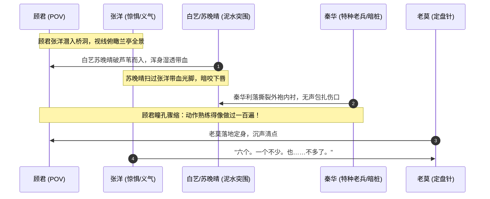
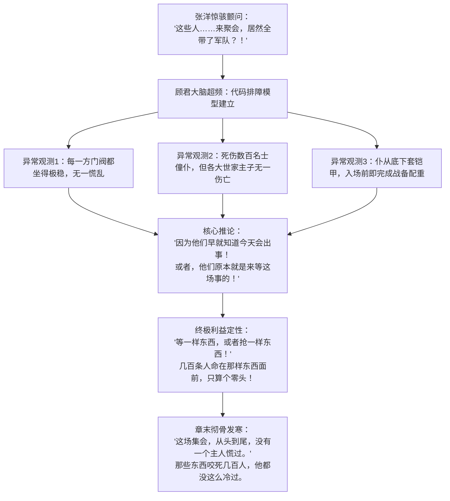

# 第36章《血流成河》前情探索与状态对齐任务卡

---

## 一、前章结尾事实总账与物理状态无缝对接 (Chapter 35 Ending Continuity Ledger)

### 1. 精确时空坐标与微观环境接续
- **精确时空坐标**：东晋穆帝永和九年（公元353年）三月初三，申时偏晚（约 15:45 ~ 16:20）。
- **天光与天象底色（毫厘不差接续第35章末）**：
  - 日头偏西，刺眼的惨白日晕逐渐转为沉郁昏黄的血色余晖，斜照在浓烟弥漫的兰亭山谷；
  - 偏厢大火仍在蔓延，黑烟如巨蟒盘旋于林木上方，火星灰烬簌簌落下，落在湿冷的溪泥与破烂的衣物上；
  - 空气中的气味形成残酷分层：上层是干燥炽烈的焦木与生硫黄恶臭，下层紧贴水面的则是刺鼻的烂泥腐草味、生铁般的浓血腥气与开膛破肚后的胆汁粪便酸臭。
- **核心地点与地理微地形**：
  - **核心掩体：兰亭石桥桥孔阴影**：
    - 位于曲水下游交汇处的双孔粗石拱桥，桥拱由风化发黑的青石块垒砌，桥墩附着湿滑阴冷的青苔与滑腻的暗黑水垢；
    - 桥孔底部为背阴浅滩，积存着干枯的芦苇断茬与冲积乱石，石壁上渗着冰冷的地表暗水，水滴声“嗒、嗒”不断，空间逼仄昏暗，仅容数人半跪蜷缩；
    - 桥孔朝向曲水主干与主会场方向，地势稍高，视线恰好穿过芦苇缝隙与石桥栏柱，能将大半个兰亭主会场、流觞曲水两岸以及东西两侧山林碎石径尽收眼底。
  - **石桥物理浩劫痕迹（开篇必须直接呈现的残酷现场）**：
    - 石桥表面已被血洗过：原本雅致洁净的青石桥板上，布满拖曳拉扯出的黏稠黑红血痕与暗红肉糜；
    - 桥东侧汉白玉雕花石栏上，挂着撕烂了半截、沾满泥浆污血的鹅黄织锦名士大袖丝袍；
    - 桥墩下方的浅水卵石滩上，横陈着两具被开膛啃食殆尽的仆从尸体，面皮被剥扯，残存的肠子顺着浅溪漂浮打转，灰白死眼望向昏暗的天空。

### 2. 六人分组突进与桥下暗影汇聚动线
接续第35章末尾老莫的果决指令（“六个人走是六个人的动静，两两一组去石桥”），三组人借由不同地形掩护，在生死时速中突进至石桥汇合：
1. **先遣突入组（顾君 + 张洋）**：
   - 动线：自后山土梁背阴处的岩缝与干涸深沟一路滑行匍匐，借着乱石堆与枯藤阴影蛇行穿插；
   - 到达：最先摸入石桥西侧桥孔深处。顾君持刀控卫，张洋脱力瘫靠在冰冷渗水的青石壁上，两眼通红充血，心跳尚未平复；
   - 侦察视野：透过桥孔阴影，率先俯瞰并目睹曲水沿线的地狱全景。
2. **侧翼潜行组（白艺 + 苏晚晴）**：
   - 动线：自侧翼缓坡滑下，扎入曲水下游茂密的湿地芦苇荡；
   - 到达：破水穿苇而行，浑身湿透，泥泞裹身，带着水草与冰冷溪泥从芦苇丛中钻入桥孔；
   - 伤情：白艺手背与手肘擦伤加剧，渗出血水；苏晚晴脸颊划痕微肿，削尖苦竹杆死扣手中。
3. **正面突进组（老莫 + 秦华）**：
   - 动线：利用正面碎石小径的岩石死角，利落规避多具游荡丧尸，走乱石滩迅捷突进；
   - 到达：最后利落切入桥孔阴影，老莫身形沉稳，秦华横刀扫尾；
   - 关键微动作：秦华入洞后毫无迟滞，立刻撕下自己外袍下摆干净干燥的布料，反手为白艺和苏晚晴包扎伤口，动作极其干脆娴熟。

### 3. 存活编制与历史死相全账本（绝对严防吃书与前知）
- **存活编制严格核算：11人 $\rightarrow$ 7人 $\rightarrow$ 6人（当前全员严格 6 人）**：
  - **Ch18 赵衡**：因碰触浮空火把被土著观测，触发世界规则杀，于溪水中暴烈溺亡（留尸）；
  - **Ch20 纪明**：因踩碎石块留下异常痕迹被察知，触发规则杀，坠崖身亡；
  - **Ch26 卫泽**：涉水修禊时撞击名士右肩产生接触力觉，触发规则杀，无外伤诡异暴烈溺毙；
  - **Ch33 方远**：执念失控冲撞主案惊呼咆哮，成为物理实体首例，被变异名士当场扑杀分尸，鲜血溅落王羲之绢帛；
  - **Ch35 马川（上一章刚死）**：精神彻底解离崩溃，否认现实狂笑挑衅丧尸，在死眼对视瞬间防御瓦解，张洋舍命相救未果，马川被铁爪穿踝拖入深沟乱石，被数具丧尸分尸吞噬惨死！
- **【一票否决红线】**：
  - 当前桥孔下存活人员**严格锁定为 6 人**：顾君、张洋、白艺、苏晚晴、老莫、秦华；
  - 绝对严禁赵衡、纪明、卫泽、方远、马川以任何形式“复活”、“发声”或“被错误计入存活”；
  - 互数人数时必须极其冰冷准确：“六个。一个不少。也……不多了。”

### 4. 六名存活角色当前物理与心理状态账本

| 角色 | 物理伤痕与体征（第35章累积） | 衣着装备与武器状态 | 心理算力与行为底色 | 禁忌边界与破绽锚点 |
|---|---|---|---|---|
| **顾君**<br>*(受限第三人称POV)* | 右手腕严重挫伤肿胀，皮下淤紫如茄；脉搏跳动带动神经抽痛；冷汗混杂炭灰，眼眶干涩充血；喉头干裂发苦如吞生铁屑。 | 反握牛角短刀，手心冷汗将缠柄生皮泡得滑腻冰凉；粗布短褐沾满黄泥与灰烬。 | 程序员代码排障逻辑超频运转；从生理恐怖抽离，敏锐捕捉战场异常：主子一个没死、盾阵秩序井然；恐怖对象彻底由“丧尸”跃迁至“门阀人心”。 | 严禁全知视角；严禁直接叫出“玉玺”或“北伐”等未来定论，只能推导至“等一样东西，或者抢一样东西”。 |
| **张洋**<br>*(直觉弹幕/情感爆点)* | 右脚鞋子在奔逃中踩脱丢失，破损的白棉袜被碎石扎烂，脚底皮肉模糊渗血；两排牙齿在风中咯咯打战，双膝因剧烈跑动发软颤抖。 | 握着开山小直刀，刀刃微卷沾泥；满脸涕泪黄泥糊面，眼眶如滴血般赤红。 | 刚经历舍命救马川失败的巨大创伤，陷入深深的虚无与惊恐；但其直觉极准，问出全章核心题眼：“这些人来聚会，居然全带了军队？！” | 绝不文绉绉说教；市井白话、爆粗、颤抖、本能的仗义与恐惧并存。 |
| **白艺**<br>*(物理博士/理性防线)* | 浑身湿透，芦苇碎叶贴在脸颊与发梢，冷风一吹嘴唇发乌发紫；左手肘与右手指节大片擦破，血水混着溪泥渗出。 | 单手死死攥紧机械秒表，外壳撞出凹痕；衣袖被撕烂半幅，露出青紫小臂。 | 用冰冷的数据与物理观察克制恐惧；观察焦尸死死端着耳杯的行为残留；确认实体化后的生物学脆弱性。 | 绝不能流露出女学者的造作，而是用物理逻辑在绝境中维持冷静。 |
| **苏晚晴**<br>*(考古研究员)* | 长马尾被溪水泡透湿哒哒贴在后背；脸颊被荆棘割出的血痕发红微肿；浑身泥水，呼吸急促而压抑。 | 双手死死横握削尖苦竹杆，竹尖沾染墨绿汁液与泥浆；腰间小挎包浸透水。 | 考古学家的敏锐观察力；目睹“仰观宇宙之大”诗稿被踩碎与许询祈福青铜台倾覆，内心受到文明碎裂的剧烈震动；对张洋的拼命暗自改观。 | 话极少，句句切中器物与历史细节；绝不发表长篇政治考据讲座。 |
| **老莫**<br>*(钱家守护者/定盘针)* | 灰布长袍下摆全被泥浆浸透沉重，发髻凌乱但神色如铁；呼吸深长平稳，下颌坚硬如青铜。 | 双手收在袖中，暗扣护身短锥，随时准备近身搏杀；布鞋沾满碎石细沙。 | 洞悉魏晋门阀政治本质与血腥算盘；不惊不慌，冷眼注视各家仆从拔甲列阵；定桥为点，少言寡语，一锤定音。 | 严禁主动泄露吴越钱家、玉玺守护者等核心秘密；保持学者威严与老道深沉。 |
| **秦华**<br>*(战术老兵/暗桩疑点)* | **【核心破绽延续】** 在泥石滩与尸群间高速突进，依然呼吸绵长均匀；发髻虽有微散但整肃；全无常人的虚脱瘫软。 | 手握开刃短刀，动作利落如尺量；撕下自己外袍内衬做绷带，分发包扎。 | **【重要伏笔】** 展现出极其过硬的战术包扎与清点纪律（“像做过一百遍”），扮演极致可靠守护者，同时加深顾君心中的疑云。 | 绝对严禁露怯；绝对严禁科普古代家谱；专注于战术隐蔽与动作执行。 |

---

## 二、兰亭惨烈全景与视听感官白描总目 (Sensory & Visceral Horror Manifest)

站在石桥孔洞阴影下，主角团透过芦苇缝隙与桥栏石隙，目击的是一幅将魏晋风雅彻底碾碎的人间炼狱全景图：

```
                             【兰亭石桥桥下石洞视线全景】
                                         |
     +-----------------------------------+-----------------------------------+
     |                                   |                                   |
【左翼水系：流觞血溪】              【中央泥滩：文明践踏】              【右翼高台：道法崩裂】
· 溪水尽赤，红浪卷过漆木耳杯        · 诗稿踩进泥血烂肉                  · 许询青铜祈福台被撞翻
· 诡异焦尸蹲在水边死攥耳杯          · "仰观宇宙之大"被肉糜糊透          · 铜香炉滚进血溪咕嘟冒泡
· 张洋呢喃："那只杯，一直端着…"     · 锦衣丝袍化作裹尸烂布              · 驱邪法事沦为招灾大醮
```

### 1. 水系惨状：血溪浮觞的荒诞地狱
- **血染曲水**：清澈蜿蜒的曲水彻底变成了黏稠滞重的赤红血溪，暗红的血沫在乱石漩涡中翻滚打转；
- **朱漆耳杯与残酒**：原本盛满美酒、供名士吟诗传递的精美漆木双耳羽杯，在暗红的血浪里载浮载沉，杯中残存的酒液混杂着血水，随着水波晃荡打转，撞在浅滩的碎石与浮尸断肢上发出轻微的“叩、叩”声；
- **视觉反差极值**：朱红的漆器、描金的云纹，在暗红浑浊的死人血水里漂流，极致的雅致与极致的血腥暴力粗暴重叠。

### 2. 诡异定格特写：曲水边的端杯焦尸
- **尸骸定格**：在石桥斜前方十余步的曲水浅滩边，半蹲着一具从偏厢火场爬出的半焦尸怪；
- **肌体白描**：半边脸孔皮肉已烧成碳黑龟裂，另一半面皮则呈泛青的尸斑色，空洞浑浊的死白眼珠死死盯着水面；
- **诡异动作残留**：它的右手不是撕扯活人，而是枯黑干瘪如鸟爪的五指，依然死死抠着一只朱漆木羽杯！
- **战栗细节**：涎水混着黑血从焦烂的嘴角一滴滴漏进杯中，它半蹲在岸边，姿态与片刻前坐在锦席上清谈品酒的名士一模一样！
- **声纹碰撞**：张洋顺着顾君视线望去，喉结艰难地上下滑动，牙齿打战挤出一句话：“老顾……那只杯……它、它活着的时候就一直端着……”白艺双唇抿得发白，低声道：“肌肉在神经毒素与剧烈灼烧中瞬间痉挛僵化，死前最后的神经突触指令被锁死成了物理刻痕。”

### 3. 文明撕裂：墨迹与烂肉糊作一团
- **残卷泥泞**：鹅黄的硬黄纸、洁白的越绢诗稿被无数只狂乱奔逃的脚爪踩进泥血之中；
- **名句受辱特写**：半张沾满黑血脚印的宣纸贴在碎石缝里，上面是狂草写就的“仰观宇宙之大”六个大字，字迹飘逸洒脱，然而“宇宙”两字已被一截烂肉与黄黑色的内脏油膏死死糊住，字墨晕开，宛如啼血；
- **风雅破灭**：名士头戴的纶巾被踩烂在浅泥里，断裂的象牙簪横插在断指旁，平日里自诩超凡脱俗的魏晋名流，此刻与草芥野狗无异。

### 4. 祭台倾覆与玄学破灭
- **青铜法台倒塌**：原本设在水滨核心、用于上巳节祈福除疫的许询青铜法台被发狂溃退的人潮生生撞翻；
- **法器沦为凶器**：青铜台角砸碎了一名跌倒道童的头骨，红黄秽物溅满台基；
- **铜香炉滚溪**：沉重的兽首三足铜香炉一路滚过泥坡，“咚”的一声跌进血水汹涌的浅溪，炉中尚未燃尽的安息香与降真香被血水呛灭，在赤红水面上咕嘟冒起几个浑浊的灰黑气泡，随即沉寂。

---

## 三、六人桥下重聚细节与深层暗线刺点 (Regroup & Deep Suspicion Beats)



### 1. 狼狈的湿身与残存生机
- **芦苇中的喘息**：芦苇丛沙沙剧烈抖动，白艺在前、苏晚晴在后，两人几乎是连滚带爬跌进桥孔湿泥中；
- **生理状态白描**：白艺浑身被冰冷的溪水泡透，单薄的外衣紧紧贴在身上，冷风灌进桥洞，冻得她牙齿剧烈打颤，高精度秒表被她用破布紧紧包在怀里；
- **苏晚晴与张洋的对视火花**：
  - 苏晚晴反手拄着苦竹杆站定，满头湿发散乱，第一眼便扫向缩在岩壁边的张洋；
  - 看到张洋那只跑丢了鞋、磨得皮开肉绽满是泥血的右脚，以及他因剧痛和后怕而剧烈颤抖的肩膀，苏晚晴发白的嘴唇微动了一下；
  - 刚才在土梁上，是这个平日嘴碎怕死的男人第一个提刀冲出去救马川。苏晚晴没有说话，只是默默移开视线，却将手中的竹竿在烂泥里插得更深。

### 2. 秦华撕袍做绷带：老兵守护者与致命疑点
- **战术包扎特写**：
  - 秦华与老莫切入桥孔后，秦华反手收刀入鞘，蹲在白艺与苏晚晴身侧；
  - 他毫不犹豫地伸手抓住自己直裰外袍的下摆，“撕拉——”一声脆响，两道尺许宽、平整利落的布条被生生扯下；
  - 他没有丝毫废话，左手按住白艺的手腕，右手缠绕布条，交叉打结、拉紧、固定，随后如法炮制替苏晚晴包扎脸颊与手臂渗血的划痕；
  - 整个动作在十秒钟内一气呵成，单手锁结，松紧程度精准卡在止血却不阻断动脉血流的临界点上；
- **顾君代码排障的神经刺痛**：
  - “动作熟练得像做过一百遍。”——顾君靠在冰冷的桥墩上，冷眼看着秦华翻飞的手指，心脏在胸腔里沉重撞击；
  - 现代社会里，一个自称在地方机关或企事业单位工作的普通中年人，怎么可能拥有这种近乎本能的战地特种兵包扎手法？
  - 结合第35章秦华在数百人践踏中逆流脱身却“衣发不乱、呼吸平稳”的异常，顾君在脑海深处为秦华建立了一个加锁的代码进程。然而此刻大敌当前，秦华又是全队最强战力与可靠屏障，这根刺只能深深扎在心底。

### 3. 清点人数的冰冷战栗
- **沉默的核对**：老莫站在桥洞光影交界的阴影边缘，目光从顾君、张洋、白艺、苏晚晴、秦华脸上一一扫过；
- **对白交锋**：
  - 张洋抹了一把脸上的泥水与鼻涕，声音干瘪沙哑得如同两块砂纸在摩擦：“数完了……六个。一个不少。”
  - 他吸了吸鼻子，眼眶红得发黑，喉结剧烈抖动了一下，补了半句：“也……不多了。”
  - 没有人回应。深沟里马川被撕碎时的骨肉嚼碎声，仿佛还顺着山风在众人耳膜边盘旋。

---

## 四、大势力亮底牌：权力机器入场与阶级冰冷碾压 (The Power Machine Emerges)

本章核心高潮与视觉转折：从“丧尸围攻无序逃亡”彻底转换为“门阀军队冷酷入场接管战场”！

```
                               【兰亭会场权力机器格局图】
                                            |
         +----------------------------------+----------------------------------+
         |                                                                     |
   【东面：陈郡谢氏（谢万）】                                           【西面：荆州军府（桓伟）】
   · 苍凉军号长鸣，山林甲光闪烁                                         · 侍卫十步横戟成环，冰冷森严
   · 仆从撕袍露两裆铠，大盾如山                                         · 敢跨十步圈者，长戟立斩不赦
   · 谢万披发按剑，溃民如水让舟                                         · 逃难名士被生生逼退回尸群
   · 谢安/琅琊王氏从容退入盾阵                                          · 铁血杀气（Ch22桓家杀气回收）
   · 盾门紧闭！任凭外围拍盾哭号
   · 长矛从盾缝递出："一下一下，不快不乱"
```

### 1. 东面谢氏：号角长鸣，白袍之下是重甲
- **苍凉号角破空**：
  - 正当满场宾客在尸群追杀下如无头苍蝇般哭嚎奔撞时，兰亭东侧青松掩映的山梁上，骤然响起一声低沉、苍凉、穿透金石的牛角长号声——呜————！
  - 号角声不急不躁，带着古代边军扎营推进时的绝对威压，瞬间压制住了全场的哭喊；
- **名士撕袍变铁军**：
  - 伴随着号角，原本侍立在会场东侧水榭、低眉顺眼的数十名谢氏青衣僮仆与管事，动作整齐划一地反手扯住衣领，猛力向下一撕！
  - 刺耳的裂帛声响成一片！宽大的素色丝麻外袍被尽数抛弃在血泥中，露出了内衬冰冷幽暗的精铁两裆铠与革带！
  - 树林后方沉重的脚步声如雷霆滚地，数十名全副武装的谢家私曲甲士大踏步切入会场，重型包铁大盾“轰”的一声砸入泥土，八尺精铁长矛如荆棘林立，呼吸之间，便在曲水东岸筑起了一座密不透风的生铁重镇！
- **顾君脑海中的震撼重击**：
  - “赴会带仆从天经地义。但如果仆从底下穿的是两裆铠……那就绝不是来赴会的了！”

### 2. 阵前按剑：谢万如中流砥柱
- **谢万的仪态白描**：
  - 领军之人正是陈郡谢氏谢万。他未着战甲，依然是一身素白长衫，发髻披散，神情冷峻自矜；
  - 他手按剑柄，立于如墙大盾的前方，长剑始终未曾拔出半寸；
- **名士溃退的荒诞景象**：
  - 数十名满身血污、鞋袜尽失的狂奔名士向他涌来，在撞上谢万冰冷视线的瞬间，竟然如同湍急的洪水撞上坚固的船头，本能地向两侧分开溃逃；
  - 谢万眼神淡漠，没有看死人，也没有看活人。他站在那里，本身就是门阀权柄的图腾。

### 3. 盾墙内外：生与死的绝对界线
- **核心入阵的从容**：
  - 盾阵侧翼留出了一道仅容两人通过的狭窄豁口；
  - 谢安手持麈尾，步履从容，衣角甚至未曾沾染多少血迹；琅琊王氏核心子弟（包括面色平静的王羲之）在重甲护卫簇拥下，缓步迈入盾阵之内；
  - 他们神色严肃，但眼底没有一丝濒死逃生的仓皇，仿佛只是移步偏厅换一盏清茶；
- **盾门紧闭与绝望拍盾**：
  - 当王谢核心踏入盾阵的瞬间，沉重的包铁大盾“轰隆”合拢，生铁搭扣咬死，盾门彻底封死！
  - 紧随其后的数百名名士、庶族宾客、娇贵侍妾与家奴仆役疯了一般扑向盾墙！
  - 他们用血肉模糊的双手死死拍打着冰冷的铁皮大盾，十指抓得指甲翻开、鲜血淋漓，破音哀嚎：“谢中郎！带上我！我是太原孙氏的门客啊！”“王右军！救救我们！让我进去！！”
  - 盾墙如铁水浇铸，纹丝不动。重甲甲士面无表情，隔着铁盾冷冷俯视着外面的同类，连眼皮都未曾眨动一下。

### 4. 机械杀戮：长矛从盾缝递出
- **冷血战术节奏**：
  - 游荡追逐活人的焦黑尸怪循着血腥味狂暴撞上盾墙，发出沉闷的人肉撞击声；
  - 盾阵内没有一丝慌乱呼喊。甚至听不到军官的号令；
  - 咔擦。长矛从大盾与大盾之间的半指缝隙中冰冷地递出——
  - “一下。一下。不快，不乱。”
  - 锋利的矛尖极其精准地刺入丧尸的心窝、咽喉、眼眶，借着杠杆借力一挑、一翻，将扑上来的怪尸生生挑翻在地，随即盾墙底部重靴踏出，将尸首的颈骨踏碎！
  - 盾墙以每十步一顿的节奏，极具工业化美感地一寸寸向前推进碾压，凡阻挡在阵前者，无论是死尸还是哀嚎的名士，全被铁阵无情推平！

### 5. 西面荆州军：桓伟的十步横戟杀阵
- **横戟成环，十步禁区**：
  - 曲水西侧廊下，荆州刺史桓温之弟桓伟昂然按刀而立；
  - 身周二十余名身材魁梧、面色黧黑的荆州百战悍卒围成铁环，长戟平端朝外，森寒的戟刃在血色残阳下泛着嗜血暗芒；
  - 侍卫圈限定死十步距离，任何人只要敢踏入十步之内，长戟直接横扫劈出！
- **名士被逼回地狱**：
  - 两名狂奔逃命的年轻名士哭喊着想冲入圈内寻求庇护，尚未靠近，长戟呼啸斩落，劲风削断了他们的发髻与衣袖，将他们生生逼回泥血浅滩！
  - 跌退的名士甚至来不及惨叫，身后两只怪爪已然探出，生生将他们拖入了血水之中；
- **Ch22杀气回收**：
  - 张洋趴在桥洞泥地里，牙齿磕碰着喃喃道：“……这跟那天在渡口……秦华说的那种杀过成千上万人才有的杀气……一模一样！”

### 6. 门阀残酷真容：里头是主人，外头全是被抛弃的狗
- 石桥下的顾君环视全场，将这幅权力全景彻底定格在视网膜上：
- 廊下、亭台、水榭……各家门阀的精锐私兵，严丝合缝地只护卫自家的嫡系主子！
- **护在里头的，全是有头有脸、名列世族宗谱的主人；挡在外头当作肉盾缓冲的，全是刚才还在水边高谈阔论、为他们写诗喝彩的寒门名士、宾客与仆役！**
- 人命在门阀阶级的生铁盾墙前，贱如烂泥。

---

## 五、张洋之问与顾君的认知跃迁（核心主旨高潮）

这是全书思想内核与悬疑主线的重大认知枢纽：**主角团的恐惧对象，在这一刻完成了从“超自然自然灾变”到“历史政治绞肉机”的史诗级蜕变！**



### 1. 张洋的灵魂叩问
- 张洋死死咬着手指，指节被咬出深紫齿印，喉管里溢出破音的困惑：
  > “老顾……你看清楚没有？盾牌……精铁长矛……长戟……
  > 这帮东晋的名士不是来写字喝酒修仙的吗？
  > 这些人……来聚会，居然他妈的全带了军队？！”
- 这不是普通的吐槽，而是一个现代普通人撞上残酷历史真相时最直观的认知崩塌。

### 2. 顾君的代码排障与齿轮咬合推演
顾君伏在冰冷的石桥青石上，右手腕的剧痛被肾上腺素完全压制。他的大脑像是一台超频过载的服务器，疯狂清洗、比对全场所有异常变量：
- **变量 A（伤亡分布）**：地上躺了上百具尸体，血水染红曲水，但死掉的全是僮仆、歌伎、杂役、低等道童以及边缘清谈名士；
- **变量 B（主脑体征）**：谢安、王羲之、桓伟、谢万……各大顶级门阀的真正话事人，从惨剧爆发的第一秒到此时此刻，哪怕发丝未乱，哪怕衣袍沾灰，**他们的眼底从始至终没有出现过真正的惊恐！**
- **变量 C（战备时机）**：重甲不是凭空变出来的。宽大丝袍底下套两裆铠，必须在清晨离家登车赴会前就穿戴整齐。重盾和长矛藏在车阵与林木中，哨音一响即可成阵。这绝不是临时自卫，这是**预设阵地的战术围剿**！

### 3. 认知跃迁：真相的绝对冰寒
- 顾君缓缓转过头，盯着张洋那张惨白扭曲的脸，齿缝间挤出冷酷的字句：
  > “张洋，你搞错了先后顺序。”
  > “不是灾变发生后他们调来了军队。”
  > “而是因为——他们早就知道今天会出事。或者说，他们今天原本就是来等这场事的。”
- 白艺与苏晚晴同时屏住了呼吸，桥洞下的空气仿佛在瞬间凝结成冰。
- 老莫站在最深的阴影里，眼皮微微一垂，没有反驳。

### 4. 利益对赌与章末悬念落点
- **等一样东西，或者抢一样东西**：
  - 顾君不知道他们到底在等什么，也不知道那个隐藏在山水雅集幕后的真正目标是什么（不能剧透玉玺与北伐）；
  - 但作为程序员的底层逻辑告诉他：能让王、谢、桓这些历史顶级巨阀同时押上全部身家性命、带上成建制甲士、冷眼坐视数百同僚宾客被活活撕碎的筹码——
  - **在这座血肉磨盘里死掉的几百条人命，在那样东西面前，大概只算得上是一个微不足道的零头！**
- **章末终极余音（情感与悬疑峰值）**：
  - 顾君趴在石桥阴影下，后颈的汗毛一根根炸立而起；
  - 看着那座滴血前推的生铁盾墙，看着在盾墙外绝望哭喊直至被丧尸扑倒分尸的名流士子；
  - 一股从骨髓最深处渗出的寒意彻底吞没了他：
  - **“这场集会，从头到尾，没有一个主人慌过。”**
  - **山谷里那些怪尸咬死了几百人，他都没觉得这么冷过。**

---

## 六、知情边界、人设声纹与红线金规 (Character Boundaries & Voice Standard)

### 1. 角色知情边界硬性锁死表

| 角色 | 此时【必须确知】的信息增量 | 此时【绝对严禁知晓/泄露】的底牌 |
|---|---|---|
| **顾君** | 1. 自身已完全实体化，会死于物理撕裂；<br>2. 门阀早有预谋，仆从内藏甲士成阵；<br>3. 雅集是死局，各大势力在等/抢某样绝密利益；<br>4. 捕捉到秦华“熟练得像做过一百遍”的包扎动作违和。 | 1. 严禁知道争夺的具体是“传国玉玺”；<br>2. 严禁知道“桓温已易容在场”；<br>3. 严禁知道幕后主谋是“匈奴后裔卢华/刘弼”；<br>4. 严禁知道王羲之写序是召后世人的“仪式”。 |
| **张洋** | 1. 亲历马川惨死，内心极度惊恐自责；<br>2. 凭市井直觉发现“来聚会居然带军队”；<br>3. 发现焦尸死死端着酒杯的诡异残留。 | 1. 严禁突然智商开挂进行历史考据分析；<br>2. 严禁知道任何关于道门投毒或门阀内斗的深层算盘。 |
| **白艺** | 1. 实体化不可逆，与世界无退相干排斥；<br>2. 从物理/神经肌肉痉挛角度解释端杯焦尸；<br>3. 确认军队战术推进对丧尸的压制有效性。 | 1. 严禁提前推导出“玉玺辐射/能量场”完整结论；<br>2. 严禁知道秦华的反派暗桩身份。 |
| **苏晚晴** | 1. 认出倒塌法台为许询的青铜法坛；<br>2. 认出被踩碎的是名士诗稿真迹；<br>3. 看到张洋带血的脚，内心对张洋产生微弱情感波澜。 | 1. 严禁提前发表关于太原王氏、陈郡谢氏、谯国桓氏的门阀谱牒长篇演讲；<br>2. 严禁说破老莫的吴越钱家背景。 |
| **秦华** | 1. 维持靠谱老兵、果断行动者的人设；<br>2. 战术撕袍包扎，动作极其熟练；<br>3. 观察战场地形，协助隐蔽。 | 1. 绝对严禁露怯，严禁做出任何反派嘲弄表情；<br>2. 严禁发表文绉绉的历史见解；<br>3. 严禁主动提及卢夏、石板或反派大计。 |
| **老莫** | 1. 确认全员6人到齐；<br>2. 看穿门阀军队入场的残酷本质，神色森冷；<br>3. 一锤定音维持桥下静默。 | 1. 严禁直接说出答案“他们抢的是玉玺”；<br>2. 严禁表露自己与现代官方或古代皇权的深层关联。 |

### 2. 声纹对标范式与台词质检标准
- **顾君**：少言寡语，一旦开口必是逻辑推演的致命死穴。短句居多，语调沙哑低沉。
  - *正向范式*：“别看死人，看阵型。矛尖向前，盾牌向外，这是在清场。”
  - *负向违规*：“我认为依据魏晋南北朝门阀政治发展规律，谢万此次带兵前来必有图谋……”（严厉禁止这种论文考据腔！）
- **张洋**：市井白话、贫嘴遇险先怂后刚、粗口对抗极端恐惧、直觉敏锐。
  - *正向范式*：“这他妈是雅集？老子长这么大，头一回见人带着长矛大盾来吃流水席的！”
  - *负向违规*：“这不禁让我联想到史书中所载的淝水之战谢家北府兵的前身……”（严厉禁止！）
- **白艺**：极度理性，语速快而短促，用数据与自然法则稳定心率。
  - *正向范式*：“肌肉纤维瞬间热变性碳化，运动神经最后的动作电位被锁住了。”
- **苏晚晴**：严谨克制，重证据与器物细节，字字如刀。
  - *正向范式*：“那是许询祈福的青铜台。连天师道的台子都翻了。”
- **秦华**：短促军人口令，战术动作凌厉，从不废话。
  - *正向范式*：“手别动。布条缠紧了能止血，忍着点疼。”
- **老莫**：沉稳如渊，说半句留十句，关键时刻定盘。
  - *正向范式*：“趴低。外面的事，神仙也管不了。”

### 3. 一票否决红线与禁忌词库

```
+-----------------------------------------------------------------------------------+
|                            【一票否决九大禁忌词库】                               |
| 严禁出现以下任何套路字眼（一旦命中任意词汇，直接质检不合格打回重写）：           |
| 1. "宛如"                     2. "仿佛在诉说着"        3. "在这一刻时间凝固"      |
| 4. "不仅如此"                 5. "更重要的是"          6. "殊不知"                |
| 7. "嘴角勾起一抹弧度"         8. "倒吸一口凉气"        9. "眼神中闪烁着坚定的光芒" |
+-----------------------------------------------------------------------------------+
|                            【结构与篇幅硬性红线】                                 |
| 1. 【连续200字无引号对白一票否决】：正文严禁大段旁白说教，必须靠对白与微动作推进！|
| 2. 【严禁剧透玉玺真名】：本章只能说"等一样东西，或者抢一样东西"，严禁出现"传国玉玺"|
| 3. 【严禁半文半白堆砌】：通俗白话主导（90%~95%），短句破进，只写物理硬细节！       |
| 4. 【严守6人存活人数】：严禁将已死角色（赵衡/纪明/卫泽/方远/马川）计入存活！        |
+-----------------------------------------------------------------------------------+
```

---

## 七、第36章推荐正文推进节拍表 (Recommended Narrative Beat Schedule)

为协助主笔作家完成极具张力的正文创作，特将本章剧情拆解为六大标准推进节拍：

```
【第36章推荐结构编排：约 2300 ~ 2600 字】
├─ 节拍一：桥洞掩体与血洗石桥（约 400 字）
│  └─ 顾君张洋潜入桥孔阴影 / 石桥血痕、挂烂丝袍、两具残缺仆从尸体白描 / 视线俯瞰曲水
├─ 节拍二：全景炼狱与视听白描（约 450 字）
│  └─ 溪水尽赤浮朱漆耳杯 / 焦尸死死攥着耳杯特写（张洋之语）/ "仰观宇宙之大"诗稿混烂肉 / 铜香炉滚溪咕嘟冒泡
├─ 节拍三：六人重聚与老兵暗刺（约 400 字）
│  └─ 白艺苏晚晴湿身破芦苇而入 / 秦华撕袍做绷带（动作熟练得像做过一百遍）/ 顾君超频捕获违和 / 六人清点
├─ 节拍四：大势力亮底牌：谢氏铁壁（约 450 字）
│  └─ 东山苍凉军号长鸣 / 谢万披发按剑不拔 / 仆从撕袍露两裆铠、大盾长矛如山 / 名士如潮避舟
├─ 节拍五：生铁盾墙与桓家杀气（约 400 字）
│  └─ 王谢从容入阵，盾门紧闭 / 数百名士绝望拍盾求救 / 长矛从盾缝递出"一下一下不快不乱" / 桓伟十步横戟杀阵
└─ 节拍六：张洋之问与认知跃迁（约 400 字）
   └─ 张洋惊骇颤问：他们来聚会居然带军队？！/ 顾君代码排障齿轮咬合：主子一个没慌、一个没死！
   └─ 真相大白：等一样东西，或者抢一样东西 / 章末彻骨冰寒：那些东西咬死几百人，他都没这么冷过
```

---
*任务卡核准：长篇小说工业化流水线 · 前情探索与状态对齐总账员 (novel_context_scout)*  
*状态：已对齐全部前置事实、人设边界与文风宪法，准予进入正文撰写阶段。*
