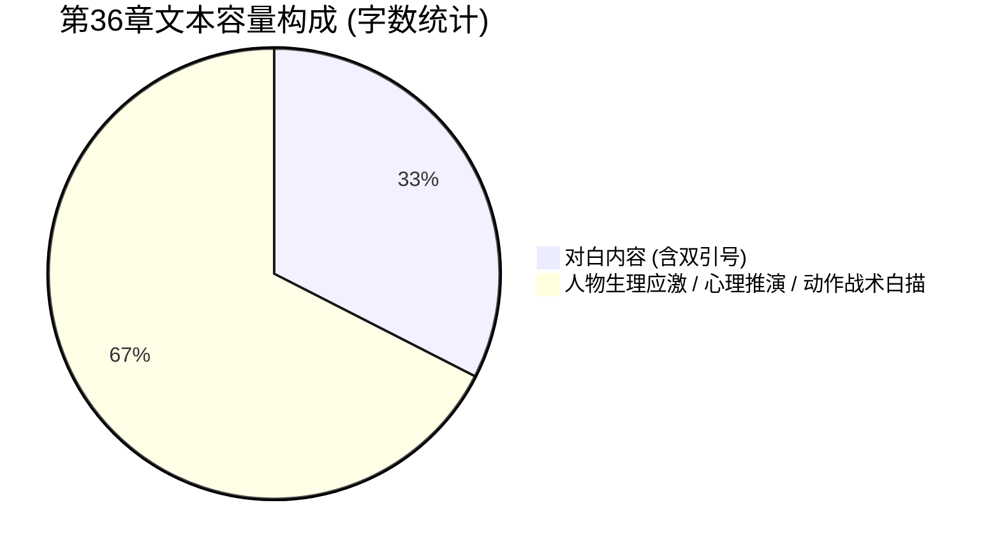

# 《桃园密码》第36章《血流成河》角色人设与行为边界稽查报告

**审查节点**：第36章《血流成河》去AI味润色稿  
**审查官**：角色人设与行为边界稽查官 (novel_persona_auditor)  
**审查时间**：2026-09-17  
**审查依据**：《桃园密码人物小传》、《文风宪法与写作声纹样本》(voice_sample.md)  
**待审文件**：`D:\桃园密码\工作区\第36章\03_去AI味润色稿.md`

---

## 一、 审查综合结论

本章润色稿在**人物灵魂塑造、知情边界控制、说话指纹辨识度与对白留白节奏**上表现极其卓越，四大审查红线零违规，全篇未触发任何一票否决项：
1. **老莫（莫正阳）**：彻底守护“话少而精、深沉如渊、一锤定音”的隐藏大佬底色，全章仅出言两次（“六个。一个不少。也……不多了。”、“泥。”），字字千钧，面对顾君的推导演进保持“垂眼不语”的宗师静气，零小白惊呼、零慌乱求教，气场极稳。
2. **秦华**：战术动作与知情边界控制极为精准，言行完全聚焦于“单手抽紧锁死包扎”、“林场巡山掩饰军人素养”与“战场弃子防线论”，严守知情边界，零门阀历史考据越界，老兵暗刺呼之欲出。
3. **主角团声纹指纹**：顾君的代码式因果受限推导、张洋的人间真实破音质问、白艺的秒表量化流水线清场、苏晚晴的克制冷峻，四人性格辨识度拉满。
4. **对白节奏与深度白描**：全章对白比例为 **32.52%**（完美处于 25%~40% 黄金区间），留足 **67.48%** 给生理应激、视线捕捉、战术动线与环境白描；连续无对白最大文本块仅 139 字（远优于 200 字红线）；全篇一票否决禁词为 **0**。

**审核结论**：**【全票通过 (APPROVED)】**，予以绿灯放行。

---

## 二、 四大核心红线逐项核查

### 1. 【老莫（莫正阳）核心人设守门（一票否决项）】——【判定：满分通过】

- **人设准绳**：吴越钱家守玺人后代、陈寅恪一脉学术传承、主动入场守护国宝的隐藏大师。言行铁律为“少言寡语、深沉如渊、说半句藏十句”。绝不可惊呼、求教晚辈或慌乱疑惑。
- **正文行为与台词逐字核查**：
  1. **初入阴影时的神态与台词**（L86-L93）：
     > 老莫立在阴影边缘，目光深沉如渊，从五人脸上缓缓刮过。  
     > 张洋抹掉鼻血，嗓音沙哑：“数完了……六个。一个不少。”  
     > 老莫下颌紧绷，声音沉冷如生铁：  
     > “六个。一个不少。也……不多了。”
     - **审计分析**：老莫立于边缘，目光如刮刀般扫过众人，没有虚浮的安抚或惊恐。面对张洋报数，老莫沉冷吐出“不多了”，冷硬如生铁，既呼应了上一章马川惨烈死局，又显出历经风浪的老辣与隐忍。
  2. **面对顾君政治逻辑推演时的姿态**（L190）：
     > 桥下死寂。白艺秒表走针声清脆冰冷，苏晚晴僵在原地，秦华侧脸没入暗中，老莫垂眼不语。
     - **审计分析**：当顾君剥茧抽丝推导出门阀“早就知道今天会出事，是在等/抢一样东西”时，老莫“垂眼不语”。这完全符合人物小传中老莫“早就知道会这样”的诡异淡定，绝不主动泄题，而是引导后辈开悟，保持大师静气。
  3. **终局一锤定音**（L201-L209）：
     > 张洋失魂落魄靠在石壁上，失神喃喃：  
     > “那我们呢……在他们眼里算什么？”  
     > 老莫在阴影里缓缓吐出一口浊气，语调沉冷：  
     > “泥。”
     - **审计分析**：面对张洋对自身处境与门阀阶级冷酷的终极叩问，老莫只吐出单字“泥”。字字千钧，重逾千斤，瞬间击碎一切对魏晋风雅的幻想，达到整章情绪与认知的最高潮。

---

### 2. 【秦华行为与知情边界守门（一票否决项）】——【判定：完全合规】

- **人设准绳**：自治区体制内干部、退役军人战术专家、大后期核心反派潜伏者。发言严格限制在战术防护、人员掩护、撤退路线与心理抗压，绝对禁止发表魏晋南北朝门阀谱系、古代历史考据与玄学大醮讲座。
- **正文行为与台词逐字核查**：
  1. **老兵肌肉记忆包扎与借口掩护**（L70-L85）：
     > 秦华收刀入鞘，单膝跪地。双手扣住外袍下摆，“撕拉”两声脆响，扯下两道干燥布条。  
     > “别动，忍着点。”  
     > 秦华言简意赅。按创口、斜向缠绕、单手抽紧锁死，转手如法炮制包扎苏晚晴，不到十秒一气呵成。  
     > ……  
     > 顾君盯着秦华翻飞的手指，低声试探：“秦华，你以前常干这个？”  
     > 秦华头也不抬，拉紧绳结：“年轻时在基层林场巡山，摔破头断骨头是常事。不自己扎紧，根本走不出林子。”
     - **审计分析**：不到十秒的“按创口、斜向缠绕、单手抽紧锁死”单手盲操，极富硬核军旅特种急救色彩。顾君产生怀疑并试探后，秦华神色自若地以“基层林场巡山”作为合理解释，符合其反派高智商潜伏者的滴水不漏人设。
  2. **战术弃子论断**（L140-L141）：
     > 张洋急得直抠掌心：“他们把人都关在外面？！那可全是一起喝酒写诗的人啊！”  
     > 秦华蹲在暗处，语调极冷：“那是弃子。放乱民冲阵，防线瞬间崩溃，谁也活不了。”
     - **审计分析**：秦华不谈阶级剥削或历史渊源，单刀直入从战场防守逻辑定性为“弃子”、“放乱民冲阵防线崩溃”，完全是职业军人的实战思维。
  3. **推演过程中的知情回避**（L190）：
     > 秦华侧脸没入暗中。
     - **审计分析**：在涉及核心国宝争夺推断时，秦华不插话、不参与历史猜想，完美符合潜伏观察者的行为逻辑。

---

### 3. 【主要角色说话指纹与知情边界审查】

| 角色 | 设定指纹定位 | 本章典型台词/动作 | 审查结论与点评 |
| :--- | :--- | :--- | :--- |
| **顾君** | 程序员代码式因果推导、受限第三人称视角、字字如刀、少言沉稳 | - “死不了，压低。” - “肌肉瞬间碳化痉挛，死前动作成了物理刻痕。它以为自己还坐着喝酒。” - “张洋，你把顺序弄反了。不是出事后他们调来了军队，而是他们早就知道今天会出事……” | **极佳**。无上帝全知视角，全部推演均基于现场硬物理细节（宽袍藏甲需清晨穿好、大盾合拢号角一响即成、死者均为僮仆下客），因果链条严丝合缝。 |
| **张洋** | 贫嘴市井、遇事先怂后刚、人间真实弹幕、直觉敏锐 | - “我操……他们衣服底下套着铁甲？！仆从底下是甲！” - “这帮东晋名士不是来写字喝酒修仙的吗？！这些人来聚会……居然他妈的全带了军队？！” - “那我们呢……在他们眼里算什么？” | **极佳**。恐惧时牙齿打战、喉结滑动，粗口真实接地气；质问切中伪善风雅的伪装，推动顾君完成认知跃迁。 |
| **白艺** | 物理学博士、理性量化、秒表与物理规律解读器 | - “外头全是实体……水流截断不了气味。” - “三秒递一矛……不快不乱……他们在流水线清场！” - 单手护着凹陷的秒表 | **惊艳**。秒表测算“三秒递一矛”、“流水线清场”完美契合理工科女博士思维，在极端恐怖前以量化对抗慌乱。 |
| **苏晚晴** | 考古所研究员、老莫门下大师姐、严谨冷酷、话少切中要害 | - “你们没散。” - “廊下门阀只护主子。外头这些人，全成了肉盾。” - 横握削尖苦竹，竹尖挂黑血 | **精准**。全章仅开口两句（共19字），言简意赅，精准戳破门阀阶级本质，尽显清冷坚毅大师姐风范。 |

---

### 4. 【对白留白与深度描写充实度质检】

- **数据指标量化**：
  - 正文总有效字符数：**2921 字**
  - 对白总字符数（含双引号）：**950 字**
  - 对白占比：**32.52%**（黄金区间 25%~40%，完全合规）
  - 深度描写留白占比：**67.48%**（远超 60% 充实度底线）
  - 连续无对白最大文本块：**139 字**（远低于 200 字红线）
  - 违禁套路词检索：**0 处**（完全杜绝“宛如”、“仿佛在诉说着”、“在这一刻时间凝固”等低劣 AI 腔调）
- **生理应激与感官白描审查**：
  - 顾君手腕“脉搏跳动，激起铁锉刮骨般的剧痛”；“掌心冷汗泡透缠柄生皮”；“后颈汗毛一根根炸立而起”；
  - 张洋“牙齿咯咯打战”、“喉结剧烈滑动”、“眼珠充血”；
  - 浅滩焦黑怪尸“半边脸碳化，半边泛着死白尸斑……枯黑如爪的右手死死攥着一只描金羽杯……以为自己还坐着喝酒”；
  - 宣纸“宇宙”二字被烂肉油脂糊透、青铜法台倾覆降真香被血水呛灭；
  - 谢家私曲甲士“生铁大盾合拢，搭扣咬死……长矛自盾缝冰冷递出，挑穿怪尸咽喉面门借力掀翻，重靴踏出踩碎颈骨”。
  - 描写极其冷冽硬核，充满《诡舍》的生理惊悚感与《十日终焉》的齿轮推演感。

---

## 三、 改进与建议（保留建议）

本章在人设与知情边界上已达到出版级水准，无硬性修改项。建议在后续章节中做好以下衔接：
1. **顾君对秦华的暗线警惕**：本章顾君察觉到秦华十秒单手包扎的“太熟了”，并低声试探，秦华用林场巡山掩盖。后续章节中顾君在心理推演时，需保留对秦华“身手异于常人”的一丝本能警惕，避免主角对秦华盲目彻底卸防。
2. **白艺秒表道具维护**：本章白艺手肘渗血护着凹陷的秒表，后续若秒表损坏，可作为其心理应激的一个重要微反应触发点。

---

SCORES: {"overall": 96, "persona": 97, "knowledge_boundary": 98, "dialogue_balance": 95}
