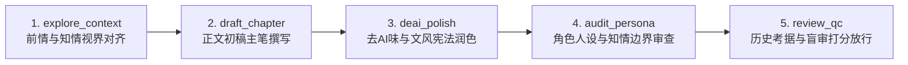

# 《桃园密码》现实间隙卷大纲（Ch 51 ~ 54）

> **章节跨度**：第 51 章 ~ 第 54 章（共 4 章，现实世界时间跨度约 24 小时）  
> **核心定位**：承上启下之枢纽。全面沉淀兰亭集会余波与生理心理创伤，完成疑点清算；推进顾君与白艺的情感与主线深度结合；揭开雷台汉墓与居延汉简惊世线索；展现反派卢夏高段位伪装引导；以硬核物理仪器与古墨异变引爆悬念，在最高潮处截然而止切入主线。  
> **执笔纪律**：受限第三人称视角（焊死在顾君视网膜上），90%~95% 现代通俗白话，高智商代码排障与物理量化，杜绝一切套路套话违禁词。

---

## 一、 整体设计内核与重大修正对齐

1. **复盘动力学（由浅入深，双人同行）**：
   - 顾君与白艺在出租屋先行**浅浅复盘**，发现单纯依赖逻辑代码和物理公式无法解开千古历史正统之谜，产生重重迷雾；
   - 顾君提议连夜拜访老莫求教；白艺主动要求同行（“我也要去”），从被动跟随者转化为主动探索者，两人并肩奔赴探求真相，感情在夜行中深刻升温。
2. **老莫与苏晚晴的学术深水区解密**：
   - 四人齐聚老莫书斋，老莫解密天师道大醮与王羲之“向后世求召令”的本质，首次吐露吴越钱家守玺宗族的“传国玉玺七碎片镇封华夏龙脉”铁律；
   - 苏晚晴拿出 1969 年甘肃武威雷台汉墓未公开的绝密考古内参：99 件铜车马基座下的现代金属微量渗入与反常磁极值，以及“守张掖长/绝域假司马”的世纪官印之谜。
3. **反派卢夏（成吉思汗的小马驹）的高段位伪装与暗中引导**：
   - **坚决纠正“挑衅跳反”的硬伤**：卢夏在论坛上绝不暴露敌意，绝不挑衅顾君；
   - 卢夏以博古通今的匿名历史权威形象，在林栩的居延汉简热帖下发表极具深度的高维考据指引，指出雷台要塞的重熔本质与天马力矩地煞阵眼，看似“好心解惑”，实则极其阴险地引导主角团主动走向河西走廊死局。主角团甚至感叹其渊博，为其后期反转埋下无与伦比的戏剧张力。
4. **悬念断章的极致运用**：
   - 白艺带入专业物理检测套件；古墨残片与居延新简红外数据发生不可思议的量子波谱共振；
   - 房间内水汽被凭空抽干蒸发，地磁偏角归零，苍凉汉家铜角与万马奔腾声震颤现实空间；
   - 在两人立誓生死相随、时空引力阱爆发坠入大漠的巅峰瞬间——**截然而止！**

---

## 二、 逐章细纲与情节推进设计

### 第 51 章：间隙章·一《回响》

- **时段**：现实世界，第一天上午 09:15 ~ 下午 17:30。
- **场景**：顾君出租屋 $\rightarrow$ 司隶校尉论坛加密层 $\rightarrow$ 张洋家 $\rightarrow$ 顾君出租屋门前。
- **登场人物**：顾君、张洋、白艺（秦华在论坛私信出场）。
- **情节点**：
  1. **生理创伤与现实重连**：顾君被肺部窒息感呛醒，手腕严重挫伤泛青紫，掌心紧握【古墨残片】（刻有“会于会稽山阴之兰亭”金字），确认会稽血战非梦，且现实只过去七个半小时。
  2. **论坛加密初连**：因兰亭未交换手机号，顾君通过司隶校尉论坛加密私信连线秦华（ID【关山难越】）。秦华确认全员脱困，通报老莫与苏晚晴正在静养，语气沉稳如山，展现靠谱老大哥形象。
  3. **探望创伤张洋**：顾君前往张洋住处。张洋呈现重度创伤后应激障碍（PTSD），双手神经性痉挛颤抖，对会稽名士分尸碎肉心有余悸。顾君以发小默契与冷幽默宽慰，确立张洋在现实后方休养并监控论坛，不再参与下一轮前线冒险。
  4. **雪梨热汤**：顾君傍晚返回，对门白艺身穿素净针织衫，端着降燥的雪梨银耳汤开门相迎。
- **本章伏笔与线索**：
  - 古墨残片散发淡淡松烟墨香，能微弱缓解神经性头痛；
  - 确立张洋留守后方，免去其后续副本肉身减员风险；
  - 铺垫顾君与白艺的邻里温情。

---

### 第 52 章：间隙章·二《同行》

- **时段**：现实世界，第一天傍晚 17:40 ~ 19:30。
- **场景**：顾君出租屋客厅 $\rightarrow$ 城市夜色街头。
- **登场人物**：顾君、白艺。
- **情节点**：
  1. **换药包扎与近距白描**：白艺取出医用急救包，专业手法为顾君清理手腕挫伤组织液，以大“8”字形弹力绷带精准固定错位软组织。
  2. **白艺心理与感情升温**：看着顾君腕上的狰狞伤痕，白艺回忆兰亭大醮生门前，谢氏甲士生铁盾墙压境，顾君傲然立于两军中轴线，冷静推演东晋南北权力架构，一锤定音“归朝堂”的大义果决。女孩内心深处对这位平日沉默寡言、关键时刻气吞万里如虎的年轻程序员，产生极强烈的精神依恋与情感共振。
  3. **浅浅复盘（初步梳理与遭遇瓶颈）**：
     - 两人喝着雪梨汤，在茶几白纸上列出时间轴与疑点：
       * 疑点A：王羲之写“后之视今，亦犹今之视昔”，为何非要传序文于外人？
       * 疑点B：五石散中的尸变毒药到底受谁指使？刘弼死前狞笑意欲何为？
       * 疑点C：传国玉玺为何始终未见真容？
       * 疑点D：秦华在现场过硬的心理素质与单手包扎动作（白艺指出其杏仁核应激近乎冷血，但顾君念其舍身顶桥救人，确立“不疑其战友本色，但核心代码绝不外借”原则）。
     - 顾君推演陷入死胡同：程序员的代码逻辑能抓出漏洞，但无法解释两千年前的华夏正统与道门法阵机制。
  4. **白艺主动请缨·并肩同行**：
     - 顾君合上笔记：“有些历史死结，逻辑推理有上限，必须当面问老莫。”
     - 白艺毫不犹豫站起身收拾急救箱：“等等，我也要去！”
     - 白艺直视顾君的眼睛：“在兰亭我大部分时间在做被动观测，这一次，我也要进入核心线索。而且老莫掌握的文物背景，对我的物理模型构建至关重要。”
     - 顾君心头微动，点头应允。两人收拾停当，并肩步入城市霓虹夜色，奔赴老莫书斋。
- **本章伏笔与线索**：
  - 白艺从“场外理科外援”正式转变为“主动入局探索者”；
  - 两人感情在共同求索的行动中完成第一次质的飞跃；
  - 埋下对秦华心理特征的理性审视。

---

### 第 53 章：间隙章·三《问道》

- **时段**：现实世界，第一天夜晚 20:00 ~ 22:30。
- **场景**：老莫的旧式四合院书斋（古籍满架、拓片生香）。
- **登场人物**：顾君、白艺、老莫（莫正阳）、苏晚晴。
- **情节点**：
  1. **四人书房汇合**：古色古香的案几旁，苏晚晴正在为老莫煎煮降压安神的参茶，满桌摊开着两汉西域拓片。四人坐定，顾君开门见山提出兰亭未解死结。
  2. **老莫全盘解密兰亭与玉玺**：
     - **大醮真相**：老莫指出，天师道杜子恭与王羲之的大醮，绝非寻常修禊，而是感知到秦汉传国玉玺龙脉气运外泄，借四十二名士精血神魂，向千百年后的时空发出“召令”，寻求没有门阀利益纠葛的后世义士裁决大统。
     - **玉玺七碎片体系**：老莫作为吴越钱家后裔，正式向顾君吐露家族绝密：传国玉玺已在历史剧变中裂解为七道核心锚点，分别镇封在华夏历史最凶险的七大转折关头（东汉西域撤军、东晋兰亭、唐末法门寺佛骨、宋代靖康等），唯有逐一化解各节点的高熵危机，方能重聚玉玺。
  3. **苏晚晴出示 1969 雷台汉墓绝密档案**：
     - 苏晚晴从保险柜取出一份文博所未公开档案：1969 年武威雷台汉墓出土铜奔马（马踏飞燕）与 99 件铜车马仪仗。
     - 档案惊天反常点：第 99 件铜俑底座下的汉代青砖，检测出非汉代的现代合金分子微量渗入，且土层呈现不可思议的瞬时高能磁化极值；同时，墓主官印赫然刻着“守张掖长/绝域假司马”——一介张掖县文官，兼领武威绝域军印，葬于数百里外的武威，正史完全失载！
  4. **论坛深水区爆帖与反派卢夏的“神级伪装”**：
     - 四人连上司隶校尉论坛，发现退役侦察兵林栩（ID【大汉铁骑】）引爆全网的万字帖《建初绝唱：从居延新简看东汉建初元年河西撤军背后的弃子疑案》，公布了新出土居延汉简红外透扫图，披露西域大撤退后无名张掖长率数百残卒死守弱水烽燧、熔尽兵甲铸天马镇地脉的悲壮史实。
     - **反派卢夏（成吉思汗的小马驹）的高段位操作**：
       * 卢夏并未挑衅，而是以顶级学者风范在林栩帖下留下精辟长评，指出：“汉代雷台乃熔炉前哨而非单体墓葬，张掖长所铸天马必落在地脉天元点，其动平衡力矩关乎地煞封印；若探河西，当防微观偏析。”
       * 老莫与苏晚晴看罢赞叹不已，顾君亦觉得此人深不可测、考据如神，将其视作论坛顶尖同行隐士。主角团完全不识其反派真面目，反而被其权威分析深深吸引，全面锚定河西走廊。
- **本章伏笔与线索**：
  - 补全传国玉玺七国宝世界观总框架；
  - 1969 雷台现代金属渗入谜团（呼应后续林栩投入 48 克钛合金军牌）；
  - 卢夏深潜伪装，反向引导主角入局，为后期大反转蓄满势能。

---

### 第 54 章：间隙章·四《引信》

- **时段**：现实世界，第一天深夜 23:00 ~ 第二天凌晨 00:15。
- **场景**：顾君出租屋（或老莫书斋测试台）。
- **登场人物**：顾君、白艺（老莫、苏晚晴作为见证或远程连线）。
- **情节点**：
  1. **白艺开箱物理量化标尺**：白艺正式展开三防战术箱，向顾君展示调试完毕的微型三轴磁通门磁强计、高敏激光测距仪与红外热像仪。白艺提出硬核物理假说：副本为微观高熵绝热孤立系，这次必须用科学仪器直接读取时空曲率与退相干常数。
  2. **测试【古墨残片】的惊天异变**：
     - 顾君将王羲之所赠古墨残片置于磁强计探头上，同时电脑调出林栩居延新简的红外光谱数据；
     - 当两汉兵煞之魂与魏晋书圣笔意在信息层重叠的瞬间，古墨背面的淡金篆字骤然爆发刺目白光！
     - 仪器疯狂尖啸：局部地磁偏角直接归零！绝对负温区形成！
     - 茶几上的茶水在短短数秒内凭空沸腾、蒸发抽干，化作白汽消散无踪！
     - 强大的空间引力阱在墨块中心成型，引力透镜将周围光线扭曲成暗红漩涡，方向死死锁死西北河西走廊！
  3. **高燃誓言与极致断章入局**：
     - 虚空中炸响两千年前的苍凉汉家大角，地下传来万千铁骑踏碎戈壁的惊天震响；
     - 狂暴沙风穿透现实，日光灯管在重力畸变中砰然爆碎成漫天白末！
     - 面对未知的深渊，白艺双手死死扣住战术仪器箱把手，坚定踏前一步与顾君并肩而立，清澈眼眸如星辰般璀璨：“顾君，这一次……换我用科学做你的眼睛。不管去哪，我都陪你到底！”
     - 两人视线对撞的一刹那，古墨残片轰然炸裂，恐怖的时空涡旋瞬间吞没整间屋子，两人的意识在刺骨灼热与引力撕扯中疾速下坠，撞向无垠的血色瀚海——
     - **在即将触碰河西绝域的前一秒，戛然而止！**
- **本章伏笔与线索**：
  - 白艺便携物理仪器成功带入下一副本；
  - 情感与战意推上全卷最高峰；
  - 极致断章制造无与伦比的期待感与追读欲望。

---

## 三、 间隙卷流水线（Pipeline）执行方案

大纲核准后，我们将通过项目流水线为间隙章执行严格的五步生成闭环：

1. **第 51 章**：已有底稿，执行流水线复核与微调；
2. **第 52 章**：按《同行》细纲执行全流程流水线生成（换药、浅浅复盘、决定找老莫、白艺要求同行）；
3. **第 53 章**：按《问道》细纲执行全流程流水线生成（老莫书斋四人会、1969雷台档案、林栩居延简、卢夏高段位伪装引导）；
4. **第 54 章**：按《引信》细纲执行全流程流水线生成（物理仪器实测、古墨共振、引力阱爆发、极致断章）。

完成后，主线副本正文自然顺延至第 55 章《血色孤烟》无缝切入！
